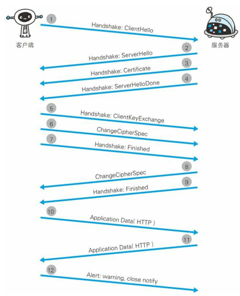
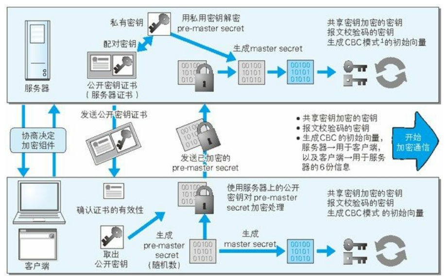

# https

## 一、HTTP的缺点

- **通信使用明文(不加密)，内容可能会被窃听。**
- **不验证通信方的身份，因此有可能遭遇伪装。**
- **无法证明报文的完整性，所以有可能被篡改。**

这些问题不仅在 HTTP 上出现，其他未加密的协议中也会存在这类问题。

### 1. 通信使用明文可能会被窃听

由于 HTTP 本身不具备加密的功能，所以也无法做到对通信整体（使用 HTTP 协议通信的请求和响应的内容）进行加密。即，HTTP 报文使用明文（指未经过加密的报文）方式发送。

- TCP/IP 是可能被窃听的网络。

  按TCP/IP 协议族的通信机制，通信内容在所有的通信线路上都有可能遭到窥视。即使是已经加密处理的通信，也会被窥视到通信内容，这点和未加密的通信时相同的。只是如果通信经过加密，就可能让人无法破解报文信息的含义，但加密处理后的报文信息本身还是会被看到。用数据抓包工具如Wireshark就可以获取http协议的请求和相应的内容并进行解析。

- 加密处理防止窃听

  加密的对象有以下几种：

  1. 通信的加密

     HTTP没有加密机制，但可以通过和SSL（Secure Socket Layer，安全套接层）或 TLS（Transport Layer Security，安全层传输协议）的组合使用，加密HTTP的通信内容。用SSL建立安全通信线路之后，就可以在这条线路上进行HTTP通信了。与SSL组合使用的HTTP被称为HTTPS

  2. 内容的加密

     由于HTTP协议中没有加密机制，那就对HTTP报文里所含的内容进行加密处理。所以客户端需要对HTTP报文进行加密处理后再发送。为了有效地加密，前提是客户端和服务端同时具备加密和解密机制。但内容仍然有被篡改的风险。

### 2. 不验证通信方的身份就可能遭遇伪装

HTTP 协议中的请求和响应不会对通信方进行确认。也就是说存在“服务器是否就是发送请求中 URI 真正指定的主机，返回的响应是否真的返回到实际提出请求的客户端”等类似问题。 

- 任何人都可以发起请求

  HTTP协议不存在确认同新方的处理步骤，所以任何人都可以发起请求。服务器只要接收到请求，不管对方是谁都会返回一个相应。所以会存在下面几种隐患：

  1. 无法确定请求发送到的web服务器是否是按真实意图返回相应的那台服务器，有可能是已伪装的web服务器。
  2. 无法确定相应返回到的客户端是否是按真实意图接收到相应的那个客户端。有可能是伪装的客户端。
  3. 无法确定正在通信的对方是否具备访问权限。
  4. 即使是无意义的请求也会接受，无法拒绝海量请求下的DoS攻击（Denial of Service，拒绝服务攻击）。

- 查明对手证书

  使用HTTP协议无法确定通信方，但使用SSL可以，SSL提供加密处理并且使用了被称为证书的手段，可以用于确定对方身份。证书由值得信任的第三方机构颁发，用来证明服务器和客户端是实际存在的。通过使用证书，来证明通信方是意料中的服务器，对使用者来说可以减少个人信息泄露的危险性。

### 3. 接收到的内容可能有误

由于HTTP协议无法证明通信的报文完整性，所以在请求或相应发出之后到对方接受之前这段时间内，即使请求或响应的内容遭到篡改，也没有办法知道。像这样，请求或相应在传输途中遭到攻击者拦截并篡改内容的攻击称为中间人攻击（Man-in-the-Middle attack，MITM）。 

## 二、HTTP+ 加密 + 认证 + 完整性保护 = HTTPS

### 1. HTTPS是身披SSL外壳的HTTP

HTTPS并非是应用层的一种新协议。只是HTTP通信接口部分用SSL和TLS协议代替而已。通常HTTP直接和TCP通信，当使用SSL时，则变成先和SSL通信，再由SSL和TCP通信。使用了SSL之后，就拥有了加密、证书和完整性保护的功能。

### 2. 相互交换密钥的公开密钥加密技术

近代的加密算法是公开的，密钥是保密的，通过这种方式得以保持加密方法的安全性。

加密和解密都会用到密钥，没有密钥就无法对密码解密，反过来说，任何人只要持有密钥就能解密了，如果密钥被攻击者获得，那加密也就失去了意义。

- 共享密钥加密的困境

  加密和解密同用一个密钥的方式称为共享密钥加密，也叫对称加密。共享密钥加密时必须把密钥也发给对方，但是怎么样才能安全地转交，在互联网上转发密钥时如果通信被监听那么密钥就可能落入攻击者之手，就失去了加密的意义，另外还要设法安全地保管接收到的密钥。

- 使用两把密钥的公开密钥加密

  公开密钥加密方式很好地解决了共享密钥加密的困难。公开密钥使用一对非对称密钥，一个公开密钥，一个私有密钥，私有密钥不能让其他人知道，而公开密钥可以随意发布，任何人都可以获得。发送密文的一方使用对方的公开密钥进行加密，对方接受到被加密的信息后再用自己的私有密钥解密。用这种方式，不需要发送用来解密的私有密钥，也不必担心私有密钥会被攻击者窃听。

- https采用混合加密机制

  HTTPS 采用共享密钥加密和公开密钥加密两者并用的混合加密机制。若密钥能够实现安全交换，那么有可能会考虑仅使用公开 密钥加密来通信。但是公开密钥加密与共享密钥加密相比，其处理速度要慢。 所以应充分利用两者各自的优势，将多种方法组合起来用于通 信。在交换密钥环节使用公开密钥加密方式，之后的建立通信交换报文阶段则使用共享密钥加密方式。 

### 3. 证明公开密钥正确性的证书

公开密钥加密方式还是存在问题的。那就是无法证明 公开密钥本身就是货真价实的公开密钥。比如，正准备和某台服务器 建立公开密钥加密方式下的通信时，如何证明收到的公开密钥就是原本预想的那台服务器发行的公开密钥。或许在公开密钥传输途中，真正的公开密钥已经被攻击者替换掉了。 

为了解决上述问题，可以使用由数字证书认证机构（CA，Certificate Authority）和其相关机关颁发的公开密钥证书。首先，服务器的运营人员向数字证书认证机构提出公开密钥的申请。数字证书认证 机构在判明提出申请者的身份之后，会对已申请的公开密钥做数字签名，然后分配这个已签名的公开密钥，并将该公开密钥放入公钥证书 后绑定在一起。服务器会将这份由数字证书认证机构颁发的公钥证书发送给客户端，以进行公开密钥加密方式通信。接到证书的客户端可使用数字证书认证机构的公开密钥，对那张证书 上的数字签名进行验证，一旦验证通过，客户端便可明确两件事： 一，认证服务器的公开密钥的是真实有效的数字证书认证机构。二， 服务器的公开密钥是值得信赖的。 

此处认证机关的公开密钥必须安全地转交给客户端。使用通信方式时，如何安全转交是一件很困难的事，因此，多数浏览器开发商发布版本时，会事先在内部植入常用认证机关的公开密钥。 

### 4. HTTPS的安全通信机制

1. 客户端通过发送 Client Hello 报文开始 SSL通信。报文中包含客户端支持的 SSL的指定版本、加密组件（Cipher Suite）列表（所使用的加密算法及密钥长度等）。 
2. 服务器可进行 SSL通信时，会以 Server Hello 报文作为应答。和客户端一样，在报文中包含 SSL版本以及加密组件。服务器的加密组件内容是从接收到的客户端加密组件内筛选出来的。 
3. 之后服务器发送 Certificate 报文。报文中包含公开密钥证书。
4. 最后服务器发送 Server Hello Done 报文通知客户端，最初阶段的 SSL握手协商部分结束。 
5. SSL第一次握手结束之后，客户端以 Client Key Exchange 报文作为回应。报文中包含通信加密中使用的一种被称为 Pre-mastersecret 的随机密码串。该报文已用步骤 3 中的公开密钥进行加密。
6. 接着客户端继续发送 Change Cipher Spec 报文。该报文会提示服务器，在此报文之后的通信会采用 Pre-master secret 密钥加密。
7. 客户端发送 Finished 报文。该报文包含连接至今全部报文的 整体校验值。这次握手协商是否能够成功，要以服务器是否能够正确解密该报文作为判定标准。 
8. 服务器同样发送 Change Cipher Spec 报文。
9. 服务器同样发送 Finished 报文。
10. 服务器和客户端的 Finished 报文交换完毕之后，SSL连接就算建立完成。当然，通信会受到 SSL的保护。从此处开始进行应用层协议的通信，即发送 HTTP 请求。 
11. 应用层协议通信，即发送 HTTP 响应。
12.  最后由客户端断开连接。断开连接时，发送 close_notify 报文。上图做了一些省略，这步之后再发送 TCP FIN 报文来关闭与 TCP 的通信。 

- SSL速度慢

  SSL的慢分两种。一种是指通信慢。另一种是指由于大量消耗CPU 及内存等资源，导致处理速度变慢。

  和使用 HTTP 相比，网络负载可能会变慢 2 到 100 倍。除去和 TCP 连接、发送 HTTP 请求 • 响应以外，还必须进行 SSL通信， 因此整体上处理通信量不可避免会增加。 

  另一点是 SSL必须进行加密处理。在服务器和客户端都需要进行加密和解密的运算处理。因此从结果上讲，比起 HTTP 会更多地消耗服务器和客户端的硬件资源，导致负载增强。

