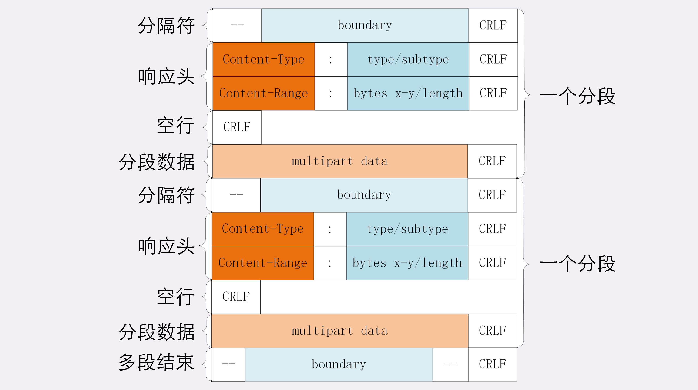
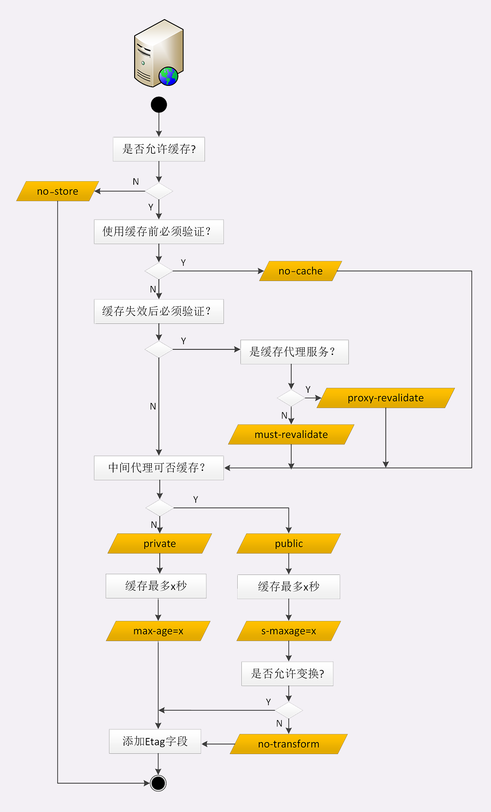
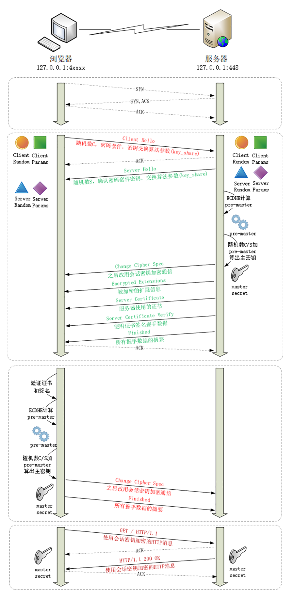
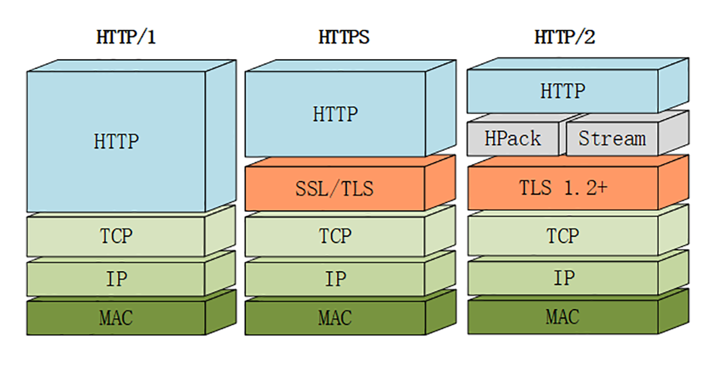

# 极客时间-透视HTTP协议：重点总结

## 一、 http报文

http是一个**纯文本**协议，所以头数据都是ASCII码的文本，可以很容易地用肉眼阅读，不用借助程序解析也能够看懂。

http协议规定报文必须有header，但可以没有body，而且在header之后必须要有一个**“空行”**，也就是**"CRLF"**，十六进制的**"0D0A"**，如果header中的头部字段后多加了一个**CRLF**，会导致后面的头部字段被当做body处理。

### 1. 头部字段

- 字段名不区分大小写，例如“Host”也可以写成“host”，但首字母大写的可读性更好；
- 字段名里不允许出现空格，可以使用连字符“-”，但不能使用下划线“_”。例如，“test-name”是合法的字段名，而“test name”“test_name”是不正确的字段名；
- 字段名后面必须紧接着“:”，不能有空格，而“:”后的字段值前可以有多个空格；但一般都只用一个空格，因为可以减小头部大小
- 字段的顺序是没有意义的，可以任意排列不影响语义；
- 字段原则上不能重复，除非这个字段本身的语义允许，例如 Set-Cookie。
- Host是请求字段，也是**唯一一个** HTTP/1.1 规范里要求必须出现的字段，也就是说，如果请求头里没有 Host，那这就是一个错误的报文。
- Content-Length，它表示报文里 body 的长度，也就是请求头或响应头空行后面数据的长度。服务器看到这个字段，就知道了后续有多少数据，可以直接接收。如果没有这个字段，那么 body 就是不定长的，需要使用 chunked 方式分段传输。

## 2. URI

URI最后可以有**片段标识符"#fragment"**，它是URI所定位的资源内部的一个“锚点”或者“标签”，浏览器可以在获取资源后直接跳转到它只是的位置。但片段标识符仅能由浏览器这样的客户端使用，服务器是看不到的。也就是说，浏览器永远不会把带“#fragment”的 URI 发送给服务器，服务器也永远不会用这种方式去处理资源的片段。

URI里只能使用ASCII码，如果要在URI里使用英语以外的汉语、日语等，或者某些特殊的URI，会在path、query里出现“@&？“等起界定符作用的字符，会导致URI解析错误，所以**URI引入了编码机制**，对于 ASCII 码以外的字符集和特殊字符做一个特殊的操作，把它们转换成与 URI 语义不冲突的形式。这在 RFC 规范里称为“escape”和“unescape”，俗称“转义”。URI 转义的规则有点“简单粗暴”，直接把非 ASCII 码或特殊字符转换成十六进制字节值，然后前面再加上一个“%”。例如，空格被转义成“%20”，“?”被转义成“%3F”。而中文、日文等则通常使用 UTF-8 编码后再转义，例如“银河”会被转义成“%E9%93%B6%E6%B2%B3”。有了这个编码规则后，URI 就更加完美了，可以支持任意的字符集用任何语言来标记资源。不过我们在浏览器的地址栏里通常是不会看到这些转义后的“乱码”的，这实际上是浏览器一种“友好”表现，隐藏了 URI 编码后的“丑陋一面”。

## 二、http的特点

- HTTP 是灵活可扩展的，可以任意添加头字段实现任意功能；
- HTTP 是可靠传输协议，基于 TCP/IP 协议“尽量”保证数据的送达；
- HTTP 是应用层协议，比 FTP、SSH 等更通用功能更多，能够传输任意数据；
- HTTP 使用了请求 - 应答模式，客户端主动发起请求，服务器被动回复请求；
- HTTP 本质上是无状态的，每个请求都是互相独立、毫无关联的，协议不要求客户端或服务器记录请求相关的信息。

## 三、http实体数据

### 1. 数据类型与编码

HTTP借鉴了电子邮件系统里让电子邮件可以发送ASCII码以外的任意数据的方案：**“多用途互联网邮件扩展”（Multipurpose Internet Mail Extensions），简称为 MIME。**

MIME 是一个很大的标准规范，但 HTTP 只“顺手牵羊”取了其中的一部分，用来标记 body 的数据类型，这就是我们平常总能听到的“MIME type”。

MIME 把数据分成了八大类，每个大类下再细分出多个子类，形式是“type/subtype”的字符串，刚好也符合了 HTTP 明文的特点，所以能够很容易地纳入 HTTP 头字段里。

HTTP里经常遇到的几个类别：

- text：即文本格式的可读数据，我们最熟悉的应该就是 text/html 了，表示超文本文档，此外还有纯文本 text/plain、样式表 text/css 等。
- image：即图像文件，有 image/gif、image/jpeg、image/png 等。
- audio/video：音频和视频数据，例如 audio/mpeg、video/mp4 等。
- application：数据格式不固定，可能是文本也可能是二进制，必须由上层应用程序来解释。常见的有 application/json，application/javascript、application/pdf 等，另外，如果实在是不知道数据是什么类型，也就是“黑盒”数据类型，就会是 application/octet-stream，即不透明的二进制数据。

有了MIME还不够，HTTP传输时为了节省带宽，有事还会压缩数据，所以还有了**“Encoding type”**，告诉数据是用的什么编码格式，这样对方才能正确解压缩，还原出原始的数据。

- gzip：GNU zip 压缩格式，也是互联网上最流行的压缩格式；
- deflate：zlib（deflate）压缩格式，流行程度仅次于 gzip；
- br：一种专门为 HTTP 优化的新压缩算法（Brotli）。

### 2. 数据类型使用的头字段

HTTP 协议定义了两个 Accept 请求头字段和两个 Content 实体头字段，用于客户端和服务器进行“内容协商”。也就是说，客户端用 Accept 头告诉服务器希望接收什么样的数据，而服务器用 Content 头告诉客户端实际发送了什么样的数据。

**Accept** 字段标记的是客户端可理解的 MIME type，可以用“,”做分隔符列出多个类型：

`Accept: text/html,application/xml,image/webp,image/png`

服务器会在响应报文里用头字段 **Content-Type** 告诉实体数据的真实类型：

`Content-Type: text/html`

**Accept-Encoding** 字段标记的是客户端支持的压缩格式。

服务器可以选择一种压缩方式来压缩数据，实际使用的压缩格式放在响应头字段 **Content-Encoding** 里。

**Accept-Encoding** 和**Content-Encoding**这两个字段是可以省略的，如果请求报文里没有 Accept-Encoding 字段，就表示客户端不支持压缩数据；如果响应报文里没有 Content-Encoding 字段，就表示响应数据没有被压缩。

### 3. 语言类型与编码

MIME type 和 Encoding type 解决了计算机理解 body 数据的问题，但没有解决语言问题。因此引入了**语言类型与字符集**两个概念。

**“语言类型”**就是人类使用的自然语言，例如英语、汉语、日语等，而这些自然语言可能还有下属的地区性方言，所以在需要明确区分的时候也要使用“type-subtype”的形式，不过这里的格式与数据类型不同，**分隔符不是“/”，而是“-”**。

自然语言的计算机处理叫做**字符集**。

**Accept-Language** 字段标记了客户端可理解的自然语言，也允许用“,”做分隔符列出多个类型。

服务器应该在响应报文里用头字段 **Content-Language** 告诉客户端实体数据使用的实际语言类型。

字符集在 HTTP 里使用的请求头字段是 **Accept-Charset**，但响应头里却没有对应的 Content-Charset，而是在 Content-Type 字段的数据类型后面用“charset=xxx”来表示，这点需要特别注意：

`Accept-Charset: gbk, utf-8`

`Content-Type: text/html; charset=utf-8`

### 4. 内容协商的质量值

在 HTTP 协议里用 Accept、Accept-Encoding、Accept-Language 等请求头字段进行内容协商的时候，还可以用一种特殊的“q”参数表示权重来设定优先级，这里的“q”是“quality factor”的意思。

权重的最大值是 1，最小值是 0.01，默认值是 1，如果值是 0 就表示拒绝。具体的形式是在数据类型或语言代码后面加一个“;”，然后是“q=value”。

这里要提醒的是“;”的用法，在大多数编程语言里“;”的断句语气要强于“,”，而在 HTTP 的内容协商里却恰好反了过来，“;”的意义是小于“,”的。如：

`Accept: text/html,application/xml;q=0.9,*/*;q=0.8`

### 5. 内容协商的结果

内容协商的过程是不透明的，每个 Web 服务器使用的算法都不一样。但有的时候，服务器会在响应头里多加一个 Vary 字段，记录服务器在内容协商时参考的请求头字段，给出一点信息，例如：

`Vary: Accept-Encoding,User-Agent,Accept`

这个 Vary 字段表示服务器依据了 Accept-Encoding、User-Agent 和 Accept 这三个头字段，然后决定了发回的响应报文。

## 四、HTTP传输大文件的方法

### 1. 数据压缩

通常浏览器在发送请求时都会带着**“Accept-Encoding”**头字段，里面是浏览器支持的压缩格式列表，例如 gzip、deflate、br 等，这样服务器就可以从中选择一种压缩算法，放进**“Content-Encoding”**响应头里，再把原数据压缩后发给浏览器。

不过这个解决方法也有个缺点，gzip 等压缩算法通常只对文本文件有较好的压缩率，而图片、音频视频等多媒体数据本身就已经是高度压缩的，再用 gzip 处理也不会变小（甚至还有可能会增大一点），所以它就失效了。所以一般不对图片等多媒体进行压缩。

### 2. 分块传输

对于大文件的传输，除了数据压缩之外，还可以通过将它“拆分”成多个小块，然后分批发给浏览器，让浏览器收到后再组装复原。这样浏览器和服务器都不用在内存里保存文件的全部，每次只收发一小部分，网络也不会被大文件长时间占用，内存、带宽等资源也就节省下来了。

分块传输在响应报文中用头字段**Transfer-Encoding: chunked”**来表示，意思是报文里的 body 部分不是一次性发过来的，而是分成了许多的块（chunk）逐个发送。**“Transfer-Encoding: chunked”和“Content-Length”这两个字段是互斥的，也就是说响应报文里这两个字段不能同时出现，一个响应报文的传输要么是长度已知，要么是长度未知（chunked）**。

分块传输的编码规则很简单，使用明文的方式：

1. 每个分块包含两个部分，长度头和数据块；
2. 长度头是以 CRLF（回车换行，即\r\n）结尾的一行明文，用 16 进制数字表示长度；
3. 数据块紧跟在长度头后，最后也用 CRLF 结尾，但数据不包含 CRLF；
4. 最后用一个长度为 0 的块表示结束，即“0\r\n\r\n”。

浏览器在收到分块传输的数据后会自动按照规则去掉分块编码，重新组装出内容，所以在浏览器中是看不出所谓的“分块传输”，仍然是一个相应报文。

### 3. 范围请求

想要获取一个大文件的其中的片段数据，如视频的特定时间范围内的数据，分块传输没有这个能力。

范围请求”（range requests）允许客户端在请求头里使用专用字段来表示只获取文件的一部分，相当于是客户端的“化整为零”。范围请求不是 Web 服务器必备的功能，可以实现也可以不实现，所以服务器必须在响应头里使用字段**“Accept-Ranges: bytes”**明确告知客户端：“我是支持范围请求的”。如果不支持的话服务器可以发送**“Accept-Ranges: none”**，或者干脆不发送“Accept-Ranges”字段，这样客户端就认为服务器没有实现范围请求功能，只能老老实实地收发整块文件了。

请求头 **Range** 是 HTTP 范围请求的专用字段，格式是**“bytes=x-y”**，其中的 x 和 y 是以字节为单位的数据范围。x、y 表示的是“偏移量”，范围必须从 0 计数，例如前 10 个字节表示为“0-9”，第二个 10 字节表示为“10-19”，而“0-10”实际上是前 11 个字节。

`Range: bytes=0-199`

服务器收到 Range 字段后，需要做四件事：

1. 它必须检查范围是否合法，比如文件只有 100 个字节，但请求“200-300”，这就是范围越界了。服务器就会返回状态码 416，意思是“你的范围请求有误，我无法处理，请再检查一下”。
2. 如果范围正确，服务器就可以根据 Range 头计算偏移量，读取文件的片段了，返回状态码“206 Partial Content”，和 200 的意思差不多，但表示 body 只是原数据的一部分。
3. 服务器要添加一个响应头字段 **Content-Range**，告诉片段的实际偏移量和资源的总大小，格式是“**bytes x-y/length**”，与 Range 头区别在没有“=”，范围后多了总长度。例如，对于“0-10”的范围请求，值就是“bytes 0-10/100”。`Content-Range: bytes 0-19/100`

### 4. 多段数据

范围请求一次只获取一个片段，其实它还支持在 Range 头里使用多个“x-y”，一次性获取多个片段数据。

这种情况需要使用一种特殊的 MIME 类型：**“multipart/byteranges”**，表示报文的 body 是由多段字节序列组成的，并且还要用一个参数**“boundary=xxx”**给出段之间的分隔标记。

多段数据的格式与分块传输也比较类似，但它需要用分隔标记 boundary 来区分不同的片段，可以通过图来对比一下：

每一个分段必须以**“- -boundary”**开始（前面加两个“-”），之后要用**“Content-Type”**和**“Content-Range”**标记这段数据的类型和所在范围，然后就像普通的响应头一样以回车换行结束，再加上分段数据，最后用一个**“- -boundary- -”**（前后各有两个“-”）表示所有的分段结束。

请求示例：

`GET /16-2 HTTP/1.1`
`Host: www.chrono.com`
`Range: bytes=0-9, 20-29`

响应示例：

`HTTP/1.1 206 Partial Content`
`Content-Type: multipart/byteranges; boundary=00000000001`
`Content-Length: 189`
`Connection: keep-alive`
`Accept-Ranges: bytes`

`--00000000001`
`Content-Type: text/plain`
`Content-Range: bytes 0-9/96`

`// this is`
`--00000000001`
`Content-Type: text/plain`
`Content-Range: bytes 20-29/96`

`ext json d`
`--00000000001--`

## 五、HTTP的连接管理

### 1. 短连接

HTTP(0.9/1.0)是个非常简单的协议，通信过程也采用了简单的“请求-应答”方式。底层的数据传输基于 TCP/IP，每次发送请求前需要先与服务器建立连接，收到响应报文后会立即关闭连接。因为客户端与服务器的整个连接过程很短暂，不会与服务器保持长时间的连接状态，所以就被称为“短连接”（short-lived connections）。早期的 HTTP 协议也被称为是“无连接”的协议。

短连接的缺点相当严重，因为在 TCP 协议里，**建立连接和关闭连接都是非常“昂贵”的操作**。TCP 建立连接要有**“三次握手”**，发送 **3** 个数据包，需要 **1(1.5)**个 RTT；关闭连接是**“四次挥手”**，**4** 个数据包需要 **2** 个 RTT。

(这里http请求和响应有4个数据包是因为，发送请求一个http请求是一个数据包，服务器返回一个tcp ack是一个数据包，服务器返回HTTP响应是一个数据包，客户端收到HTTP响应发送tcp ack一个数据包)

而 HTTP 的一次简单“请求 - 响应”通常只需要 **4** 个包，如果不算服务器内部的处理时间，最多是 **2** 个 RTT。这么算下来，浪费的时间就是“3÷5=60%”，有**三分之二**的时间被浪费掉了，传输效率低得惊人。

### 2. 长连接

针对短连接暴露出的缺点，HTTP 协议就提出了**“长连接”**的通信方式，也叫**“持久连接”（persistent connections）**、**“连接保活”（keep alive）**、**“连接复用”（connection reuse）**。

其实解决办法也很简单，用的就是**“成本均摊”**的思路，既然 TCP 的连接和关闭非常耗时间，那么就把这个时间成本由原来的一个“请求 - 应答”均摊到多个“请求 - 应答”上。

这样虽然不能改善 TCP 的连接效率，但基于“分母效应”，每个“请求 - 应答”的无效时间就会降低不少，整体传输效率也就提高了。

**显然，如果在这个长连接上发送的请求越多，分母就越大，利用率也就越高。**

因为TCP协议还有**“慢启动”"拥塞窗口"**等特性，通常建立新的“冷连接”会比打开一段时间的“热连接”要慢一些，所以长连接比端连接还多了这一层的优势。

长连接的一个重要问题是如何正确地区分多个报文的开始和结束，所以最好总使用"content-length"头明确相应实体的长度，正确标记报文结束。如果是流式传输，body长度不能立即确定，就必须用分块传输编码。

利用HTTP的长连接特性对服务器发起大量请求，导致服务器最终耗尽资源“拒绝服务”，就是场所的DoS。

HTTP的连接管理还有第三种pipeline(管道，或者叫流水线)，在长连接的基础上又进了一步，可以批量发送请求批量接收响应，但因为存在一些问题，Chrome等浏览器都没有实现它，已经被事实上“废弃”了。

Connection字段还有一个取值：“onnection:Upgrade”，配合状态码101表示协议升级，例如从HTTP切换到WebSocket。

### 3. 连接相关的头字段

由于长连接对性能的改善效果非常显著，所以在 HTTP/1.1 中的连接都会默认启用长连接。不需要用什么特殊的头字段指定，只要向服务器发送了第一次请求，后续的请求都会重复利用第一次打开的 TCP 连接，也就是长连接，在这个连接上收发数据。也可以在请求头里明确地要求使用长连接机制，使用的字段是 Connection，值是“keep-alive”。不管客户端是否显式要求长连接，如果服务器支持长连接，它总会在响应报文里放一个“Connection: keep-alive”字段，告诉客户端：“我是支持长连接的，接下来就用这个 TCP 一直收发数据吧”。

**不过长连接也有一些小缺点，问题就出在它的“长”字上。**

因为 TCP 连接长时间不关闭，服务器必须在内存里保存它的状态，这就占用了服务器的资源。如果有大量的空闲长连接只连不发，就会很快耗尽服务器的资源，导致服务器无法为真正有需要的用户提供服务。

所以，长连接也需要在恰当的时间关闭，不能永远保持与服务器的连接，这在客户端或者服务器都可以做到。

在客户端，可以在请求头里加上“Connection: close”字段，告诉服务器：“这次通信后就关闭连接”。服务器看到这个字段，就知道客户端要主动关闭连接，于是在响应报文里也加上这个字段，发送之后就调用 Socket API 关闭 TCP 连接。

**服务器端通常不会主动关闭连接，但也可以使用一些策略**。拿 Nginx 来举例，它有两种方式：

- 使用“keepalive_timeout”指令，设置长连接的超时时间，如果在一段时间内连接上没有任何数据收发就主动断开连接，避免空闲连接占用系统资源。
- 使用“keepalive_requests”指令，设置长连接上可发送的最大请求次数。比如设置成 1000，那么当 Nginx 在这个连接上处理了 1000 个请求后，也会主动断开连接。

另外，客户端和服务器都可以在报文里附加通用头字段“Keep-Alive: timeout=value”，限定长连接的超时时间。**但这个字段的约束力并不强，通信的双方可能并不会遵守，所以不太常见。**

### 4. 队头阻塞

**对头阻塞(Head-of-line blocking)与短连接和长连接无关，而是由 HTTP 基本的“请求 - 应答”模型所导致的。**

因为 HTTP 规定报文必须是“一发一收”，这就形成了一个先进先出的“串行”队列。队列里的请求没有轻重缓急的优先级，只有入队的先后顺序，排在最前面的请求被最优先处理。

如果队首的请求因为处理的太慢耽误了时间，那么队列里后面的所有请求也不得不跟着一起等待，结果就是其他的请求承担了不应有的时间成本。

队头阻塞在http和tcp层次都有，原因不同。这里将的是http队头阻塞。

### 5. 性能优化

“请求 - 应答”模型不能变，所以**“队头阻塞”问题在 HTTP/1.1 里无法解决，只能缓解**。

可以采用**“并发连接”（concurrent connections）**，**也就是同时对一个域名发起多个长连接，用数量来解决质量的问题。**

但这种方式**也存在缺陷**。如果每个客户端都想自己快，建立很多个连接，用户数×并发数就会是个天文数字。服务器的资源根本就扛不住，或者被服务器认为是恶意攻击，反而会造成“拒绝服务”。

所以，HTTP 协议建议客户端使用并发，但不能“滥用”并发。RFC2616 里明确限制每个客户端最多并发 2 个连接。不过实践证明这个数字实在是太小了，众多浏览器都“无视”标准，把这个上限提高到了 **6~8**。后来修订的 RFC7230 也就“顺水推舟”，取消了这个“2”的限制。

但是，如果"并发连接"锁压榨出的性能还是无法满足需求，还有什么办法？还可以使用“域名分片”。

**“域名分片”（domain sharding）技术，还是用数量来解决质量的思路。**

**HTTP 协议和浏览器限制对同一个域名的并发连接数量**，那我们可以通过多开几个域名绕过这个限制。比如 shard1.chrono.com、shard2.chrono.com，而这些域名都指向同一台服务器 www.chrono.com，这样实际长连接的数量又翻了一倍。

## 六、HTTP重定向和跳转

在浏览器上点击链接跳转时，浏览器会解析链接里的URI，再用这个URI发起一个新的HTTP请求，获取响应报文后会渲染出新URI指向的页面，这样的跳转是由浏览器的使用者主动发起的，可以称为“主动跳转”，但还有一类跳转是由服务器发起的，浏览器无法控制，相对地称为“被动跳转”，这在HTTP协议里有个专门的名词，叫做**“重定向”(Redirection)**。

### 1. 重定向的过程

当发送的HTTP请求获得的HTTP响应中带有301、302等代表跳转的状态码时，浏览器会重定向到响应报文中Location指定的资源，不用开发者工具的话是看不到这个跳转过程的，也就是重定向是“用户无感知”的。

**“Location”**字段属于响应字段，**只能出现在响应报文里**。但只有配合 301/302 状态码才有意义，它标记了服务器要求重定向的 URI，要求浏览器跳转到指定的资源。

浏览器收到 301/302 报文，会检查响应头里有没有“Location”。如果有，就从字段值里提取出 URI，发出新的 HTTP 请求，相当于自动替我们点击了这个链接。

在“Location”里的 URI **既可以使用绝对 URI，也可以使用相对 URI**。所谓“绝对 URI”，就是完整形式的 URI，包括 scheme、host:port、path 等。所谓“相对 URI”，就是省略了 scheme 和 host:port，只有 path 和 query 部分，是不完整的，但可以从请求上下文里计算得到。

### 2. 重定向状态码

- 301俗称“永久重定向”（Moved Permanently），意思是原 URI 已经“永久”性地不存在了，今后的所有请求都必须改用新的 URI。浏览器看到 301，就知道原来的 URI“过时”了，就会做适当的优化。比如历史记录、更新书签，下次可能就会直接用新的 URI 访问，省去了再次跳转的成本。搜索引擎的爬虫看到 301，也会更新索引库，不再使用老的 URI。
- 302 俗称“临时重定向”（“Moved Temporarily”），意思是原 URI 处于“临时维护”状态，新的 URI 是起“顶包”作用的“临时工”。浏览器或者爬虫看到 302，会认为原来的 URI 仍然有效，但暂时不可用，所以只会执行简单的跳转页面，不记录新的 URI，也不会有其他的多余动作，下次访问还是用原 URI。
- 303 See Other：类似 302，但要求重定向后的请求改为 GET 方法，访问一个结果页面，避免 POST/PUT 重复操作；（理解为有限制的302）
- 307 Temporary Redirect：类似 302，但重定向后请求里的方法和实体不允许变动，含义比 302 更明确；（也可以理解为有限制的302）
- 308 Permanent Redirect：类似 307，不允许重定向后的请求变动，但它是 301“永久重定向”的含义。（理解为有限制的301？）

**303、307、308三个状态码的接受程度较低，有的浏览器和服务器可能不支持，开发时应当慎重，测试确认浏览器的实际效果后才能使用。**

### 3. 重定向的应用场景

使用3xx状态码**可以在服务端拥有主动权**，控制浏览器的行为。

使用重定向跳转，核心是要理解**“重定向”**和**“永久 / 临时”**这两个关键词。

重定向的使用场景：

- 一个最常见的原因就是“资源不可用”，需要用另一个新的 URI 来代替。至于不可用的原因那就很多了。例如域名变更、服务器变更、网站改版、系统维护，这些都会导致原 URI 指向的资源无法访问，为了避免出现 404，就需要用重定向跳转到新的 URI，继续为网民提供服务。
- 另一个原因就是“避免重复”，让多个网址都跳转到一个 URI，增加访问入口的同时还不会增加额外的工作量。例如，有的网站都会申请多个名称类似的域名，然后把它们再重定向到主站上。

决定要实行重定向后接下来要考虑的就是“永久”和“临时”的问题了，也就是选择 301 还是 302：

- 301 的含义是“永久”的。

  如果域名、服务器、网站架构发生了大幅度的改变，比如启用了新域名、服务器切换到了新机房、网站目录层次重构，这些都算是“永久性”的改变。原来的 URI 已经不能用了，必须用 301“永久重定向”，通知浏览器和搜索引擎更新到新地址，这也是搜索引擎优化（SEO）要考虑的因素之一。

- 302 的含义是“临时”的。

  原来的 URI 在将来的某个时间点还会恢复正常，常见的应用场景就是系统维护，把网站重定向到一个通知页面，告诉用户过一会儿再来访问。另一种用法就是“服务降级”，比如在双十一促销的时候，把订单查询、领积分等不重要的功能入口暂时关闭，保证核心服务能够正常运行。

### 4. 重定向相关问题

- 性能损耗

  很明显，重定向的机制决定了一个跳转会有两次请求 - 应答，比正常的访问多了一次。虽然 301/302 报文很小，但大量的跳转对服务器的影响也是不可忽视的。站内重定向还好说，可以长连接复用，站外重定向就要开两个连接，如果网络连接质量差，那成本可就高多了，会严重影响用户的体验。所以重定向应当适度使用，决不能滥用。

- 循环跳转

  如果重定向的策略设置欠考虑，可能会出现“A=>B=>C=>A”的无限循环，不停地在这个链路里转圈圈。所以 HTTP 协议特别规定，浏览器必须具有检测“循环跳转”的能力，在发现这种情况时应当停止发送请求并给出错误提示。

重定向报文里还可以用Refresh字段，实现延时重定向，例如"Refresh: 5； url=xxx"告诉浏览器5秒后再跳转。

与跳转有关的还有一个"Referer"和"Referrer-Policy"，表示浏览器的来源(即引用地址)，可用于统计分析和防盗链。

301/302重定向是由浏览器执行的，对于服务器来说可以称为**"外部重定向"**,相应的也就有服务器的**“内部重定向”**，直接在服务器内部跳转URI，因为不会发出额外的HTTP请求，(即在相应报文里就带回了新URI)，所以没有额外的性能损失。

## 七、HTTP的Cookie机制

HTTP 是**“无状态”**的，这既是优点也是缺点。优点是服务器没有状态差异，可以很容易地组成集群，而缺点就是无法支持需要记录状态的事务操作。好在 **HTTP 协议是可扩展的**，后来发明的 Cookie 技术，给 HTTP 增加了“记忆能力”。

### 1. Cookie 的工作过程

要用到两个字段：响应头字段 **Set-Cookie** 和请求头字段 **Cookie**。

服务器通过在响应报文里添加Set-Cookie字段，以key=value的键值对形式发送给浏览器，浏览器收到响应报文，看到里面有 Set-Cookie，知道这是服务器给的身份标识，于是就保存起来，下次再请求的时候就自动把这个值放进 Cookie 字段里发给服务器。服务器有时会在响应头里添加多个 Set-Cookie，存储多个“key=value”。但浏览器这边发送时不需要用多个 Cookie 字段，只要在一行里用“;”隔开就行。

**Cookie 是由浏览器负责存储的**，而不是操作系统。所以，它是“浏览器绑定”的，只能在本浏览器内生效。

**Cookie 同源策略：Cookie中的同源只关注域名，忽略协议和端口**。所以`https://localhost:8080/`和`http://localhost:8081/`的Cookie是共享的。

如果在同一个域名上部署了两个以上的后端服务，那么**有可能发生cookie覆盖的情况**，即A服务set-Cookie时在浏览器端覆盖了B服务的cookie，导致B服务失去了登录状态，需要后端：1、将服务部署在不同的域名下。2、修改cookie名称保证两个cookie名称不同。

### 2. Cookie的属性

- Cookie 的生存周期

  Cookie 的生存周期，也就是它的有效期，让它只能在一段时间内可用，就像是食品的“保鲜期”，一旦超过这个期限浏览器就认为是 Cookie 失效，在存储里删除，也不会发送给服务器。

  Cookie 的有效期可以使用 Expires 和 Max-Age 两个属性来设置。

  **“Expires”**俗称“过期时间”，用的是**绝对时间点**，可以理解为“截止日期”（deadline）。**“Max-Age”**用的是**相对时间**，单位是秒，浏览器用收到报文的时间点再加上 Max-Age，就可以得到失效的绝对时间。

  Expires 和 Max-Age 可以同时出现，两者的失效时间可以一致，也可以不一致，但**浏览器会优先采用 Max-Age 计算失效期**。

  如果不指定Expires或Max-Age属性，那么Cookie仅在浏览器运行时有效，一旦浏览器关闭就会失效，这被称为会话Cookie(session cookie)或内存Cookie(in-memory cookie)。

  如果Cookie的Max-age设置为0，就是立即过期，不允许缓存，但在会话期间是可用的，浏览器会话关闭之前可用cookie记录用户的信息。

- Cookie 的作用域

  Cookie 的作用域，让浏览器仅发送给特定的服务器和 URI，避免被其他网站盗用。作用域的设置比较简单，**“Domain”**和**“Path”**指定了 Cookie 所属的**域名**和**路径**，浏览器在发送 Cookie 前会从 URI 中提取出 host 和 path 部分，对比 Cookie 的属性。如果不满足条件，就不会在请求头里发送 Cookie。

  现实中为了省事，通常 Path 就用一个“/”或者直接省略，表示域名下的任意路径都允许使用 Cookie，让服务器自己去挑。

  `Domain` 指定了哪些主机可以接受 Cookie。如果不指定，默认为 origin，**不包含子域名**。如果指定了`Domain`，则一般包含子域名。因此，指定 `Domain` 比省略它的限制要少。但是，当子域需要共享有关用户的信息时，这可能会有所帮助。 

- Cookie 的安全性

  在前端在JS 脚本里可以用 **document.cookie** 来读写 Cookie 数据，这就带来了安全隐患，有可能会导致“跨站脚本”（XSS）攻击窃取数据。

  属性**“HttpOnly”**会告诉浏览器，**此 Cookie 只能通过浏览器 HTTP 协议传输，禁止其他方式访问**，浏览器的 JS 引擎就会禁用 document.cookie 等一切相关的 API，脚本攻击也就无从谈起了。

  另一个属性**“SameSite”**可以防范“跨站请求伪造”（XSRF）攻击，设置成**“SameSite=Strict”**可以严格限定 Cookie 不能随着跳转链接跨站发送，而**“SameSite=Lax”**则略宽松一点，允许 GET/HEAD 等安全方法，但禁止 POST 跨站发送。设置**“SameSite=None”**的前提是同时设置`Secure`属性（Cookie 只能通过 HTTPS 协议发送），否则无效。

  还有一个属性叫**“Secure”**，表示这个 Cookie **仅能用 HTTPS 协议加密传输**，明文的 HTTP 协议会禁止发送。但 Cookie 本身不是加密的，浏览器里还是以明文的形式存在。新版本的浏览器中，HTTP:无法使用Cookie的Secure标记。

  这个链接将sameSite讲得很好：[sameSite用法](https://www.ruanyifeng.com/blog/2019/09/cookie-samesite.html)

浏览器对Cookie的大小有限制，不允许无限存储，一般总大小不能超过4KB。

### 3. Cookie的应用

- 身份识别

  Cookie 最基本的一个用途就是身份识别，保存用户的登录信息，实现会话事务。

  比如，你用账号和密码登录某电商，登录成功后网站服务器就会发给浏览器一个 Cookie，内容大概是“name=yourid”，这样就成功地把身份标签贴在了你身上。之后你在网站里随便访问哪件商品的页面，浏览器都会自动把身份 Cookie 发给服务器，所以服务器总会知道你的身份，一方面免去了重复登录的麻烦，另一方面也能够自动记录你的浏览记录和购物下单（在后台数据库或者也用 Cookie），实现了“状态保持”。

- 广告跟踪

  Cookie 的另一个常见用途是广告跟踪。

  你上网的时候肯定看过很多的广告图片，这些图片背后都是广告商网站（例如 Google），它会“偷偷地”给你贴上 Cookie 小纸条，这样你上其他的网站，别的广告就能用 Cookie 读出你的身份，然后做行为分析，再推给你广告。

  这种 Cookie 不是由访问的主站存储的，所以又叫“第三方 Cookie”（third-party cookie）。如果广告商势力很大，广告到处都是，那么就比较“恐怖”了，无论你走到哪里它都会通过 Cookie 认出你来，实现广告“精准打击”。

## 八、HTTP的缓存控制

由于链路漫长，网络时延不可控，浏览器使用 HTTP 获取资源的成本较高。所以，非常有必要把“来之不易”的数据缓存起来，下次再请求的时候尽可能地复用。这样，就可以避免多次请求 - 应答的通信成本，节约网络带宽，也可以加快响应速度。

### 1. 服务器的缓存控制

缓存的运行机制：

1. 浏览器发现缓存无数据，于是发送请求，向服务器获取资源；
2. 服务器响应请求，返回资源，同时标记资源的有效期；
3. 浏览器缓存资源，等待下次重用。

服务器标记资源有效期使用的头字段是**“Cache-Control”**，里面的值**“max-age=30”**就是资源的有效时间，相当于告诉浏览器，“这个页面只能缓存 30 秒，之后就算是过期，不能用。"，**max-age** 是“生存时间”，时间的计算起点是响应报文的创建时刻（即 Date 字段，也就是离开服务器的时刻），而不是客户端收到报文的时刻，也就是说包含了在链路传输过程中所有节点所停留的时间。

“max-age”是 HTTP 缓存控制最常用的属性，此外在响应报文里还可以用其他的属性来更精确地指示浏览器应该如何使用缓存：

- **no-store**：不允许缓存，用于某些变化非常频繁的数据，例如秒杀页面；
- **no-cache**：它的字面含义容易与 no-store 搞混，实际的意思并不是不允许缓存，而是**可以缓存，但在使用之前必须要去服务器验证是否过期，是否有最新的版本**；
- **must-revalidate**：又是一个和 no-cache 相似的词，它的意思是如果缓存不过期就可以继续使用，**但过期了如果还想用就必须去服务器验证**。

### 2. 客户端的缓存控制

不止服务器可以发**“Cache-Control”**头，浏览器也可以发**“Cache-Control“**，也就是说请求 - 应答的双方都可以用这个字段进行缓存控制，互相协商缓存的使用策略。

当点击**F5“刷新”**按钮的时候，**浏览器**会在请求头里加一个`“Cache-Control: max-age=0”`。服务器看到 **max-age=0**，也就会用一个最新生成的报文回应浏览器。

**Ctrl+F5 的“强制刷新”**浏览器会在发出的请求中添加一个“Cache-Control: no-cache”，含义和“max-age=0”基本一样，就看后台的服务器怎么理解，通常两者的效果是相同的。

### 3. 条件请求

浏览器用“Cache-Control”做缓存控制只能是刷新数据，不能很好地利用缓存数据，又因为缓存会失效，使用前还必须要去服务器验证是否是最新版。

HTTP 协议定义了一系列**“If”开头的“条件请求”**字段，专门用来检查**验证资源是否过期**。

条件请求一共有 5 个头字段：最常用的是**“if-Modified-Since”**和**“If-None-Match”**这两个，其他的三个头字段是“If-Unmodified-Since”“If-Match”和“If-Range”。需要第一次的响应报文预先提供“Last-modified”和“ETag”，然后第二次请求时就可以带上缓存里的原值，验证资源是否是最新的。如果资源没有变，服务器就回应一个“304 Not Modified”，表示缓存依然有效，浏览器就可以更新一下有效期，然后放心大胆地使用缓存了。

**ETag** 是**“实体标签”（Entity Tag）**的缩写，是资源的一个唯一标识，主要是用来解决修改时间无法准确区分文件变化的问题。

比如，一个文件在一秒内修改了多次，但因为修改时间是秒级，所以这一秒内的新版本无法区分。再比如，一个文件定期更新，但有时会是同样的内容，实际上没有变化，用修改时间就会误以为发生了变化，传送给浏览器就会浪费带宽。

ETag 还有“强”“弱”之分。强 ETag 要求资源在字节级别必须完全相符，弱 ETag 在值前有个“W/”标记，只要求资源在语义上没有变化，但内部可能会有部分发生了改变（例如 HTML 里的标签顺序调整，或者多了几个空格）。

**浏览器强制刷新是因为请求头里的 If-Modified-Since 和 If-None-Match 会被清空，并且cache-control：no-cache所以会返回最新数据**。

## 九、HTTP的代理服务

引入 HTTP 代理后，原来简单的双方通信就变复杂了一些，加入了一个或者多个中间人，但整体上来看，还是一个有顺序关系的链条，而且链条里相邻的两个角色仍然是简单的一对一通信，不会出现越级的情况。

链条的起点还是客户端（也就是浏览器），中间的角色被称为代理服务器（proxy server），链条的终点被称为源服务器（origin server）。

### 1. 代理服务

“代理服务”就是指服务本身不生产内容，而是处于中间位置转发上下游的请求和响应，具有双重身份：面向下游的用户时，表现为服务器，代表源服务器响应客户端的请求；而面向上游的源服务器时，又表现为客户端，代表客户端发送请求。

### 2. 代理的作用

由于代理处在 HTTP 通信过程的中间位置，相应地就对上屏蔽了真实客户端，对下屏蔽了真实服务器，简单的说就是“欺上瞒下”。在这个中间层的“小天地”里就可以做很多的事情，为 HTTP 协议增加更多的灵活性，实现客户端和服务器的“双赢”。

代理最基本的一个功能是负载均衡。因为在面向客户端时屏蔽了源服务器，客户端看到的只是代理服务器，源服务器究竟有多少台、是哪些 IP 地址都不知道。于是代理服务器就可以掌握请求分发的“大权”，决定由后面的哪台服务器来响应请求。

在负载均衡的同时，代理服务还可以执行更多的功能，比如：

- **健康检查**：使用“心跳”等机制监控后端服务器，发现有故障就及时“踢出”集群，保证服务高可用；
- **安全防护**：保护被代理的后端服务器，限制 IP 地址或流量，抵御网络攻击和过载；
- **加密卸载**：对外网使用 SSL/TLS 加密通信认证，而在安全的内网不加密，消除加解密成本；
- **数据过滤**：拦截上下行的数据，任意指定策略修改请求或者响应；
- **内容缓存**：暂存、复用服务器响应。

### 3. 代理相关头字段

代理服务器需要用字段“Via”标明代理的身份。Via 是一个通用字段，请求头或响应头里都可以出现。每当报文经过一个代理节点，代理服务器就会把自身的信息追加到字段的末尾。如果通信链路中有很多中间代理，就会在 Via 里形成一个链表，这样就可以知道报文究竟走过了多少个环节才到达了目的地。

Via 字段只解决了客户端和源服务器判断是否存在代理的问题，还不能知道对方的真实信息。

但服务器的 IP 地址应该是保密的，关系到企业的内网安全，所以一般不会让客户端知道。不过反过来，通常服务器需要知道客户端的真实 IP 地址，方便做访问控制、用户画像、统计分析。

可惜的是 HTTP 标准里并没有为此定义头字段，但已经出现了很多“事实上的标准”，最常用的两个头字段是**“X-Forwarded-For”**和**“X-Real-IP”**。

“X-Forwarded-For”的字面意思是“为谁而转发”，形式上和“Via”差不多，也是每经过一个代理节点就会在字段里追加一个信息。但“Via”追加的是代理主机名（或者域名），而**“X-Forwarded-For”追加的是请求方的 IP 地址**。所以，**在字段里最左边的 IP 地址就是客户端的地址**。

**“X-Real-IP”**是另一种获取客户端真实 IP 的手段，它的作用很简单，就是**记录客户端 IP 地址，没有中间的代理信息**，相当于是“X-Forwarded-For”的简化版。如果客户端和源服务器之间只有一个代理，那么这两个字段的值就是相同的。

### 4. 代理协议

通过“X-Forwarded-For”操作代理信息**必须要解析 HTTP 报文头**，这对于代理来说成本比较高，原本只需要简单地转发消息就好，而现在却必须要费力解析数据再修改数据，会**降低代理的转发性能**。

另一个问题是“X-Forwarded-For”等头必须要修改原始报文，而有些情况下是不允许甚至不可能的（比如使用 HTTPS 通信被加密）。

所以就出现了一个专门的“代理协议”（The PROXY protocol），它由知名的代理软件 HAProxy 所定义，也是一个“事实标准”，被广泛采用（注意并不是 RFC）。

“代理协议”和 HTTP 差不多，也是明文，它在 HTTP 报文前增加了一行 **ASCII 码**文本，相当于又多了一个头。

这一行文本其实非常简单，开头**必须是“PROXY”五个大写字母**，然后是“TCP4”或者“TCP6”，表示客户端的 IP 地址类型，再后面是请求方地址、应答方地址、请求方端口号、应答方端口号，最后用一个回车换行（\r\n）结束。

`PROXY TCP4 1.1.1.1 2.2.2.2 55555 80\r\n
GET / HTTP/1.1\r\n
Host: www.xxx.com\r\n
\r\n`

服务器看到这样的报文，**只要解析第一行**就可以拿到客户端地址，不需要再去理会后面的 HTTP 数据，省了很多事情。

## 十、HTTP的缓存代理

“缓存代理”，也就是支持缓存控制的代理服务。

HTTP 传输链路上，不只是客户端有缓存，服务器上的缓存也是非常有价值的，可以让请求不必走完整个后续处理流程，“就近”获得响应结果。

特别是对于那些“读多写少”的数据，例如突发热点新闻、爆款商品的详情页，一秒钟内可能有成千上万次的请求。即使仅仅缓存数秒钟，也能够把巨大的访问流量挡在外面，让 RPS（request per second）降低好几个数量级，减轻应用服务器的并发压力，对性能的改善是非常显著的。

HTTP 的服务器缓存功能主要由代理服务器来实现（即缓存代理），而源服务器系统内部虽然也经常有各种缓存（如 Memcache、Redis、Varnish 等），但与 HTTP 没有太多关系。

### 1. 缓存代理服务

在没有缓存的时候，代理服务器每次都是直接转发客户端和服务器的报文，中间不会存储任何数据，只有最简单的中转功能。

加入了缓存后，代理服务收到源服务器发来的响应数据后需要做两件事。第一个当然是把报文转发给客户端，而第二个就是把报文存入自己的 Cache 里。下一次再有相同的请求，代理服务器就可以直接发送 304 或者缓存数据，不必再从源服务器那里获取。这样就降低了客户端的等待时间，同时节约了源服务器的网络带宽。

### 2. 源服务器的缓存控制

“Cache-Control”属性：max-age、no-store、no-cache 和 must-revalidate缓存属性可以约束客户端，也可以约束代理。但客户端和代理是不一样的，客户端的缓存只是用户自己使用，而代理的缓存可能会为非常多的客户端提供服务。所以，需要对它的缓存再多一些限制条件。

首先，我们要区分客户端上的缓存和代理上的缓存，可以使用两个新属性**“private”**和**“public”**。

“private”表示缓存只能在客户端保存，是用户“私有”的，不能放在代理上与别人共享。而“public”的意思就是缓存完全开放，谁都可以存，谁都可以用。

比如你登录论坛，返回的响应报文里用“Set-Cookie”添加了论坛 ID，这就属于私人数据，不能存在代理上。不然，别人访问代理获取了被缓存的响应就麻烦了。

其次，缓存失效后的重新验证也要区分开（即使用条件请求“Last-modified”和“ETag”），**“must-revalidate”**是只要过期就必须回源服务器验证，而新的**“proxy-revalidate”**只要求代理的缓存过期后必须验证，客户端不必回源，只验证到代理这个环节就行了。

再次，缓存的生存时间可以使用新的**“s-maxage”**（s 是 share 的意思，注意 maxage 中间没有“-”），只限定在代理上能够存多久，而客户端仍然使用“max-age”。

还有一个代理专用的属性**“no-transform”**。代理有时候会对缓存下来的数据做一些优化，比如把图片生成 png、webp 等几种格式，方便今后的请求处理，而“no-transform”就会禁止这样做，不许“偷偷摸摸搞小动作”。

下面的流程图是完整的服务器端缓存控制策略，可以同时控制客户端和代理：

源服务器在设置完“Cache-Control”后必须要为报文加上“Last-modified”或“ETag”字段。否则，客户端和代理后面就无法使用条件请求来验证缓存是否有效，也就不会有 304 缓存重定向。

### 3. 客户端的缓存控制

下面是客户端的缓存流程图：

缓存的生存时间，多了两个新属性**“max-stale”**和**“min-fresh”**。

“max-stale”的意思是如果代理上的缓存过期了也可以接受，但不能过期太多，超过 x 秒也会不要。“min-fresh”的意思是缓存必须有效，而且必须在 x 秒后依然有效。

### 4. 其他问题

- **Vary**

  它是内容协商的结果，相当于报文的一个版本标记。同一个请求，经过内容协商后可能会有不同的字符集、编码、浏览器等版本。比如，“Vary: Accept-Encoding”“Vary: User-Agent”，缓存代理必须要存储这些不同的版本。

  当再收到相同的请求时，代理就读取缓存里的“Vary”，对比请求头里相应的“ Accept-Encoding”“User-Agent”等字段，如果和上一个请求的完全匹配，比如都是“gzip”“Chrome”，就表示版本一致，可以返回缓存的数据。

- **Purge**

  也就是“缓存清理”，它对于代理也是非常重要的功能。

  - 过期的数据应该及时淘汰，避免占用空间；
  - 源站的资源有更新，需要删除旧版本，主动换成最新版（即刷新）；
  - 有时候会缓存了一些本不该存储的信息，例如网络谣言或者危险链接，必须尽快把它们删除。

  清理缓存的方法有很多，比较常用的一种做法是使用自定义请求方法“PURGE”，发给代理服务器，要求删除 URI 对应的缓存数据。

## 十一、HTTPS是什么？SSL/TLS又是什么

### 1. 为什么要有HTTPS？

简单的回答是**“因为 HTTP 不安全”**。

由于 HTTP 天生“明文”的特点，整个传输过程完全透明，任何人都能够在链路中截获、修改或者伪造请求 / 响应报文，数据不具有可信性。

### 2. 什么是安全权？

通常认为，如果通信过程具备了四个特性，就可以认为是“安全”的，这四个特性是：**机密性、完整性，身份认证和不可否认。**

- **机密性**

  机密性（Secrecy/Confidentiality）是指对数据的“保密”，只能由可信的人访问，对其他人是不可见的“秘密”，简单来说就是不能让不相关的人看到不该看的东西。

- **完整性**

  完整性（Integrity，也叫一致性）是指数据在传输过程中没有被篡改，不多也不少，“完完整整”地保持着原状。机密性虽然可以让数据成为“秘密”，但不能防止黑客对数据的修改，黑客可以替换数据，调整数据的顺序，或者增加、删除部分数据，破坏通信过程。

- **身份认证**

  身份认证（Authentication）是指确认对方的真实身份，也就是“证明你真的是你”，保证消息只能发送给可信的人。如果通信时另一方是假冒的网站，那么数据再保密也没有用，黑客完全可以使用冒充的身份“套”出各种信息，加密和没加密一样。

- **不可否认**

  不可否认（Non-repudiation/Undeniable），也叫不可抵赖，意思是不能否认已经发生过的行为，不能“说话不算数”“耍赖皮”。使用前三个特性，可以解决安全通信的大部分问题，但如果缺了不可否认，那通信的事务真实性就得不到保证，有可能出现“老赖”。

所以，只有同时具备了机密性、完整性、身份认证、不可否认这四个特性，通信双方的利益才能有保障，才能算得上是真正的安全。

### 3. 什么是HTTPS？

HTTPS为 HTTP 增加了刚才所说的四大安全特性。

HTTPS规定了新的协议名**“https”**，默认端口号 **443**，至于其他的什么请求 - 应答模式、报文结构、请求方法、URI、头字段、连接管理等等都完全沿用 HTTP，没有任何新的东西。

HTTPS把HTTP下层的传输协议由 TCP/IP 换成了 SSL/TLS，由“HTTP over TCP/IP”变成了“HTTP over SSL/TLS”，让 HTTP 运行在了安全的 SSL/TLS 协议上。

### 4. SSL/TLS

SSL 即安全套接层（Secure Sockets Layer），在 OSI 模型中处于第 5 层（会话层），由网景公司于 1994 年发明，有 v2 和 v3 两个版本，而 v1 因为有严重的缺陷从未公开过。SSL 发展到 v3 时已经证明了它自身是一个非常好的安全通信协议，于是互联网工程组 IETF 在 1999 年把它改名为 TLS（传输层安全，Transport Layer Security），正式标准化，版本号从 1.0 重新算起，所以 TLS1.0 实际上就是 SSLv3.1。

TLS 由记录协议、握手协议、警告协议、变更密码规范协议、扩展协议等几个子协议组成，综合使用了对称加密、非对称加密、身份认证等许多密码学前沿技术。

浏览器和服务器在使用 TLS 建立连接时需要选择一组恰当的加密算法来实现安全通信，这些算法的组合被称为“密码套件”（cipher suite，也叫加密套件）。

## 十二、对称加密与非对称加密

实现机密性最常用的手段是**“加密”**（encrypt），就是把消息用某种方式转换成谁也看不懂的乱码，只有掌握特殊“钥匙”的人才能再转换出原始文本。

这里的“钥匙”就叫做**“密钥”**（key），加密前的消息叫**“明文”**（plain text/clear text），加密后的乱码叫**“密文”**（cipher text），使用密钥还原明文的过程叫**“解密”**（decrypt），是加密的反操作，加密解密的操作过程就是**“加密算法”**。

由于 HTTPS、TLS 都运行在计算机上，所以“密钥”就是一长串的数字，但约定俗成的度量单位是“位”（bit），而不是“字节”（byte）。比如，说密钥长度是 128，就是 16 字节的二进制串，密钥长度 1024，就是 128 字节的二进制串。

按照密钥的使用方式，加密可以分为两大类：**对称加密和非对称加密**。

### 1. 对称加密

“对称加密”很好理解，就是指加密和解密时使用的密钥都是同一个，是“对称”的。只要保证了密钥的安全，那整个通信过程就可以说具有了机密性。

举个例子，你想要登录某网站，只要事先和它约定好使用一个对称密钥，通信过程中传输的全是用密钥加密后的密文，只有你和网站才能解密。黑客即使能够窃听，看到的也只是乱码，因为没有密钥无法解出明文，所以就实现了机密性。

TLS 里有非常多的对称加密算法可供选择，比如 RC4、DES、3DES、AES、ChaCha20 等，但前三种算法都被认为是不安全的，通常都禁止使用，目前常用的只有 AES 和 ChaCha20。

AES 的意思是“高级加密标准”（Advanced Encryption Standard），密钥长度可以是 128、192 或 256。它是 DES 算法的替代者，安全强度很高，性能也很好，而且有的硬件还会做特殊优化，所以非常流行，是应用最广泛的对称加密算法。

ChaCha20 是 Google 设计的另一种加密算法，密钥长度固定为 256 位，纯软件运行性能要超过 AES，曾经在移动客户端上比较流行，但 ARMv8 之后也加入了 AES 硬件优化，所以现在不再具有明显的优势，但仍然算得上是一个不错的算法。

### 2. 加密分组模式

对称算法还有一个**“分组模式”**的概念，它可以让算法用固定长度的密钥加密任意长度的明文，把小秘密（即密钥）转化为大秘密（即密文）。

最早有 ECB、CBC、CFB、OFB 等几种分组模式，但都陆续被发现有安全漏洞，所以现在基本都不怎么用了。最新的分组模式被称为 AEAD（Authenticated Encryption with Associated Data），在加密的同时增加了认证的功能，常用的是 GCM、CCM 和 Poly1305。

把上面这些组合起来，就可以得到 TLS 密码套件中定义的对称加密算法。

比如，AES128-GCM，意思是密钥长度为 128 位的 AES 算法，使用的分组模式是 GCM；ChaCha20-Poly1305 的意思是 ChaCha20 算法，使用的分组模式是 Poly1305。

### 3. 非对称加密

对称加密看上去好像完美地实现了机密性，但其中有一个很大的问题：**如何把密钥安全地传递给对方，术语叫“密钥交换”**。

因为在对称加密算法中只要持有密钥就可以解密。如果你和网站约定的密钥在传递途中被黑客窃取，那他就可以在之后随意解密收发的数据，通信过程也就没有机密性可言了。

这个问题该怎么解决呢？

你或许会说：“把密钥再加密一下发过去就好了”，但传输“加密密钥的密钥”又成了新问题。这就像是“鸡生蛋、蛋生鸡”，可以无限递归下去。只用对称加密算法，是绝对无法解决密钥交换的问题的。

所以，就出现了非对称加密（也叫公钥加密算法）。

它有两个密钥，一个叫**“公钥”**（public key），一个叫**“私钥”**（private key）。两个密钥是不同的，“不对称”，公钥可以公开给任何人使用，而私钥必须严格保密。

公钥和私钥有个特别的**“单向”**性，虽然都可以用来加密解密，但公钥加密后只能用私钥解密，反过来，私钥加密后也只能用公钥解密。

非对称加密可以解决“密钥交换”的问题。网站秘密保管私钥，在网上任意分发公钥，你想要登录网站只要用公钥加密就行了，密文只能由私钥持有者才能解密。而黑客因为没有私钥，所以就无法破解密文。

非对称加密算法的设计要比对称算法难得多，在 TLS 里只有很少的几种，比如 DH、DSA、RSA、ECC 等。

RSA 可能是其中最著名的一个，几乎可以说是非对称加密的代名词，它的安全性基于**“整数分解”**的数学难题，**使用两个超大素数的乘积作为生成密钥的材料**，想要从公钥推算出私钥是非常困难的。

ECC（Elliptic Curve Cryptography）是非对称加密里的“后起之秀”，它基于**“椭圆曲线离散对数”**的数学难题，使用特定的曲线方程和基点生成公钥和私钥，子算法 ECDHE 用于密钥交换，ECDSA 用于数字签名。

### 4. 混合加密

虽然非对称加密没有“密钥交换”的问题，但因为它们都是基于复杂的数学难题，运算速度很慢，即使是 ECC 也要比 AES 差上好几个数量级。如果仅用非对称加密，虽然保证了安全，但通信速度有如乌龟、蜗牛，实用性就变成了零。**非对称加密比对称加密慢了几百倍**。

把对称加密和非对称加密结合起来呢，两者互相取长补短，即能高效地加密解密，又能安全地密钥交换。这就是现在 TLS 里使用的混合加密方式，其实说穿了也很简单：在通信刚开始的时候使用非对称算法，比如 RSA、ECDHE，首先解决密钥交换的问题。然后用随机数产生对称算法使用的“会话密钥”（session key），再用公钥加密。因为会话密钥很短，通常只有 16 字节或 32 字节，所以慢一点也无所谓。对方拿到密文后用私钥解密，取出会话密钥。这样，双方就实现了对称密钥的安全交换，后续就不再使用非对称加密，全都使用对称加密。

这样混合加密就解决了对称加密算法的密钥交换问题，而且安全和性能兼顾，完美地实现了机密性。

在混合加密中用到了公钥加密，因为只能由私钥解密。那么反过来，私钥加密后任何人都可以用公钥解密，这有什么用呢？答：是为了做身份认证，不可抵赖，因为默认私钥只有持有人知道。

## 十三、数字签名与证书

上一节使用混合加密实现了机密性，但只有机密性离安全还差得很远。

黑客虽然拿不到会话密钥，无法破解密文，但可以通过窃听收集到足够多的密文，再尝试着修改、重组后发给网站。因为没有完整性保证，服务器只能“照单全收”，然后他就可以通过服务器的响应获取进一步的线索，最终就会破解出明文。

另外，黑客也可以伪造身份发布公钥。如果你拿到了假的公钥，混合加密就完全失效了。你以为自己是在和“某宝”通信，实际上网线的另一端却是黑客，银行卡号、密码等敏感信息就在“安全”的通信过程中被窃取了。

所以，在机密性的基础上还必须加上完整性、身份认证等特性，才能实现真正的安全。

### 1. 摘要算法

**实现完整性的手段主要是摘要算法**（Digest Algorithm），也就是常说的散列函数、哈希函数（Hash Function）。

可以把摘要算法近似地理解成一种特殊的压缩算法，它能够把任意长度的数据“压缩”成固定长度、而且独一无二的“摘要”字符串，就好像是给这段数据生成了一个数字“指纹”。

也可以把摘要算法理解成特殊的“单向”加密算法，它只有算法，没有密钥，加密后的数据无法解密，不能从摘要逆推出原文。

因为摘要算法对输入具有“单向性”和“雪崩效应”，输入的微小不同会导致输出的剧烈变化，所以也被 TLS 用来生成伪随机数（PRF，pseudo random function）。

### 2. 完整性

摘要算法保证了“数字摘要”和原文是完全等价的。所以，我们只要在原文后附上它的摘要，就能够保证数据的完整性。

比如，你发了条消息：“转账 1000 元”，然后再加上一个 SHA-2 的摘要。网站收到后也计算一下消息的摘要，把这两份“指纹”做个对比，如果一致，就说明消息是完整可信的，没有被修改。

如果黑客在中间哪怕改动了一个标点符号，摘要也会完全不同，网站计算比对就会发现消息被窜改，是不可信的。

不过摘要算法不具有机密性，如果明文传输，那么黑客可以修改消息后把摘要也一起改了，网站还是鉴别不出完整性。

所以，真正的完整性必须要建立在机密性之上，在混合加密系统里用会话密钥加密消息和摘要，这样黑客无法得知明文，也就没有办法动手脚了。

这有个术语，叫哈希消息认证码（HMAC）。

### 3. 数字签名

加密算法结合摘要算法，我们的通信过程可以说是比较安全了。但这里还有漏洞，就是通信的两个端点（endpoint）。

就像一开始所说的，黑客可以伪装成网站来窃取信息。而反过来，他也可以伪装成你，向网站发送支付、转账等消息，网站没有办法确认你的身份，钱可能就这么被偷走了。

现实生活中，解决身份认证的手段是签名和印章，只要在纸上写下签名或者盖个章，就能够证明这份文件确实是由本人而不是其他人发出的。

在 TLS 里有什么东西和现实中的签名、印章很像，只能由本人持有，而其他任何人都不会有呢？只要用这个东西，就能够在数字世界里证明你的身份。

这个东西就是非对称加密里的**“私钥”**，使用私钥再加上摘要算法，就能够实现**“数字签名”**，同时实现**“身份认证”**和**“不可否认”**。

数字签名的原理其实很简单，就是把公钥私钥的用法反过来，之前是公钥加密、私钥解密，现在是私钥加密、公钥解密。

因为非对称加密效率太低，所以私钥只加密原文的摘要，这样运算量就小的多，而且得到的数字签名也很小，方便保管和传输。

签名和公钥一样完全公开，任何人都可以获取。但这个签名只有用私钥对应的公钥才能解开，拿到摘要后，再比对原文验证完整性，就可以像签署文件一样证明消息确实是你发的。

这两个行为也有专用术语，叫做“签名”和“验签”。

只要你和网站互相交换公钥，就可以用“签名”和“验签”来确认消息的真实性，因为私钥保密，黑客不能伪造签名，就能够保证通信双方的身份。

### 4. 数字证书和CA

到现在，综合使用对称加密、非对称加密和摘要算法，我们已经实现了安全的四大特性，但还不完美，这里还有一个**“公钥的信任”**问题。因为谁都可以发布公钥，我们还缺少防止黑客伪造公钥的手段，也就是说，怎么来判断这个公钥就是你或者某宝的公钥呢？

我们可以用类似密钥交换的方法来解决公钥认证问题，用别的私钥来给公钥签名，显然，这又会陷入“无穷递归”。

但这次实在是“没招”了，要终结这个“死循环”，就必须引入“外力”，找一个公认的可信第三方，让它作为“信任的起点，递归的终点”，构建起公钥的信任链。

这个“第三方”就是我们常说的 **CA（Certificate Authority，证书认证机构）**。它就像网络世界里的公安局、教育部、公证中心，具有极高的可信度，由它来给各个公钥签名，用自身的信誉来保证公钥无法伪造，是可信的。

CA 对公钥的签名认证也是有格式的，不是简单地把公钥绑定在持有者身份上就完事了，还要包含**序列号、用途、颁发者、有效时间**等等，把这些打成一个包再签名，完整地证明公钥关联的各种信息，形成**“数字证书”（Certificate）**。

不过，CA 怎么证明自己呢？

这还是**信任链**的问题。小一点的 CA 可以让大 CA 签名认证，但链条的最后，也就是 **Root CA**，就只能自己证明自己了，这个就叫**“自签名证书”（Self-Signed Certificate）**或者**“根证书”（Root Certificate）**。你必须相信，否则整个证书信任链就走不下去了。

有了这个证书体系，**操作系统和浏览器都内置了各大 CA 的根证书**，上网的时候只要服务器发过来它的证书，就可以验证证书里的签名，顺着证书链（Certificate Chain）一层层地验证，直到找到根证书，就能够确定证书是可信的，从而里面的公钥也是可信的。

### 5. 证书体系的弱点

证书体系（PKI，Public Key Infrastructure）虽然是目前整个网络世界的安全基础设施，但绝对的安全是不存在的，它也有弱点，还是关键的“信任”二字。

如果 CA 失误或者被欺骗，签发了错误的证书，虽然证书是真的，可它代表的网站却是假的。

还有一种更危险的情况，CA 被黑客攻陷，或者 CA 有恶意，因为它（即根证书）是信任的源头，整个信任链里的所有证书也就都不可信了。

针对第一种，开发出了 CRL（证书吊销列表，Certificate revocation list）和 OCSP（在线证书状态协议，Online Certificate Status Protocol），及时废止有问题的证书。

对于第二种，因为涉及的证书太多，就只能操作系统或者浏览器从根上“下狠手”了，撤销对 CA 的信任，列入“黑名单”，这样它颁发的所有证书就都会被认为是不安全的。

### 流程总结：

1. 服务器去CA机构申请证书，证书中包含了要发给客户端的公钥、签发者、到期时间等信息。但如果就这样发给客户端的话，中间人可以轻松地拦截并把自己的带有“假公钥”的“假证书”发给客户端，这样就欺骗了客户端，后续的通信就不安全了，所以发送数字证书需要一定的加密手段，这里的做法是使用数字签名：将证书的信息利用摘要算法计算出摘要之后，用CA的密钥进行加密，生成数字签名。
2. 服务器将数字证书和数字签名一起发给浏览器，因为有数字签名，所以数字证书无法被中间人修改（如果被修改后会造成摘要变动，与签名里解密出的原始摘要不匹配，所以能发现原文被篡改），浏览器拿到数字证书之后，其实这是一个证书链，不包含根证书，根证书公钥内置在浏览器中，浏览器利用根证书的公钥对证书链的根证书数字签名进行解签，获取的摘要和证书链根证书数字签名的摘要进行对比，如果相等，就拿到了证书链的根证书的公钥，然后依次从一级证书往下验签，最后拿到服务器的公钥。
3. 接着协商对称加密的密钥，然后通信等。

## 十四、TLS1.2连接过程解析

### 1. TLS协议的组成

TLS 包含几个子协议，你也可以理解为它是由几个不同职责的模块组成，比较常用的有记录协议、警报协议、握手协议、变更密码规范协议等。

- **记录协议**（Record Protocol）规定了 TLS 收发数据的基本单位：记录（record）。它有点像是 TCP 里的 segment，所有的其他子协议都需要通过记录协议发出。但**多个记录数据可以在一个 TCP 包里一次性发出，也并不需要像 TCP 那样返回 ACK。**
- **警报协议**（Alert Protocol）的职责是向对方发出警报信息，有点像是 HTTP 协议里的状态码。比如，protocol_version 就是不支持旧版本，bad_certificate 就是证书有问题，收到警报后另一方可以选择继续，也可以立即终止连接。
- **握手协议**（Handshake Protocol）是 TLS 里最复杂的子协议，要比 TCP 的 SYN/ACK 复杂的多，浏览器和服务器会在握手过程中协商 TLS 版本号、随机数、密码套件等信息，然后交换证书和密钥参数，最终双方协商得到会话密钥，用于后续的混合加密系统。
- **变更密码规范协议**Change Cipher Spec Protocol），它非常简单，就是一个“通知”，告诉对方，后续的数据都将使用加密保护。那么反过来，在它之前，数据都是明文的。

下面的这张图简要地描述了 TLS 的握手过程，其中每一个“框”都是一个记录，**多个记录组合成一个 TCP 包发送**。所以，**最多经过两次消息往返（4 个消息）就可以完成握手**，然后就可以在安全的通信环境里发送 HTTP 报文，实现 HTTPS 协议。

### 2. ECDHE 握手过程

1. 在 TCP 建立连接之后，浏览器会首先发一个**“Client Hello”**消息，也就是跟服务器“打招呼”。里面有客户端的**版本号、支持的密码套件，还有一个随机数（Client Random）**，用于后续生成会话密钥。
2. 服务器收到“Client Hello”后，会返回一个**“Server Hello”**消息。把版本号对一下，也给出一个**随机数（Server Random）**，然后从客户端的列表里选一个作为本次通信使用的**密码套件**。
3. 然后，服务器为了证明自己的身份，就把证书也发给了客户端（Server Certificate）。
4. 接下来是一个关键的操作，因为服务器选择了 ECDHE 算法，所以它会在证书后发送**“Server Key Exchange”**消息，里面是**椭圆曲线的公钥（Server Params）**，用来实现密钥交换算法，再加上自己的**私钥签名认证**。
5. 之后是**“Server Hello Done”**消息，服务器说：“我的信息就是这些，打招呼完毕。”。这样第一个消息往返就结束了**（两个 TCP 包）**，结果是客户端和服务器通过明文共享了三个信息：**Client Random、Server Random 和 Server Params**。
6. 浏览器拿到服务器的证书后开始走证书链逐级验证，确认证书的真实性，再用证书公钥验证签名，就确认了服务器的身份。然后，客户端按照密码套件的要求，也生成一个椭圆曲线的**公钥（Client Params）**，用**“Client Key Exchange”**消息发给服务器。
7. 现在客户端和服务器手里都拿到了密钥交换算法的两个参数**（Client Params、Server Params）**，就用 ECDHE 算法一阵算，算出了一个新的东西，叫**“Pre-Master”**，其实也是一个随机数。算法可以保证即使黑客截获了之前的参数，也是绝对算不出这个随机数的。现在客户端和服务器手里有了三个随机数：**Client Random、Server Random 和 Pre-Master**。用这三个作为原始材料，就可以生成用于加密会话的主密钥，叫**“Master Secret”**。而黑客因为拿不到“Pre-Master”，所以也就得不到主密钥。要三个随机数的原因是TLS的设计者考虑得十分周到，他们不信任客户端或服务器伪随机数的可靠性，为了保证真正的“完全随机”“不可预测”，把三个不可靠的随机数混合起来，那么“随机”的程度就非常高了，足够让黑客难以猜测。有了主密钥和派生的会话密钥，握手就快结束了。客户端发一个**“Change Cipher Spec”**。
8. 然后再发一个**“Finished”**消息，**把之前所有发送的数据做个摘要，再加密一下，让服务器做个验证**。意思就是告诉服务器：“后面都改用对称算法加密通信了啊，用的就是打招呼时说的 AES，加密对不对还得你测一下。”
9. 服务器也是同样的操作，发**“Change Cipher Spec”**。
10. 服务器再发送一个**"Finished”**，消息，双方都验证加密解密 OK，握手正式结束，后面就收发被加密的 HTTP 请求和响应了。

在ECDHE的**（Client Params）**和**（Server Params）**的交换过程中都没有加密，那么中间人拦截了这些之后可以计算出**（Pre-Master）**吗？答案是不能，因为ECDHE使用的是椭圆曲线上的离散对数，客户端上存有未发送的椭圆曲线私钥，服务器端上存有未发送的椭圆曲线私钥，而pre-master只有使用客户端和服务器端的椭圆曲线公钥，以及任意一个椭圆曲线私钥，才可以计算出来，所以**（Client Params）**和**（Server Params）**被窃听了也无法计算出pre-master出来，所以保证了通信的加密性。

### 3. RSA握手过程

ECDHE是如今主流的 TLS 握手过程，这与传统的握手有两点不同。

- 使用 ECDHE 实现密钥交换，而不是 RSA，所以会在服务器端发出**“Server Key Exchange”**消息。
- 因为使用了 ECDHE，客户端可以不用等到服务器发回“Finished”确认握手完毕，**立即就发出 HTTP 报文，省去了一个消息往返的时间浪费**。这个叫**“TLS False Start”**，意思就是“抢跑”，和“TCP Fast Open”有点像，都是不等连接完全建立就提前发应用数据，提高传输的效率。

对于RSA握手过程，“Pre-Master”不再需要用算法生成，而是客户端直接生成随机数，然后用服务器的公钥加密，通过“Client Key Exchange”消息发给服务器。服务器再用私钥解密，这样双方也实现了共享三个随机数，就可以生成主密钥。

### 4. 双向认证

上面说的是**“单向认证”**握手过程，**只认证了服务器的身份，而没有认证客户端的身份**。这是因为通常单向认证通过后已经建立了安全通信，用账号、密码等简单的手段就能够确认用户的真实身份。

但为了防止账号、密码被盗，有的时候（比如网上银行）还会使用 U 盾**给用户颁发客户端证书**，实现“双向认证”，这样会更加安全。

双向认证的流程也没有太多变化，只是在“Server Hello Done”之后，“Client Key Exchange”之前，**客户端要发送“Client Certificate”消息，服务器收到后也把证书链走一遍，验证客户端的身份**。

### RSA和ECDHE对比

RSA不具有**“前向安全”**，即他无法保证在密钥被破解之后，以前所发的报文的安全性，因为知道了密钥之后，就可以破解以前的报文了。而使用ECDHE则可以保证**“前向安全”**，因为ECDHE的握手过程中服务器私钥是用来做身份认证的，不参与加密过程，加密每次都由客户端和服务器端各自生成椭圆曲线的公钥和私钥，是会话级的密钥，所以浏览器密钥即使被破解了，也可以保证以前发的报文不被破解。

## 十五、TLS1.3特性解析

TLS1.2 已经是 10 年前（2008 年）的“老”协议了，虽然历经考验，但毕竟“岁月不饶人”，在安全、性能等方面已经跟不上如今的互联网了。

TLS1.3 在（2018 年）制定，再次确立了信息安全领域的新标准。

LS1.3 的三个主要改进目标：**兼容、安全与性能**。

### 1. 最大化兼容性

由于 1.1、1.2 等协议已经出现了很多年，很多应用软件、中间代理（官方称为“MiddleBox”）只认老的记录协议格式，更新改造很困难，甚至是不可行（设备僵化）。

在早期的试验中发现，一旦变更了记录头字段里的版本号，也就是由 0x303（TLS1.2）改为 0x304（TLS1.3）的话，大量的代理服务器、网关都无法正确处理，最终导致 TLS 握手失败。

为了保证这些被广泛部署的“老设备”能够继续使用，避免新协议带来的“冲击”，TLS1.3 不得不做出妥协，**保持现有的记录格式不变，通过“伪装”来实现兼容**，使得 TLS1.3 看上去“像是”TLS1.2。

那么，该怎么区分 1.2 和 1.3 呢？

这要用到一个新的**扩展协议（Extension Protocol）**，它有点“补充条款”的意思，**通过在记录末尾添加一系列的“扩展字段”来增加新的功能，老版本的 TLS 不认识它可以直接忽略，这就实现了“后向兼容”**。

在记录头的 Version 字段被兼容性“固定”的情况下，只要是 TLS1.3 协议，握手的“Hello”消息后面就必须有**“supported_versions”**扩展，它标记了 TLS 的版本号，**使用它就能区分新旧协议**。

### 2. 强化安全

TLS1.2 在十来年的应用中获得了许多宝贵的经验，陆续发现了很多的漏洞和加密算法的弱点，所以 TLS1.3 就在协议里修补了这些不安全因素。

比如：

- 伪随机数函数由 PRF 升级为 HKDF（HMAC-based Extract-and-Expand Key Derivation Function）；
- 明确禁止在记录协议里使用压缩；
- 废除了 RC4、DES 对称加密算法；
- 废除了 ECB、CBC 等传统分组模式；
- 废除了 MD5、SHA1、SHA-224 摘要算法；
- 废除了 RSA、DH 密钥交换算法和许多命名曲线。

通过“精简”之后，原来众多的算法、参数组合导致密码套件非常复杂，难以选择，而现在的 TLS1.3 里只有 5 个套件，无论是客户端还是服务器都不会再犯“选择困难症”了。

废除RSA和DH密钥交换算法的原因：不具有**"前向安全”**（Forward Secrecy），即在密钥被破解后无法保证之前使用该密钥发送的报文的安全性。

假设有这么一个很有耐心的黑客，一直在长期收集混合加密系统收发的所有报文。如果加密系统使用服务器证书里的 RSA 做密钥交换，一旦私钥泄露或被破解（使用社会工程学或者巨型计算机），那么黑客就能够使用私钥解密出之前所有报文的“Pre-Master”，再算出会话密钥，破解所有密文。

而 ECDHE 算法在**每次握手时都会生成一对临时的公钥和私钥**，每次通信的密钥对都是不同的，也就是**“一次一密”**，即使黑客花大力气破解了这一次的会话密钥，也只是这次通信被攻击，**之前的历史消息不会受到影响**，仍然是安全的。

所以现在主流的服务器和浏览器在握手阶段都已经不再使用 RSA，改用 ECDHE，而 TLS1.3 在协议里明确废除 RSA 和 DH 则在标准层面保证了“前向安全”。

### 3. 提升性能

HTTPS 建立连接时除了要做 TCP 握手，还要做 TLS 握手，在 1.2 中会**多花两个消息往返（2-RTT）**，可能导致几十毫秒甚至上百毫秒的延迟，在移动网络中延迟还会更严重。

现在因为密码套件大幅度简化，也就没有必要再像以前那样走复杂的协商流程了。TLS1.3 **压缩了以前的“Hello”协商过程，删除了“Key Exchange”消息，把握手时间减少到了“1-RTT”**，效率提高了一倍。

具体的做法还是**利用了扩展**。客户端在“Client Hello”消息里直接用**“supported_groups”**带上支持的曲线，比如 P-256、x25519，用**“key_share”**带上曲线对应的客户端公钥参数，用**“signature_algorithms”**带上签名算法。

服务器收到后在这些扩展里选定一个曲线和参数，再用**“key_share”**扩展返回服务器这边的公钥参数，就实现了双方的密钥交换，后面的流程就和 1.2 基本一样了。

除了标准的“1-RTT”握手，TLS1.3 还引入了“0-RTT”握手，用“pre_shared_key”和“early_data”扩展，在 TCP 连接后立即就建立安全连接发送加密消息，不过这需要有一些前提条件。

### 4. 握手分析

1. 在 TCP 建立连接之后，浏览器首先还是发一个**“Client Hello”**。因为 1.3 的消息兼容 1.2，所以开头的版本号、支持的密码套件和随机数（Client Random）结构都是一样的（不过这时的随机数是 32 个字节）。**“Client Hello”**里进行了拓展：**“supported_versions”**表示这是 TLS1.3，**“supported_groups”**是支持的曲线，**“key_share”**是曲线对应的参数。

   这就好像是说：

   “还是照老规矩打招呼，这边有这些这些信息。但我猜你可能会升级，所以再多给你一些东西，也许后面用的上，咱们有话尽量一口气说完。”

2. 服务器收到“Client Hello”同样返回**“Server Hello”**消息，还是要给出一个**随机数**（Server Random）和**选定密码套件**。表面上看和 TLS1.2 是一样的，重点是后面的扩展。**“supported_versions”**里确认使用的是 TLS1.3，然后在**“key_share”**扩展带上曲线和对应的公钥参数。

   服务器的“Hello”消息大概是这个意思：

   “还真让你给猜对了，虽然还是按老规矩打招呼，但咱们来个‘旧瓶装新酒’。刚才你给的我都用上了，我再给几个你缺的参数，这次加密就这么定了。”

   这时只交换了两条消息，客户端和服务器就拿到了四个共享信息：**Client Random 和 Server Random、Client Params 和 Server Params，**两边就可以各自用 ECDHE 算出“Pre-Master”，再用 HKDF 生成主密钥“Master Secret”，效率比 TLS1.2 提高了一大截。

3. 在算出主密钥后，服务器立刻发出**“Change Cipher Spec”**消息，比 TLS1.2 提早进入加密通信，**后面的证书等就都是加密的了，减少了握手时的明文信息泄露**。

4. 这里 TLS1.3 还有一个安全强化措施，多了个**“Certificate Verify”**消息，用服务器的私钥把前面的曲线、套件、参数等握手数据加了签名，作用和“Finished”消息差不多。但由于是私钥签名，所以**强化了身份认证和防窜改。**

5. 这两个“Hello”消息之后，**客户端验证服务器证书，再发“Finished”消息，就正式完成了握手**，开始收发 HTTP 报文。

## 十六、HTTPS的优化

HTTPS比HTTP慢，慢在两个方面：

- 建立连接时的**非对称加密握手**
- 握手后的**对称加密报文传输**

由于目前流行的 AES、ChaCha20 性能都很好，还有**硬件优化**，报文传输的性能损耗可以说是非常地小，小到几乎可以忽略不计了。所以，**通常所说的“HTTPS 连接慢”指的就是刚开始建立连接的那段时间**。

在 TCP 建连之后，正式数据传输之前，HTTPS 比 HTTP 增加了一个 TLS 握手的步骤，这个步骤最长可以花费两个消息往返，**也就是 2-RTT**。而且在握手消息的网络耗时之外，还会有其他的一些“隐形”消耗，比如：

- 产生用于密钥交换的临时公私钥对（ECDHE）；
- 验证证书时访问 CA 获取 CRL 或者 OCSP；
- 非对称加密解密处理“Pre-Master”。

在最差的情况下，也就是不做任何的优化措施，HTTPS 建立连接可能会比 HTTP 慢上几百毫秒甚至几秒，这其中既有网络耗时，也有计算耗时，就会让人产生“打开一个 HTTPS 网站好慢啊”的感觉。

不过刚才说的情况早就是“过去时”了，现在已经有了很多行之有效的 HTTPS 优化手段，运用得好可以把连接的额外耗时降低到几十毫秒甚至是“零”。

下面图中把 TLS 握手过程中影响性能的部分都标记了出来：

### 1. 硬件优化

在计算机世界里的“优化”可以分成“硬件优化”和“软件优化”两种方式，先来看看有哪些硬件的手段。

HTTPS 连接是计算密集型，而不是 I/O 密集型。所以，如果你花大价钱去买网卡、带宽、SSD 存储就是“南辕北辙”了，起不到优化的效果。

首先，你可以**选择更快的 CPU**，最好还内建 AES 优化，这样即可以加速握手，也可以加速传输。

其次，你可以**选择“SSL 加速卡”**，加解密时调用它的 API，让专门的硬件来做非对称加解密，分担 CPU 的计算压力。

不过“SSL 加速卡”也有一些缺点，比如**升级慢、支持算法有限，不能灵活定制解决方案**等。

所以，就出现了第三种硬件加速方式：**“SSL 加速服务器”**，用专门的服务器集群来彻底“卸载”TLS 握手时的加密解密计算，性能自然要比单纯的“加速卡”要强大的多。

### 2. 软件优化

软件方面的优化还可以再分成两部分：一个是**软件升级**，一个是**协议优化**。

- **软件升级**

  软件升级实施起来比较简单，就是把现在正在使用的软件尽量升级到最新版本。

  由于这些软件在更新版本的时候都会做性能优化、修复错误，只要运维能够主动配合，这种软件优化是最容易做的，也是最容易达成优化效果的。

  但对于很多大中型公司来说，硬件升级或软件升级都是个棘手的问题，有成千上万台各种型号的机器遍布各个机房，逐一升级不仅需要大量人手，而且有较高的风险，可能会影响正常的线上服务。

  所以，在软硬件升级都不可行的情况下，我们最常用的优化方式就是在现有的环境下挖掘协议自身的潜力。

- **协议优化**

  从刚才的 TLS 握手图中你可以看到影响性能的一些环节，协议优化就要从这些方面着手，先来看看核心的密钥交换过程。

  如果有可能，应当尽量采用 TLS1.3，它大幅度简化了握手的过程，完全握手只要 **1-RTT**，而且更加安全。

  如果暂时不能升级到 1.3，只能用 1.2，那么握手时使用的密钥交换协议**应当尽量选用椭圆曲线的 ECDHE 算法。它不仅运算速度快，安全性高，还支持“False Start”，能够把握手的消息往返由 2-RTT 减少到 1-RTT**，达到与 TLS1.3 类似的效果。

  另外，椭圆曲线也要选择高性能的曲线，最好是 x25519，次优选择是 P-256。对称加密算法方面，也可以选用“AES_128_GCM”，它能比“AES_256_GCM”略快一点点。

### 3. 证书优化

除了密钥交换，握手过程中的证书验证也是一个比较耗时的操作，服务器需要把自己的证书链全发给客户端，然后客户端接收后再逐一验证。

这里就有两个优化点，一个是**证书传输**，一个是**证书验证**。

服务器的证书可以选择椭圆曲线（ECDSA）证书而不是 RSA 证书，因为 224 位的 ECC 相当于 2048 位的 RSA，所以椭圆曲线证书的“个头”要比 RSA 小很多，即能够节约带宽也能减少客户端的运算量，可谓“一举两得”。

客户端的证书验证其实是个很复杂的操作，除了要**公钥解密验证多个证书签名**外，因为证书还有可能会被撤销失效，客户端**有时还会再去访问 CA，下载 CRL 或者 OCSP 数据**，这又会**产生 DNS 查询、建立连接、收发数据等一系列网络通信，增加好几个 RTT**。

CRL（Certificate revocation list，证书吊销列表）由 CA 定期发布，里面是所有被撤销信任的证书序号，查询这个列表就可以知道证书是否有效。

但 CRL 因为是“定期”发布，就有“时间窗口”的安全隐患，而且随着吊销证书的增多，列表会越来越大，一个 CRL 经常会上 MB。想象一下，每次需要预先下载几 M 的“无用数据”才能连接网站，实用性实在是太低了。

所以，现在 CRL 基本上不用了，取而代之的是 OCSP（在线证书状态协议，Online Certificate Status Protocol），向 CA 发送查询请求，让 CA 返回证书的有效状态。

但 OCSP 也要多出一次网络请求的消耗，而且还依赖于 CA 服务器，如果 CA 服务器很忙，那响应延迟也是等不起的。

于是又出来了一个“补丁”，叫“OCSP Stapling”（OCSP 装订），它可以让服务器预先访问 CA 获取 OCSP 响应，然后在握手时随着证书一起发给客户端，免去了客户端连接 CA 服务器查询的时间。

### 4. 会话复用

至此已经讨论了四种 HTTPS 优化手段（硬件优化、软件优化、协议优化、证书优化）。

我们再回想一下 HTTPS 建立连接的过程：先是 TCP 三次握手，然后是 TLS 一次握手。这后一次握手的重点是算出主密钥**“Master Secret”**，而主密钥每次连接都要重新计算，未免有点太浪费了，**如果能够把“辛辛苦苦”算出来的主密钥缓存一下“重用”，不就可以免去了握手和计算的成本了吗**？

这种做法就叫**“会话复用”（TLS session resumption）**，和 HTTP Cache 一样，也是提高 HTTPS 性能的“大杀器”，被浏览器和服务器广泛应用。

- **Session ID**

  就是客户端和服务器首次连接后各自保存一个会话的 ID 号，内存里存储主密钥和其他相关的信息。当客户端再次连接时发一个 ID 过来，服务器就在内存里找，找到就直接用主密钥恢复会话状态，跳过证书验证和密钥交换，只用一个消息往返就可以建立安全通信。

  

  服务器在**“ServerHello”**消息后直接发送了**“Change Cipher Spec”**和**“Finished”**消息，复用会话完成了握手。

- **会话票证(Session Ticket)**

  “Session ID”是最早出现的会话复用技术，也是应用最广的，但它也有**缺点**，服务器**必须保存每一个客户端的会话数据**，对于拥有百万、千万级别用户的网站来说存储量就成了大问题，**加重了服务器的负担**。

  它有点**类似 HTTP 的 Cookie**，**存储的责任由服务器转移到了客户端**，服务器加密会话信息，用**“New Session Ticket”**消息发给客户端，让客户端保存。

  重连的时候，客户端使用扩展**“session_ticket”**发送**“Ticket”**而不是“Session ID”，服务器**解密后验证有效期，就可以恢复会话**，开始加密通信。

  不过“Session Ticket”方案需要使用一个**固定的密钥文件（ticket_key）来加密 Ticket**，为了防止密钥被破解，保证“前向安全”，密钥文件需要**定期轮换**，比如设置为一小时或者一天。

**Session ID和Session Ticket这两种会话复用技术在TLS1.3中均已被废除，只能使用PSK实现会话复用**

### 5. 预共享密钥

**“False Start”“Session ID”“Session Ticket”**等方式只能实现 **1-RTT**，而 TLS1.3 更进一步实现了**“0-RTT”**，原理和“Session Ticket”差不多，但在发送 Ticket 的同时会带上**应用数据（Early Data）**，免去了 1.2 里的服务器确认步骤，这种方式叫**“Pre-shared Key”，简称为“PSK”**。(就是握手的时候顺便把应用也带上了)。

所以PSK是Session Ticket的强化版，带着ticket的同时把应用数据也发给服务器了。

但“PSK”也不是完美的，它为了**追求效率而牺牲了一点安全性**，容易受到**“重放攻击”（Replay attack）**的威胁。黑客可以截获“PSK”的数据，像复读机那样反复向服务器发送。

解决的办法是只允许安全的 GET/HEAD 方法，在消息里加入时间戳、“nonce”验证，或者“一次性票证”限制重放。

## 十七、HTTP/2特性概览

https通过在http中引入SSL/TLS在安全上达到了“极致”，但在性能方面却很一般，只优化了握手加密的环节，对于整体的数据传输并没有提出更好的方案，还只能依赖于**“长连接”**这种**“落后”**的技术。

HTTP向着性能方面“发力”，进化出了HTTP/2

### 1. 兼容HTTP/1

由于 HTTPS 已经在安全方面做的非常好了，所以 HTTP/2 的唯一目标就是改进性能。

HTTP/1有庞大的历史包袱，所以协议的修改在兼容性方面是首要考虑的目标，不然会产生很大的影响。

因为必须要**保持功能上的兼容**，所以 HTTP/2 把 HTTP 分解成了**“语义”**和**“语法”**两个部分，**“语义”层不做改动**，与 HTTP/1 完全一致（即 RFC7231）。比如请求方法、URI、状态码、头字段等概念都保留不变，这样就消除了再学习的成本，基于 HTTP 的上层应用也不需要做任何修改，可以无缝转换到 HTTP/2。

与 HTTPS 不同，HTTP/2 没有在 URI 里引入新的协议名，仍然用“http”表示明文协议，用“https”表示加密协议。这样可以让浏览器或者服务器去自动升级或降级协议，免去了选择的麻烦，让用户在上网的时候都意识不到协议的切换，实现平滑过渡。

在“语义”保持稳定之后，HTTP/2 在**“语法”**层做了“天翻地覆”的改造，**完全变更了 HTTP 报文的传输格式**。

### 2. 头部压缩

HTTP/2 对报文的头部做了很大的改进。

HTTP/1 里可以用头字段**“Content-Encoding”**指定 Body 的编码方式，比如用 gzip 压缩来节约带宽，但报文的另一个组成部分——Header 却被无视了，没有针对它的优化手段。

由于报文 Header 一般会携带“User Agent”“Cookie”“Accept”“Server”等许多固定的头字段，多达几百字节甚至上千字节，但 Body 却经常只有几十字节（比如 GET 请求、204/301/304 响应），成了不折不扣的“大头儿子”。更要命的是，成千上万的请求响应报文里有很多字段值都是重复的，非常浪费，“长尾效应”导致大量带宽消耗在了这些冗余度极高的数据上。

所以，HTTP/2 把**“头部压缩”**作为性能改进的一个重点，优化的方式还是“压缩”。

不过 HTTP/2 并没有使用传统的压缩算法，而是开发了专门的**“HPACK”**算法，在客户端和服务器两端建立“字典”，用索引号表示重复的字符串，还釆用哈夫曼编码来压缩整数和字符串，可以达到 50%~90% 的高压缩率。

### 3. 二进制格式

HTTP/1 是纯文本形式的报文，优点是“一目了然”，用最简单的工具就可以开发调试，非常方便。

但 HTTP/2 在这方面没有“妥协”，决定改变延续了十多年的现状，不再使用肉眼可见的 ASCII 码，而是向下层的 TCP/IP 协议“靠拢”，**全面采用二进制格式**。

这样虽然对人不友好，但却大大方便了计算机的解析。原来使用纯文本的时候容易出现多义性，比如大小写、空白字符、回车换行、多字少字等等，程序在处理时必须用复杂的状态机，效率低，还麻烦。而二进制里只有“0”和“1”，可以严格规定字段大小、顺序、标志位等格式，“对就是对，错就是错”，**解析起来没有歧义**，实现简单，而且**体积小、速度快**，做到“内部提效”。

HTTP/2把 TCP 协议的部分特性挪到了应用层，把原来的**“Header+Body”**的消息“打散”为数个小片的**二进制“帧”（Frame）**，用**“HEADERS”帧存放头数据、“DATA”帧**存放实体数据。

这种做法有点像是“Chunked”分块编码的方式，也是“化整为零”的思路，但 HTTP/2 数据分帧后“Header+Body”的报文结构就完全消失了，协议看到的只是一个个的“碎片”。

### 4. 虚拟的流

消息的“碎片”到达目的地后应该怎么组装起来呢？

HTTP/2 为此定义了一个**“流”（Stream）**的概念，它是**二进制帧的双向传输序列**，同一个消息往返的帧会分配一个**唯一的流 ID**。你可以把它想象成是一个虚拟的“数据流”，在里面流动的是一串**有先后顺序的数据帧**，这些数据帧**按照次序组装起来**就是 HTTP/1 里的请求报文和响应报文。

因为“流”是虚拟的，实际上并不存在，所以 HTTP/2 就可以在一个 TCP 连接上用“流”同时发送多个“碎片化”的消息，这就是常说的**“多路复用”（ Multiplexing）**——**多个往返通信都复用一个连接来处理**。

在“流”的层面上看，消息是一些**有序的“帧”**序列，而在“连接”的层面上看，消息却是乱序收发的“帧”。多个请求 / 响应之间没有了顺序关系，不需要排队等待，也就**不会再出现“队头阻塞”**问题，降低了延迟，大幅度提高了连接的利用率。

为了更好地利用连接，加大吞吐量，HTTP/2 还添加了一些**控制帧**来管理虚拟的“流”，实现了**优先级**和**流量控制**，这些特性也和 TCP 协议非常相似。

HTTP/2 还在一定程度上改变了传统的“请求 - 应答”工作模式，服务器不再是完全被动地响应请求，**也可以新建“流”主动向客户端发送消息**。比如，在浏览器刚请求 HTML 的时候就提前把可能会用到的 JS、CSS 文件发给客户端，减少等待的延迟，这被称为**“服务器推送”（Server Push，也叫 Cache Push）**。

总结报文格式：

header采用了头部压缩，减小了传输体积。

将header+body改成了headers frame和data frame的形式，以“虚拟流”的形式进行传输。对于一个HTTP报文，是一个“虚拟流”，每个“虚拟流”分配了唯一的“流id”，每个流分成了多个帧，这些帧是有序的，按顺序发给对方，对方按顺序接收并拼接成http报文，而在同个TCP连接中不同的HTTP报文之间是无序的，即可以同时发送请求和接收请求，不同的报文的帧在目的地按顺序拼接成HTTP报文，所以实现了多路复用，解决了队头阻塞(TCP层面还是队头阻塞，需要等待ack)。

### 5. 安全强化

出于兼容的考虑，HTTP/2 延续了 HTTP/1 的“明文”特点，可以像以前一样使用明文传输数据，不强制使用加密通信，不过格式还是二进制，只是不需要解密。

但由于 HTTPS 已经是大势所趋，而且主流的浏览器 Chrome、Firefox 等都公开宣布只支持加密的 HTTP/2，所以“事实上”的 HTTP/2 是加密的。也就是说，互联网上通常所能见到的 HTTP/2 都是使用“https”协议名，跑在 TLS 上面。

为了区分“加密”和“明文”这两个不同的版本，HTTP/2 协议定义了两个字符串标识符：“h2”表示加密的 HTTP/2，“h2c”表示明文的 HTTP/2，多出的那个字母“c”的意思是“clear text”。

在 HTTP/2 标准制定的时候（2015 年）已经发现了很多 SSL/TLS 的弱点，而新的 TLS1.3 还未发布，所以加密版本的 HTTP/2 在安全方面做了强化，要求下层的通信协议必须是 TLS1.2 以上，还要支持前向安全和 SNI，并且把几百个弱密码套件列入了“黑名单”，比如 DES、RC4、CBC、SHA-1 都不能在 HTTP/2 里使用，相当于底层用的是“TLS1.25”。

### 6. 协议栈

下面的这张图对比了 HTTP/1、HTTPS 和 HTTP/2 的协议栈，你可以清晰地看到，HTTP/2 是建立在“HPack”“Stream”“TLS1.2”基础之上的，比 HTTP/1、HTTPS 复杂了一些。

虽然 HTTP/2 的底层实现很复杂，但它的“语义”还是简单的 HTTP/1，之前学习的知识不会过时，仍然能够用得上。

## 十八、HTTP/2内核剖析

### 1. 连接前言

由于 HTTP/2“事实上”是基于 TLS，所以在正式收发数据之前，会有 TCP 握手和 TLS 握手。

TLS 握手成功之后，客户端必须要发送一个**“连接前言”（connection preface）**，用来确认建立 HTTP/2 连接。

这个“连接前言”是**标准的 HTTP/1 请求报文**，使用纯**文本的 ASCII 码**格式，请求方法是特别注册的一个关键字**“PRI”**，全文只有 **24 个字节**：

`PRI * HTTP/2.0\r\n\r\nSM\r\n\r\n`

只要服务器收到这个“连接前言”，就知道客户端在 TLS 上想要的是 HTTP/2 协议，而不是其他别的协议，后面就会都使用 HTTP/2 的数据格式。

### 2. 头部压缩

确立了连接之后，HTTP/2 就开始准备请求报文。

因为语义上它与 HTTP/1 兼容，所以报文还是由“Header+Body”构成的，但在请求发送前，必须要用“HPACK”算法来压缩头部数据。

“HPACK”算法是专门为压缩 HTTP 头部定制的算法，与 gzip、zlib 等压缩算法不同，它是一个“有状态”的算法，需要客户端和服务器各自维护一份“索引表”，也可以说是“字典”（这有点类似 brotli），压缩和解压缩就是查表和更新表的操作。

为了方便管理和压缩，HTTP/2 废除了原有的起始行概念，把起始行里面的**请求方法、URI、状态码**等统一转换成了**头字段**的形式，并且给这些“不是头字段的头字段”起了个特别的名字——**“伪头字段”（pseudo-header fields）**。而起始行里的**版本号和错误原因短语因为没什么大用，顺便也给废除了**。

为了与“真头字段”区分开来，这些“伪头字段”会在名字前加一个**“:”**，比如**“:authority” “:method” “:status”**，分别表示的是**域名、请求方法和状态码**。

现在 HTTP 报文头就简单了，全都是“Key-Value”形式的字段，于是 HTTP/2 就为一些最常用的头字段定义了一个只读的**“静态表”（Static Table）**。

但如果表里只有 Key 没有 Value，或者是自定义字段根本找不到该怎么办呢？

这就要用到**“动态表”（Dynamic Table）**，它添加在静态表后面，结构相同，但会在**编码解码的时候随时更新**。

比如说，第一次发送请求时的“user-agent”字段长是一百多个字节，用哈夫曼压缩编码发送之后，客户端和服务器都更新自己的动态表，添加一个新的索引号“65”。那么下一次发送的时候就不用再重复发那么多字节了，只要用一个字节发送编号就好。

随着在 HTTP/2 连接上发送的报文越来越多，两边的“字典”也会越来越丰富，最终每次的头部字段都会变成一两个字节的代码，原来上千字节的头用几十个字节就可以表示了，压缩效果比 gzip 要好得多。

### 3. 二进制帧

头部数据压缩之后，HTTP/2 就要把报文拆成二进制的帧准备发送。

HTTP/2 的帧结构有点类似 TCP 的段或者 TLS 里的记录，但报头很小，只有 **9** 字节，非常地节省（可以对比一下 TCP 头，它最少是 20 个字节）。

二进制的格式也保证了不会有歧义，而且使用位运算能够非常简单高效地解析。

帧开头是 **3 个字节**的长度**（但不包括头的 9 个字节）**，默认上限是 2^14，最大是 2^24，也就是说 HTTP/2 的帧通常不超过 **16K**，最大是 **16M**。

长度后面的一个字节是**帧类型**，大致可以分成**数据帧**和**控制帧**两类，**HEADERS 帧**和 **DATA 帧**属于数据帧，存放的是 HTTP 报文，而 **SETTINGS、PING、PRIORITY 等则是用来管理流的控制帧**。

HTTP/2 总共定义了 10 种类型的帧，但一个字节可以表示最多 256 种，所以也允许在标准之外定义其他类型实现功能扩展。这就有点像 TLS 里扩展协议的意思了，比如 Google 的 gRPC 就利用了这个特点，定义了几种自用的新帧类型。

第 5 个字节是非常重要的**帧标志**信息，可以保存 8 个标志位，携带简单的控制信息。常用的标志位有 **END_HEADERS 表示头数据结束**，相当于 HTTP/1 里头后的空行（“\r\n”），**END_STREAM 表示单方向数据发送结束（即 EOS，End of Stream）**，相当于 HTTP/1 里 Chunked 分块结束标志（“0\r\n\r\n”）。

报文头里最后 4 个字节是流标识符，也就是帧所属的“流”，接收方使用它就可以从**乱序的帧里识别出具有相同流 ID 的帧序列，按顺序组装起来**就实现了虚拟的“流”。

流标识符虽然有 4 个字节，但最高位被保留不用，所以只有 31 位可以使用，也就是说，流标识符的上限是 2^31，大约是 21 亿。

### 4. 流与多路复用

**流是二进制帧的双向传输序列。**

在 HTTP/2 连接上，虽然帧是乱序收发的，但只要它们都拥有相同的流 ID，就都属于一个流，而且在这个流里帧不是无序的，而是有着严格的先后顺序。

在概念上，一个 HTTP/2 的流就等同于一个 HTTP/1 里的“请求 - 应答”。在 HTTP/1 里一个“请求 - 响应”报文来回是一次 HTTP 通信，在 HTTP/2 里一个流也承载了相同的功能。(一个流完成一次报文的来回，所以流id相同)

HTTP/2 的流特点：

- 流是可并发的，一个 HTTP/2 连接上可以同时发出多个流传输数据，也就是并发多请求，实现“多路复用”；
- 客户端和服务器都可以创建流，双方互不干扰；
- 流是双向的，一个流里面客户端和服务器都可以发送或接收数据帧，也就是一个“请求 - 应答”来回；
- 流之间没有固定关系，彼此独立，但流内部的帧是有严格顺序的；
- 流可以设置优先级，让服务器优先处理，比如先传 HTML/CSS，后传图片，优化用户体验；
- 流 ID 不能重用，只能顺序递增，客户端发起的 ID 是奇数，服务器端发起的 ID 是偶数；
- 在流上发送“RST_STREAM”帧可以随时终止流，取消接收或发送；
- 第 0 号流比较特殊，不能关闭，也不能发送数据帧，只能发送控制帧，用于流量控制。

HTTP/2 在一个连接上使用多个流收发数据，那么它**本身默认就会是长连接**，所以永远不需要“Connection”头字段（keepalive 或 close）。

下载大文件的时候想取消接收，在 HTTP/1 里只能断开 TCP 连接重新“三次握手”，成本很高，而在 HTTP/2 里就可以简单地发送一个“RST_STREAM”中断流，而长连接会继续保持。

因为客户端和服务器两端都可以创建流，而流 ID 有奇数偶数和上限的区分，所以大多数的流 ID 都会是奇数，而且客户端在一个连接里最多只能发出 2^30，也就是 10 亿个请求。

ID 用完了该怎么办呢？这个时候可以再发一个控制帧“GOAWAY”，真正关闭 TCP 连接。

### 5. 流状态转换

HTTP/2 借鉴了 TCP，根据帧的标志位实现流状态转换。

HTTP/2 的流也有一个状态转换图，对应到一个标准的 HTTP“请求 - 应答”：

最开始的时候流都是**“空闲”**（idle）状态，也就是“不存在”，可以理解成是待分配的“号段资源”。

当客户端发送 **HEADERS 帧**后，有了流 ID，流就进入了**“打开”**状态，两端都可以收发数据，然后客户端发送一个带**“END_STREAM”**标志位的帧，流就进入了**“半关闭”**状态。

这个“半关闭”状态很重要，意味着客户端的请求数据已经发送完了，需要接受响应数据，而服务器端也知道请求数据接收完毕，之后就要内部处理，再发送响应数据。

响应数据发完了之后，也要带上**“END_STREAM”**标志位，表示数据发送完毕，这样流两端就都进入了“关闭”状态，流就结束了。

**流 ID 不能重用，所以流的生命周期就是 HTTP/1 里的一次完整的“请求 - 应答”，流关闭就是一次通信结束。**

下一次再发请求就要开一个新流（而不是新连接），**流 ID 不断增加**，直到到达上限，发送**“GOAWAY”**帧开一个新的 TCP 连接，流 ID 就又可以重头计数。

因为流可以并发，所以 HTTP/2 就可以实现无阻塞的多路复用。

## 十九、HTTP/3展望

### 1.HTTP/2 的”队头阻塞“

因为 HTTP/2 虽然使用**“帧”“流”“多路复用”**，没有了**“队头阻塞”**，但这些手段都是在**应用层**里，而在下层，也就是 TCP 协议里，还是会发生“队头阻塞”。

在 HTTP/2 把多个“请求 - 响应”分解成流，交给 TCP 后，TCP 会再拆成更小的包依次发送（其实在 TCP 里应该叫 segment，也就是“段”）。

在网络良好的情况下，包可以很快送达目的地。但如果网络质量比较差，像手机上网的时候，就有可能会丢包。而 TCP 为了保证可靠传输，有个特别的“丢包重传”机制，丢失的包必须要等待重新传输确认，其他的包即使已经收到了，也只能放在缓冲区里，上层的应用拿不出来，只能“干着急”。

简单的例子：

客户端用 TCP 发送了三个包，但服务器所在的操作系统只收到了后两个包，第一个包丢了。那么内核里的 TCP 协议栈就只能把已经收到的包暂存起来，“停下”等着客户端重传那个丢失的包，这样就又出现了“队头阻塞”。

由于这种“队头阻塞”是 TCP 协议固有的，所以 HTTP/2 即使设计出再多的“花样”也无法解决。

Google 在推 SPDY 的时候就已经意识到了这个问题，于是就又发明了一个新的“QUIC”协议，让 HTTP 跑在 QUIC 上而不是 TCP 上。

而这个**“HTTP over QUIC”**就是 HTTP 协议的下一个大版本，HTTP/3。它在 HTTP/2 的基础上又实现了质的飞跃，真正“完美”地解决了“队头阻塞”问题。

### 2. QUIC 协议

从这张图里，你可以看到 HTTP/3 有一个关键的改变，那就是它把下层的 TCP“抽掉”了，换成了 UDP。因为 UDP 是无序的，包之间没有依赖关系，所以就从根本上解决了“队头阻塞”。

UDP 是一个简单、不可靠的传输协议，只是对 IP 协议的一层很薄的包装，和 TCP 相比，它实际应用的较少。

不过正是因为它简单，不需要建连和断连，通信成本低，也就非常灵活、高效，“可塑性”很强。

### 3. QUIC 的特点

QUIC 基于 UDP，而 UDP 是“无连接”的，根本就不需要“握手”和“挥手”，所以天生就要比 TCP 快。

就像 TCP 在 IP 的基础上实现了可靠传输一样，QUIC 也基于 UDP 实现了可靠传输，保证数据一定能够抵达目的地。它还引入了类似 HTTP/2 的“流”和“多路复用”，单个“流”是有序的，可能会因为丢包而阻塞，但其他“流”不会受到影响。

为了防止网络上的中间设备（Middle Box）识别协议的细节，QUIC 全面采用加密通信，可以很好地抵御窜改和“协议僵化”（ossification）。

因为 TLS1.3 已经在（2018）正式发布，所以 QUIC 就直接应用了 TLS1.3，顺便也就获得了 0-RTT、1-RTT 连接的好处。

但 QUIC 并不是建立在 TLS 之上，而是内部“包含”了 TLS。它使用自己的帧“接管”了 TLS 里的“记录”，握手消息、警报消息都不使用 TLS 记录，直接封装成 QUIC 的帧发送，省掉了一次开销。

## 二十、WAF网络应用防火墙

HTTPS使用了 SSL/TLS 协议，加密整个通信过程，能够防止恶意窃听和窜改，保护我们的数据安全。

但 HTTPS 只是网络安全中很小的一部分，仅仅保证了“通信链路安全”，让第三方无法得知传输的内容。在通信链路的两端，也就是客户端和服务器，它是无法提供保护的。

### 1. Web服务遇到的威胁

- **“DDoS”攻击（distributed denial-of-service attack）**

  黑客会控制许多“僵尸”计算机，向目标服务器发起大量无效请求。因为服务器无法区分正常用户和黑客，只能“照单全收”，这样就挤占了正常用户所应有的资源。如果黑客的攻击强度很大，就会像“洪水”一样对网站的服务能力造成冲击，耗尽带宽、CPU 和内存，导致网站完全无法提供正常服务。

- **“SQL 注入”（SQL injection）**

  网站后台的 Web 服务经常会提取出 HTTP 报文里的各种信息，应用于业务，有时会缺乏严格的检查。因为 HTTP 报文在语义结构上非常松散、灵活，URI 里的 query 字符串、头字段、body 数据都可以任意设置，这就带来了安全隐患，给了黑客“代码注入”的可能性。黑客可以精心编制 HTTP 请求报文，发送给服务器，服务程序如果没有做防备，就会“上当受骗”，执行黑客设定的代码。

  “SQL 注入”（SQL injection）应该算是最著名的一种“代码注入”攻击了，它利用了服务器字符串拼接形成 SQL 语句的漏洞，构造出非正常的 SQL 语句，获取数据库内部的敏感信息。

- **“HTTP 头注入”**

  HTTP 头注入”攻击的方式也是类似的原理，它在“Host”“User-Agent”“X-Forwarded-For”等字段里加入了恶意数据或代码，服务端程序如果解析不当，就会执行预设的恶意代码。

### 2. 网络应用防火墙

传统“防火墙”工作在三层或者四层，隔离了外网和内网，使用预设的规则，只允许某些特定 IP 地址和端口号的数据包通过，拒绝不符合条件的数据流入或流出内网，实质上是一种**网络数据过滤设备**。

WAF 也是一种“防火墙”，但它工作在七层，看到的不仅是 IP 地址和端口号，还能看到整个 HTTP 报文，所以就能够对报文内容做更深入细致的审核，使用更复杂的条件、规则来过滤数据。

说白了，WAF 就是一种**“HTTP 入侵检测和防御系统”**。

通常一款产品能够称为 WAF，要具备下面的一些功能：

- IP 黑名单和白名单，拒绝黑名单上地址的访问，或者只允许白名单上的用户访问；
- URI 黑名单和白名单，与 IP 黑白名单类似，允许或禁止对某些 URI 的访问；
- 防护 DDoS 攻击，对特定的 IP 地址限连限速；
- 过滤请求报文，防御“代码注入”攻击；
- 过滤响应报文，防御敏感信息外泄；
- 审计日志，记录所有检测到的入侵操作。

WAF的工作原理就像是平时编写程序时必须要做的函数入口参数检查，拿到 HTTP 请求、响应报文，用字符串处理函数看看有没有关键字、敏感词，或者用正则表达式做一下模式匹配，命中了规则就执行对应的动作，比如返回 403/404。

## 二十一、CDN内容分发网络

CDN（Content Delivery Network 或 Content Distribution Network），中文名叫“内容分发网络”，给我们在应用领域外部加速HTTP协议的服务

### 1. 为什么要有网络加速

光速是有限的，虽然每秒 30 万公里，但这只是真空中的上限，在实际的电缆、光缆中的速度会下降到原本的三分之二左右，也就是 20 万公里 / 秒，这样一来，地理位置的距离导致的传输延迟就会变得比较明显了。比如，北京到广州直线距离大约是 2000 公里，按照刚才的 20 万公里 / 秒来算的话，发送一个请求单程就要 10 毫秒，往返要 20 毫秒，即使什么都不干，这个“硬性”的时延也是躲不过的。

互联网从逻辑上看是一张大网，但实际上是由许多小网络组成的，这其中就有小网络“互连互通”的问题，典型的就是各个电信运营商的网络，比如国内的电信、联通、移动三大家。

这些小网络内部的沟通很顺畅，但网络之间却只有很少的联通点。如果你在 A 网络，而网站在 C 网络，那么就必须“跨网”传输，和成千上万的其他用户一起去“挤”连接点的“独木桥”。而带宽终究是有限的，能抢到多少只能看你的运气。

网络中还存在许多的路由器、网关，数据每经过一个节点，都要停顿一下，在二层、三层解析转发，这也会消耗一定的时间，带来延迟。

把这些因素再放到全球来看，地理距离、运营商网络、路由转发的影响就会成倍增加。想象一下，你在北京，访问旧金山的网站，要跨越半个地球，中间会有多少环节，会增加多少时延？

最终结果就是，如果仅用现有的 HTTP 传输方式，大多数网站都会访问速度缓慢、用户体验糟糕。

### 2. 什么是CDN

CDN的出现就是专门为解决“长距离”上网络访问速度慢而诞生的一种网络应用服务。

CDN 有三个关键词：**“内容”“分发”**和**“网络”**。

CDN 的最核心原则是**“就近访问”**，如果用户能够在本地几十公里的距离之内获取到数据，那么时延就基本上变成 0 了。

所以 CDN 投入了大笔资金，在全国、乃至全球的各个大枢纽城市都建立了机房，部署了大量拥有高存储高带宽的节点，构建了一个专用网络。这个网络是跨运营商、跨地域的，虽然内部也划分成多个小网络，但它们之间用高速专有线路连接，是真正的“信息高速公路”，基本上可以认为不存在网络拥堵。

有了这个高速的专用网之后，CDN 就要“分发”源站的“内容”了，CDN使用“推”或者“拉”的手段，把源站的内容逐级缓存到网络的每一个节点上。

于是，用户在上网的时候就不直接访问源站，而是访问离他“最近的”一个 CDN 节点，术语叫**“边缘节点”（edge node）**，其实就是**缓存了源站内容的代理服务器**，这样一来就省去了“长途跋涉”的时间成本，实现了“网络加速”。

在 CDN 领域里，“内容”其实就是 HTTP 协议里的“资源”，比如超文本、图片、视频、应用程序安装包等等。

资源按照是否可缓存又分为**“静态资源”**和**“动态资源”**。所谓的“静态资源”是指数据内容“静态不变”，任何时候来访问都是一样的，比如图片、音频。所谓的“动态资源”是指数据内容是“动态变化”的，也就是由后台服务计算生成的，每次访问都不一样，比如商品的库存、微博的粉丝数等。

很显然，只有静态资源才能够被缓存加速、就近访问，而动态资源只能由源站实时生成，即使缓存了也没有意义。不过，如果动态资源指定了**“Cache-Control”**，允许缓存短暂的时间，那它在这段时间里也就变成了“静态资源”，可以被 CDN 缓存加速。

### 3. CDN的负载均衡

CDN有两个关键组成部分：**全局负载均衡**和**缓存系统**，对应的是 **DNS**和**缓存代理**。

**全局负载均衡（Global Sever Load Balance）**一般简称为 **GSLB**，它是 CDN 的“大脑”，主要的职责是当用户接入网络的时候在 CDN 专网中**挑选出一个“最佳”节点提供服务**，解决的是用户如何找到“最近的”边缘节点，对整个 CDN 网络进行“负载均衡”。

GSLB 最常见的实现方式是**“DNS 负载均衡”**，原来没有 CDN 的时候，权威 DNS 返回的是网站自己服务器的实际 IP 地址，浏览器收到 DNS 解析结果后直连网站。

但加入 CDN 后就不一样了，**权威 DNS** 返回的不是 IP 地址，而是一个 **CNAME( Canonical Name ) 别名记录**，指向的就是 CDN 的 GSLB。因为没拿到 IP 地址，于是本地 DNS 就会向 GSLB 再发起请求，这样就进入了 CDN 的全局负载均衡系统，开始“智能调度”，主要的依据有这么几个：

1. 看用户的 IP 地址，查表得知地理位置，找相对最近的边缘节点；
2. 看用户所在的运营商网络，找相同网络的边缘节点；
3. 检查边缘节点的负载情况，找负载较轻的节点；
4. 其他，比如节点的“健康状况”、服务能力、带宽、响应时间等。

GSLB 把这些因素综合起来，用一个复杂的算法，最后找出一台“最合适”的边缘节点，把这个节点的 IP 地址返回给用户，用户就可以“就近”访问 CDN 的缓存代理了。

### 4. CDN的缓存代理

缓存系统是 CDN 的另一个关键组成部分，相当于 CDN 的“心脏”。如果缓存系统的服务能力不够，不能很好地满足用户的需求，那 GSLB 调度算法再优秀也没有用。

但互联网上的资源是无穷无尽的，不管 CDN 厂商有多大的实力，也不可能把所有资源都缓存起来。所以，缓存系统只能有选择地缓存那些最常用的那些资源。

这里就有两个 CDN 的关键概念：**“命中”**和**“回源”**。

“命中”就是指用户访问的资源恰好在缓存系统里，可以直接返回给用户；

“回源”则正相反，缓存里没有，必须用代理的方式回源站取。

相应地，也就有了两个衡量 CDN 服务质量的指标：“命中率”和“回源率”。命中率就是命中次数与所有访问次数之比，回源率是回源次数与所有访问次数之比。显然，好的 CDN 应该是命中率越高越好，回源率越低越好。现在的商业 CDN 命中率都在 90% 以上，相当于把源站的服务能力放大了 10 倍以上。

为了尽可能地提高命中率、降低回源率：

- 最基本的方式就是在存储系统上下功夫，硬件用高速 CPU、大内存、万兆网卡，再搭配 TB 级别的硬盘和快速的 SSD。软件方面则不断“求新求变”，各种新的存储软件都会拿来尝试，比如 Memcache、Redis、Ceph，尽可能地高效利用存储，存下更多的内容。
- 缓存系统也可以划分出层次，分成一级缓存节点和二级缓存节点。一级缓存配置高一些，直连源站，二级缓存配置低一些，直连用户。回源的时候二级缓存只找一级缓存，一级缓存没有才回源站，这样最终“扇入度”就缩小了，可以有效地减少真正的回源。
- 使用高性能的缓存服务，目前国内的 CDN 厂商内部都是基于开源软件定制的。最常用的是专门的缓存代理软件 Squid、Varnish，还有新兴的 ATS（Apache Traffic Server），而 Nginx 和 OpenResty 作为 Web 服务器领域的“多面手”，凭借着强大的反向代理能力和模块化、易于扩展的优点，也在 CDN 里占据了不少的份额。

**一般网站不自建同城、异地机房的而选择CDN的原因是自建成本太高，一般公司玩不起。**

**对于无法缓存的动态资源，CDN一般有专用的告诉网络直连源站，或者动态路径优化，所以动态资源回源比通过公网速度快很多。**

## 二十二、Websocket：沙盒里的TCP

“WebSocket”是一种基于 TCP 的轻量级网络通信协议，在地位上是与 HTTP“平级”的。

### 1. 为什么要有 WebSocket

WebSocket 与 HTTP/2 一样，都是为了解决 HTTP 某方面的缺陷而诞生的。HTTP/2 针对的是“队头阻塞”，而 WebSocket 针对的是“请求 - 应答”通信模式。

“请求 - 应答”是一种“半双工”的通信模式，虽然可以双向收发数据，但同一时刻只能一个方向上有动作，传输效率低。更关键的一点，它是一种“被动”通信模式，服务器只能“被动”响应客户端的请求，无法主动向客户端发送数据。

虽然后来的 HTTP/2、HTTP/3 新增了 Stream、Server Push 等特性，但“请求 - 应答”依然是主要的工作方式。这就导致 HTTP 难以应用在动态页面、即时消息、网络游戏等要求“实时通信”的领域。

在 WebSocket 出现之前，在浏览器环境里用 JavaScript 开发实时 Web 应用很麻烦。因为浏览器是一个“受限的沙盒”，不能用 TCP，只有 HTTP 协议可用，所以就出现了很多“变通”的技术，“轮询”（polling）就是比较常用的的一种。

简单地说，轮询就是不停地向服务器发送 HTTP 请求，问有没有数据，有数据的话服务器就用响应报文回应。如果轮询的频率比较高，那么就可以近似地实现“实时通信”的效果。但轮询的缺点也很明显，反复发送无效查询请求耗费了大量的带宽和 CPU 资源，非常不经济。

### 2. WebSocket 的特点

WebSocket 是一个真正“全双工”的通信协议，与 TCP 一样，客户端和服务器都可以随时向对方发送数据。于是，服务器就可以变得更加“主动”了。一旦后台有新的数据，就可以立即“推送”给客户端，不需要客户端轮询，“实时通信”的效率也就提高了。

WebSocket 采用了二进制帧结构，语法、语义与 HTTP 完全不兼容，但因为它的主要运行环境是浏览器，为了便于推广和应用，就不得不“搭便车”，在使用习惯上尽量向 HTTP 靠拢，这就是它名字里“Web”的含义。

服务发现方面，WebSocket 没有使用 TCP 的“IP 地址 + 端口号”，而是延用了 HTTP 的 URI 格式，但开头的协议名不是“http”，引入的是两个新的名字：“ws”和“wss”，分别表示明文和加密的 WebSocket 协议。

### 3. WebSocket 的帧结构

WebSocket 用的也是二进制帧。

WebSocket 虽然有“帧”，但却没有像 HTTP/2 那样定义“流”，也就不存在“多路复用”“优先级”等复杂的特性，而它自身就是“全双工”的，也就不需要“服务器推送”。

下图就是 WebSocket 的帧结构定义，长度不固定，最少 2 个字节，最多 14 字节：

第一个字节的第一位**“FIN”是消息结束的标志位**，相当于 HTTP/2 里的“END_STREAM”，表示数据发送完毕。一个消息可以拆成多个帧，接收方看到“FIN”后，就可以把前面的帧拼起来，组成完整的消息。

“FIN”后面的三个位是保留位，目前没有任何意义，但必须是 0。

第一个字节的后 4 位很重要，叫“Opcode”，操作码，其实就是帧类型，比如 1 表示帧内容是纯文本，2 表示帧内容是二进制数据，8 是关闭连接，9 和 10 分别是连接保活的 PING 和 PONG。

第二个字节第一位是掩码标志位**“MASK”**，表示帧内容是否使用异或操作（xor）做简单的加密。目前的 WebSocket 标准规定，客户端发送数据必须使用掩码，而服务器发送则必须不使用掩码。

第二个字节后 7 位是**“Payload len”，表示帧内容的长度**。它是另一种变长编码，最少 7 位，最多是 7+64 位，也就是额外增加 8 个字节，所以一个 WebSocket 帧最大是 2^64。

长度字段后面是**“Masking-key”**，掩码密钥，它是由上面的标志位“MASK”决定的，如果使用掩码就是 4 个字节的随机数，否则就不存在。

WebSocket 的帧头就四个部分**：“结束标志位 + 操作码 + 帧长度 + 掩码”**。

### 4. WebSocket 的握手

和 TCP、TLS 一样，WebSocket 也要有一个握手过程，然后才能正式收发数据。

这里它还是搭上了 HTTP 的“便车”，**利用了 HTTP 本身的“协议升级”特性，“伪装”成 HTTP，这样就能绕过浏览器沙盒、网络防火墙等等限制**，这也是 WebSocket 与 HTTP 的另一个重要关联点。

WebSocket 的握手是一个标准的 HTTP GET 请求，但要带上两个协议升级的专用头字段：

- “Connection: Upgrade”，表示要求协议“升级”；
- “Upgrade: websocket”，表示要“升级”成 WebSocket 协议。

为了防止普通的 HTTP 消息被“意外”识别成 WebSocket，握手消息还增加了两个额外的认证用头字段（所谓的“挑战”，Challenge）：

- Sec-WebSocket-Key：一个 Base64 编码的 16 字节随机数，作为简单的认证密钥；
- Sec-WebSocket-Version：协议的版本号，当前必须是 13。

服务器收到 HTTP 请求报文，看到上面的四个字段，就知道这不是一个普通的 GET 请求，而是 WebSocket 的升级请求，于是就不走普通的 HTTP 处理流程，而是构造一个特殊的“101 Switching Protocols”响应报文，通知客户端，接下来就不用 HTTP 了，全改用 WebSocket 协议通信。（有点像 TLS 的“Change Cipher Spec”）

WebSocket 的握手响应报文也是有特殊格式的，要用字段“Sec-WebSocket-Accept”验证客户端请求报文，同样也是为了防止误连接。

具体的做法是把请求头里“Sec-WebSocket-Key”的值，加上一个专用的 UUID “258EAFA5-E914-47DA-95CA-C5AB0DC85B11”，再计算 SHA-1 摘要。

`encode_base64(sha1(Sec-WebSocket-Key + '258EAFA5-E914-47DA-95CA-C5AB0DC85B11' ))`

客户端收到响应报文，就可以用同样的算法，比对值是否相等，如果相等，就说明返回的报文确实是刚才握手时连接的服务器，认证成功。

握手完成，后续传输的数据就不再是 HTTP 报文，而是 WebSocket 格式的二进制帧了。

