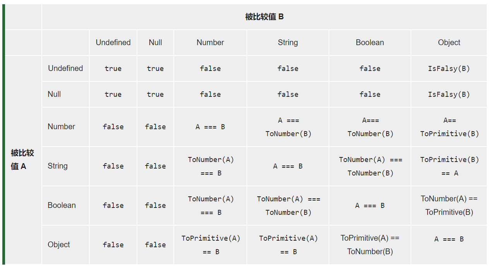

# JavaScript类型相关

## 讲一下===和==的区别

- ===是严格相等，不会发生类型转换，`NaN !== NaN`，`+0 === -0`
- ==是抽象相等(宽松相等)，会发生类型转换
- `Object.is`，是ES6新特性，和===类似，`Object.is(NaN,NaN) === true`，`Object.is(+0,-0) === false`

**严格相等===：**

会比较两个值是否相等，在比较之前不会进行隐式转换，如果两个值有不同的类型，则结果为false。

特殊情况：`NaN !== NaN`，`+0 === -0`

**宽松相等==：**

在比较之前会将两个值转换为相同的类型，在类型转换之后的比较方式和全等操作符===相等，转换规则如下：



`ToPrimitive(A)`通过尝试调用 A 的`A.toString()` 和 `A.valueOf()` 方法，将参数 A 转换为原始值（Primitive）。

```
// 一个没有提供 Symbol.toPrimitive 属性的对象，参与运算时的输出结果
var obj1 = {};
console.log(+obj1);     // NaN
console.log(`${obj1}`); // "[object Object]"
console.log(obj1 + ""); // "[object Object]"

// 接下面声明一个对象，手动赋予了 Symbol.toPrimitive 属性，再来查看输出结果
var obj2 = {
  [Symbol.toPrimitive](hint) {
    if (hint == "number") {
      return 10;
    }
    if (hint == "string") {
      return "hello";
    }
    return true;
  }
};
console.log(+obj2);     // 10      -- hint 参数值是 "number"
console.log(`${obj2}`); // "hello" -- hint 参数值是 "string"
console.log(obj2 + ""); // "true"  -- hint 参数值是 "default"
```

为了进行转换，JavaScript 尝试查找并调用三个对象方法：

1. 调用 `obj[Symbol.toPrimitive](hint)` —— 带有 symbol 键 `Symbol.toPrimitive`（系统 symbol）的方法，如果这个方法存在的话，
2. 否则，如果 hint 是 `"string"` —— 尝试 `obj.toString()` 和 `obj.valueOf()`，无论哪个存在。
3. 否则，如果 hint 是 `"number"` 或 `"default"` —— 尝试 `obj.valueOf()` 和 `obj.toString()`，无论哪个存在。

**valudOf的优先级大于toString**

**同值相等Object.is：**

同值相等解决了全等===在NaN和正负0上的异样表现：确定两个值是否在任何情况下功能上是相同的。也就是说对于一个比较值在任何情况下替换成另一个比较值时，功能上是相同的。

Object.is和全等===基本相同，除了`Object.is(NaN,NaN) === true`，`Object.is(+0,-0) === false`

## 字符和new出来的字符串有啥区别

字符串时js的基本类型，typeof的返回值为string

new出来的字符串时js的对象类型，也就是string的装箱类型，typeof的返回值是object


