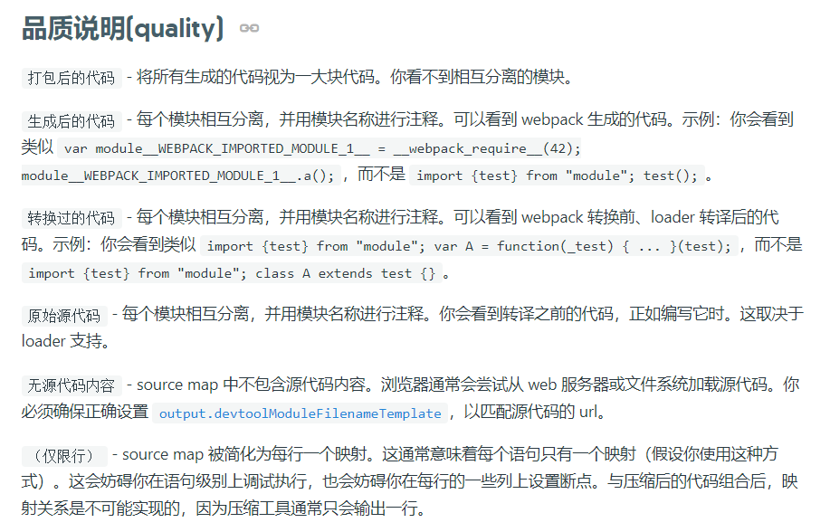

# Source Maps

## 作用

帮助调试，因为对着构建生成的代码debug不现实，所以需要对生成的代码映射到源代码，提升我们的调试效率，webpack内置了source maps插件我们可以自己配置想要的效果。

## 配置

webpack可以生成内联的或者额外的.map文件(通过注释链接到对应的.map文件)。

有inline，说明将.map作为dataURI嵌入。(有inline的也会生成.map，但是会将.map以base64编码的形式作为dataURI嵌入，体积会比原来的.map大三分之一)

有cheap，说明不包含列信息，也不包含loader的sourcemap。

如果有module，就是包含loader的sourcemap。

有eval就是用eval包裹模块代码。(在每个eval的末尾都指向源代码的地址的注释)

**生产环境用source-map，开发环境用cheap-module-eval-source-map或eval-sourcemap**

