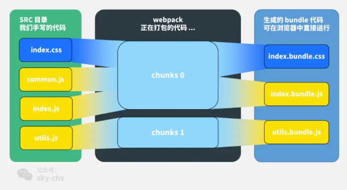

# chunk、bundle、module的区别

module、chunk、bundle是同一份逻辑代码在不同转换场景取的三个名字

module是我们写的源代码，每一个文件是一个module。

当webpack对我们的源代码进行打包时，会根据引用关系生成chunk文件，比如我们使用代码分割时、配splitChunk时就会生成chunk文件。

webpack处理好chunk文件后，最后会输出chunk文件，一些plugin会在这个时候对chunk进行处理，比如miniCssExtractPlugin会抽取出css文件，这样对于同一个chunk文件会有对应的.bundle.js和.bundle.css。