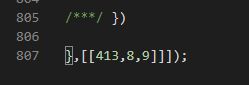
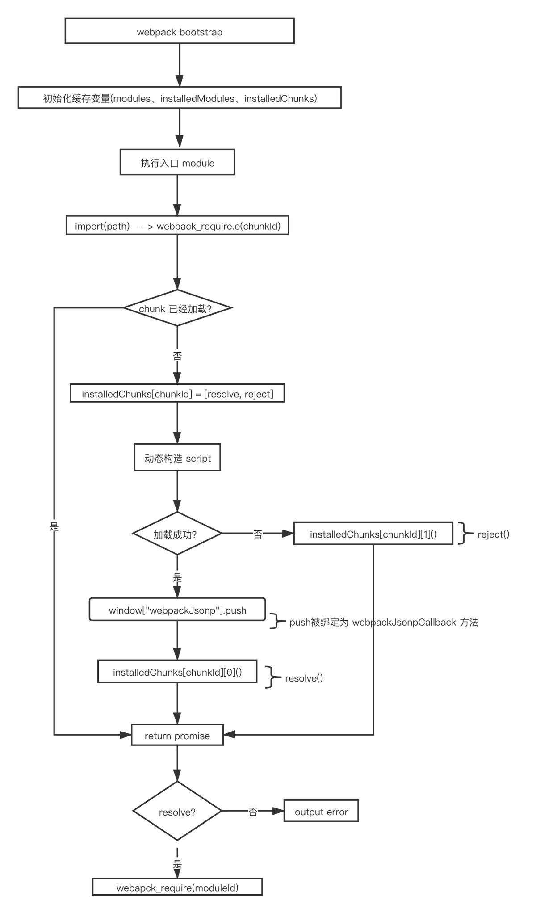

# Webpack运行时

## 运行时示例代码

```javascript
/******/ (function(modules) { // webpackBootstrap
/******/ 	// install a JSONP callback for chunk loading
/******/ 	function webpackJsonpCallback(data) {
/******/ 		var chunkIds = data[0];
/******/ 		var moreModules = data[1];
/******/ 		var executeModules = data[2];
/******/
/******/ 		// add "moreModules" to the modules object,
/******/ 		// then flag all "chunkIds" as loaded and fire callback
/******/ 		var moduleId, chunkId, i = 0, resolves = [];
/******/ 		for(;i < chunkIds.length; i++) {
/******/ 			chunkId = chunkIds[i];
/******/ 			if(Object.prototype.hasOwnProperty.call(installedChunks, chunkId) && installedChunks[chunkId]) {
/******/ 				resolves.push(installedChunks[chunkId][0]);
/******/ 			}
/******/ 			installedChunks[chunkId] = 0;
/******/ 		}
/******/ 		for(moduleId in moreModules) {
/******/ 			if(Object.prototype.hasOwnProperty.call(moreModules, moduleId)) {
/******/ 				modules[moduleId] = moreModules[moduleId];
/******/ 			}
/******/ 		}
/******/ 		if(parentJsonpFunction) parentJsonpFunction(data);
/******/
/******/ 		while(resolves.length) {
/******/ 			resolves.shift()();
/******/ 		}
/******/
/******/ 		// add entry modules from loaded chunk to deferred list
/******/ 		deferredModules.push.apply(deferredModules, executeModules || []);
/******/
/******/ 		// run deferred modules when all chunks ready
/******/ 		return checkDeferredModules();
/******/ 	};
/******/ 	function checkDeferredModules() {
/******/ 		var result;
/******/ 		for(var i = 0; i < deferredModules.length; i++) {
/******/ 			var deferredModule = deferredModules[i];
/******/ 			var fulfilled = true;
/******/ 			for(var j = 1; j < deferredModule.length; j++) {
/******/ 				var depId = deferredModule[j];
/******/ 				if(installedChunks[depId] !== 0) fulfilled = false;
/******/ 			}
/******/ 			if(fulfilled) {
/******/ 				deferredModules.splice(i--, 1);
/******/ 				result = __webpack_require__(__webpack_require__.s = deferredModule[0]);
/******/ 			}
/******/ 		}
/******/
/******/ 		return result;
/******/ 	}
/******/
/******/ 	// The module cache
/******/ 	var installedModules = {};
/******/
/******/ 	// object to store loaded CSS chunks
/******/ 	var installedCssChunks = {
/******/ 		8: 0
/******/ 	}
/******/
/******/ 	// object to store loaded and loading chunks
/******/ 	// undefined = chunk not loaded, null = chunk preloaded/prefetched
/******/ 	// Promise = chunk loading, 0 = chunk loaded
/******/ 	var installedChunks = {
/******/ 		8: 0
/******/ 	};
/******/
/******/ 	var deferredModules = [];
/******/
/******/ 	// script path function
/******/ 	function jsonpScriptSrc(chunkId) {
/******/ 		return __webpack_require__.p + "static/js/" + ({}[chunkId]||chunkId) + "." + {"0":"1a7e2aa3","1":"86774901","2":"71586893","3":"f1994a3b","4":"7bbd6aa8","5":"a7a72025","6":"4cbdf933","10":"92bd3097","11":"9eafc215","12":"d8130ab7","13":"d1c86c8b","14":"c27328f1","15":"287bf3a5","16":"f1a411bd","17":"0f67f7e4","18":"25965062","19":"08f9a8e1","20":"ee5f7dca","21":"8a53b176","22":"5ff63834","23":"51f7f3ad","24":"af72d505","25":"646da745","26":"2f7cfc9e","27":"df0242f3"}[chunkId] + ".chunk.js"
/******/ 	}
/******/
/******/ 	// The require function
/******/ 	function __webpack_require__(moduleId) {
/******/
/******/ 		// Check if module is in cache
/******/ 		if(installedModules[moduleId]) {
/******/ 			return installedModules[moduleId].exports;
/******/ 		}
/******/ 		// Create a new module (and put it into the cache)
/******/ 		var module = installedModules[moduleId] = {
/******/ 			i: moduleId,
/******/ 			l: false,
/******/ 			exports: {}
/******/ 		};
/******/
/******/ 		// Execute the module function
/******/ 		modules[moduleId].call(module.exports, module, module.exports, __webpack_require__);
/******/
/******/ 		// Flag the module as loaded
/******/ 		module.l = true;
/******/
/******/ 		// Return the exports of the module
/******/ 		return module.exports;
/******/ 	}
/******/
/******/ 	// This file contains only the entry chunk.
/******/ 	// The chunk loading function for additional chunks
/******/ 	__webpack_require__.e = function requireEnsure(chunkId) {
/******/ 		var promises = [];
/******/
/******/
/******/ 		// mini-css-extract-plugin CSS loading
/******/ 		var cssChunks = {"5":1,"10":1};
/******/ 		if(installedCssChunks[chunkId]) promises.push(installedCssChunks[chunkId]);
/******/ 		else if(installedCssChunks[chunkId] !== 0 && cssChunks[chunkId]) {
/******/ 			promises.push(installedCssChunks[chunkId] = new Promise(function(resolve, reject) {
/******/ 				var href = "static/css/" + ({}[chunkId]||chunkId) + "." + {"0":"31d6cfe0","1":"31d6cfe0","2":"31d6cfe0","3":"31d6cfe0","4":"31d6cfe0","5":"464c2a2e","6":"31d6cfe0","10":"f600b3f9","11":"31d6cfe0","12":"31d6cfe0","13":"31d6cfe0","14":"31d6cfe0","15":"31d6cfe0","16":"31d6cfe0","17":"31d6cfe0","18":"31d6cfe0","19":"31d6cfe0","20":"31d6cfe0","21":"31d6cfe0","22":"31d6cfe0","23":"31d6cfe0","24":"31d6cfe0","25":"31d6cfe0","26":"31d6cfe0","27":"31d6cfe0"}[chunkId] + ".chunk.css";
/******/ 				var fullhref = __webpack_require__.p + href;
/******/ 				var existingLinkTags = document.getElementsByTagName("link");
/******/ 				for(var i = 0; i < existingLinkTags.length; i++) {
/******/ 					var tag = existingLinkTags[i];
/******/ 					var dataHref = tag.getAttribute("data-href") || tag.getAttribute("href");
/******/ 					if(tag.rel === "stylesheet" && (dataHref === href || dataHref === fullhref)) return resolve();
/******/ 				}
/******/ 				var existingStyleTags = document.getElementsByTagName("style");
/******/ 				for(var i = 0; i < existingStyleTags.length; i++) {
/******/ 					var tag = existingStyleTags[i];
/******/ 					var dataHref = tag.getAttribute("data-href");
/******/ 					if(dataHref === href || dataHref === fullhref) return resolve();
/******/ 				}
/******/ 				var linkTag = document.createElement("link");
/******/ 				linkTag.rel = "stylesheet";
/******/ 				linkTag.type = "text/css";
/******/ 				linkTag.onload = resolve;
/******/ 				linkTag.onerror = function(event) {
/******/ 					var request = event && event.target && event.target.src || fullhref;
/******/ 					var err = new Error("Loading CSS chunk " + chunkId + " failed.\n(" + request + ")");
/******/ 					err.code = "CSS_CHUNK_LOAD_FAILED";
/******/ 					err.request = request;
/******/ 					delete installedCssChunks[chunkId]
/******/ 					linkTag.parentNode.removeChild(linkTag)
/******/ 					reject(err);
/******/ 				};
/******/ 				linkTag.href = fullhref;
/******/
/******/ 				var head = document.getElementsByTagName("head")[0];
/******/ 				head.appendChild(linkTag);
/******/ 			}).then(function() {
/******/ 				installedCssChunks[chunkId] = 0;
/******/ 			}));
/******/ 		}
/******/
/******/ 		// JSONP chunk loading for javascript
/******/
/******/ 		var installedChunkData = installedChunks[chunkId];
/******/ 		if(installedChunkData !== 0) { // 0 means "already installed".
/******/
/******/ 			// a Promise means "currently loading".
/******/ 			if(installedChunkData) {
/******/ 				promises.push(installedChunkData[2]);
/******/ 			} else {
/******/ 				// setup Promise in chunk cache
/******/ 				var promise = new Promise(function(resolve, reject) {
/******/ 					installedChunkData = installedChunks[chunkId] = [resolve, reject];
/******/ 				});
/******/ 				promises.push(installedChunkData[2] = promise);
/******/
/******/ 				// start chunk loading
/******/ 				var script = document.createElement('script');
/******/ 				var onScriptComplete;
/******/
/******/ 				script.charset = 'utf-8';
/******/ 				script.timeout = 120;
/******/ 				if (__webpack_require__.nc) {
/******/ 					script.setAttribute("nonce", __webpack_require__.nc);
/******/ 				}
/******/ 				script.src = jsonpScriptSrc(chunkId);
/******/
/******/ 				// create error before stack unwound to get useful stacktrace later
/******/ 				var error = new Error();
/******/ 				onScriptComplete = function (event) {
/******/ 					// avoid mem leaks in IE.
/******/ 					script.onerror = script.onload = null;
/******/ 					clearTimeout(timeout);
/******/ 					var chunk = installedChunks[chunkId];
/******/ 					if(chunk !== 0) {
/******/ 						if(chunk) {
/******/ 							var errorType = event && (event.type === 'load' ? 'missing' : event.type);
/******/ 							var realSrc = event && event.target && event.target.src;
/******/ 							error.message = 'Loading chunk ' + chunkId + ' failed.\n(' + errorType + ': ' + realSrc + ')';
/******/ 							error.name = 'ChunkLoadError';
/******/ 							error.type = errorType;
/******/ 							error.request = realSrc;
/******/ 							chunk[1](error);
/******/ 						}
/******/ 						installedChunks[chunkId] = undefined;
/******/ 					}
/******/ 				};
/******/ 				var timeout = setTimeout(function(){
/******/ 					onScriptComplete({ type: 'timeout', target: script });
/******/ 				}, 120000);
/******/ 				script.onerror = script.onload = onScriptComplete;
/******/ 				document.head.appendChild(script);
/******/ 			}
/******/ 		}
/******/ 		return Promise.all(promises);
/******/ 	};
/******/
/******/ 	// expose the modules object (__webpack_modules__)
/******/ 	__webpack_require__.m = modules;
/******/
/******/ 	// expose the module cache
/******/ 	__webpack_require__.c = installedModules;
/******/
/******/ 	// define getter function for harmony exports
/******/ 	__webpack_require__.d = function(exports, name, getter) {
/******/ 		if(!__webpack_require__.o(exports, name)) {
/******/ 			Object.defineProperty(exports, name, { enumerable: true, get: getter });
/******/ 		}
/******/ 	};
/******/
/******/ 	// define __esModule on exports
/******/ 	__webpack_require__.r = function(exports) {
/******/ 		if(typeof Symbol !== 'undefined' && Symbol.toStringTag) {
/******/ 			Object.defineProperty(exports, Symbol.toStringTag, { value: 'Module' });
/******/ 		}
/******/ 		Object.defineProperty(exports, '__esModule', { value: true });
/******/ 	};
/******/
/******/ 	// create a fake namespace object
/******/ 	// mode & 1: value is a module id, require it
/******/ 	// mode & 2: merge all properties of value into the ns
/******/ 	// mode & 4: return value when already ns object
/******/ 	// mode & 8|1: behave like require
/******/ 	__webpack_require__.t = function(value, mode) {
/******/ 		if(mode & 1) value = __webpack_require__(value);
/******/ 		if(mode & 8) return value;
/******/ 		if((mode & 4) && typeof value === 'object' && value && value.__esModule) return value;
/******/ 		var ns = Object.create(null);
/******/ 		__webpack_require__.r(ns);
/******/ 		Object.defineProperty(ns, 'default', { enumerable: true, value: value });
/******/ 		if(mode & 2 && typeof value != 'string') for(var key in value) __webpack_require__.d(ns, key, function(key) { return value[key]; }.bind(null, key));
/******/ 		return ns;
/******/ 	};
/******/
/******/ 	// getDefaultExport function for compatibility with non-harmony modules
/******/ 	__webpack_require__.n = function(module) {
/******/ 		var getter = module && module.__esModule ?
/******/ 			function getDefault() { return module['default']; } :
/******/ 			function getModuleExports() { return module; };
/******/ 		__webpack_require__.d(getter, 'a', getter);
/******/ 		return getter;
/******/ 	};
/******/
/******/ 	// Object.prototype.hasOwnProperty.call
/******/ 	__webpack_require__.o = function(object, property) { return Object.prototype.hasOwnProperty.call(object, property); };
/******/
/******/ 	// __webpack_public_path__
/******/ 	__webpack_require__.p = "/";
/******/
/******/ 	// on error function for async loading
/******/ 	__webpack_require__.oe = function(err) { console.error(err); throw err; };
/******/
/******/ 	var jsonpArray = this["webpackJsonp"] = this["webpackJsonp"] || [];
/******/ 	var oldJsonpFunction = jsonpArray.push.bind(jsonpArray);
/******/ 	jsonpArray.push = webpackJsonpCallback;
/******/ 	jsonpArray = jsonpArray.slice();
/******/ 	for(var i = 0; i < jsonpArray.length; i++) webpackJsonpCallback(jsonpArray[i]);
/******/ 	var parentJsonpFunction = oldJsonpFunction;
/******/
/******/
/******/ 	// run deferred modules from other chunks
/******/ 	checkDeferredModules();
/******/ })
/************************************************************************/
/******/ ([]);
```

## chunk文件代码示例




以上是其中一个有代表性的chunk文件代码示例，它有第三项 `executeModules`，其chunk代码不一定有。

## 运行时代码解读

### webpackJsonpCallback函数

webpack用来执行拆分成chunk的js代码的函数

- 当webpack_runtime加载时，它被用来执行已加载的chunk文件
- 当chunk文件加载时会调用**windows全局对象**下的**webpackJsonpCallback**的函数引用以执行chunk文件

chunk内容会被当做data传入**webpackJsonpCallback**函数：

chunk的格式为数组：

1. 数组的第一项为chunkIds数组，这个数组一般只有一项，当只有一项时这一项就是当前chunk的id。当有多项时第一项为当前chunk的id，后面的每一项id都是由于splitChunk分包的时候，由于分包策略被拆出去的小chunk的id，如果当前chunk加载完，由于当前chunk较大，包含了后面几个id对应的chunk的所有模块，所以可以直接将后面所有的chunk都标记为已加载(即0)。当后续加载到对应的chunk id时，无需再请求对应的chunk，而是在内存中判断到对应的chunk已加载`installedChunks[chunkId] === 0`，所以可以直接读取改chunk对应的所有模块内容。
2. 数组的第二项为当前chunk包含的module模块内容，由键值对组成，即键名为对应的moduleId，键值为对应的模块内容，这些模块内容对应相关模块的export。模块的id由webpack中的配置或使用的插件决定，一般在开发模式中是文件的相对路径名，在生产环境中为特定的数字或者哈希值。webpack4中一般使用哈希值来保证长效缓存。
3. 数组的第三项为`executeModules`，**不一定存在**，用来push到`deferredModules`中，(deferredModules后面讲)，现在暂时理解为入口模块的id和一些在运行入口代码前需要加载的chunk文件的id就好。

```javascript
 	// install a JSONP callback for chunk loading
 	function webpackJsonpCallback(data) {
        //只有一项时，是当前chunk的id，有多项时，后面几项是被当前chunk覆盖的chunk的id。
 		var chunkIds = data[0];
        //当前chunk包含的模块内容
 		var moreModules = data[1];
        //一些在执行入口模块前需要加载的chunk的信息
 		var executeModules = data[2];

 		// add "moreModules" to the modules object,
 		// then flag all "chunkIds" as loaded and fire callback
 		var moduleId, chunkId, i = 0, resolves = [];
        // 将所有chunkIds标记为已加载，并且将在加载状态的promise的resolve存起来后面一起resolve
 		for(;i < chunkIds.length; i++) {
 			chunkId = chunkIds[i];
 			if(Object.prototype.hasOwnProperty.call(installedChunks, chunkId) && installedChunks[chunkId]) {
 				resolves.push(installedChunks[chunkId][0]);
 			}
 			installedChunks[chunkId] = 0;
 		}
        //将当前chunk的模块合入到全局模块缓存modules中，之后会从modules中同步读取对应模块信息
 		for(moduleId in moreModules) {
 			if(Object.prototype.hasOwnProperty.call(moreModules, moduleId)) {
 				modules[moduleId] = moreModules[moduleId];
 			}
 		}
        //如果webpack-runtime先执行完的话，这个parentJsonpFunction会是全局windows对象下
        //一个数组的push方法，把该chunk push到这个数组中。
        //在多页应用中后面的页有可能复用这个chunk
 		if(parentJsonpFunction) parentJsonpFunction(data);
		//把所有还在加载状态中的promise给resolve掉
 		while(resolves.length) {
 			resolves.shift()();
 		}
	
 		// add entry modules from loaded chunk to deferred list
        // 把executeModules存在deferredModules中给checkDeferredModules函数判断
        // 是否入口所需的chunk都已加载完毕
 		deferredModules.push.apply(deferredModules, executeModules || []);

 		// run deferred modules when all chunks ready
 		return checkDeferredModules();
 	};
```


### checkDeferredModules函数

用来判断入口所依赖的chunk是否都已经加载完毕，没加载完毕时不执行入口模块，加载完毕时开始执行入口模块。

这个函数在webpack-runtime的最后会调用一次，以及在每一个chunk加载完时会调用一次。

这样webpack-runtime和其他的script的加载顺序不同时就不会影响到执行结果了，webpack只会在入口依赖的所有chunk都加载完后才开始执行入口模块。

```javascript
function checkDeferredModules() {
 		var result;
 		for(var i = 0; i < deferredModules.length; i++) {
 			var deferredModule = deferredModules[i];
 			var fulfilled = true;
 			for(var j = 1; j < deferredModule.length; j++) {
 				var depId = deferredModule[j];
 				if(installedChunks[depId] !== 0) fulfilled = false;
 			}
            // 如果都加载了，就执行入口模块
 			if(fulfilled) {
 				deferredModules.splice(i--, 1);
 				result = __webpack_require__(__webpack_require__.s = deferredModule[0]);
 			}
 		}

 		return result;
 	}
```

### installedModules模块缓存

所有chunk中的模块都会缓存在这个`installedModules`对象中，键名为模块唯一的键名，模块是模块的导出内容。

### installedCssChunks 存储css chunk的状态

这个是用了`mini-css-extract-plugin`插件后才会有的对象，用来存储各个css chunk 对应的状态，和installedChunks表达方式相同。

### installedChunks 存储chunk的状态

这个对象用来存储每个js chunk的状态。共有4中状态：

- **undefined = chunk还未加载**
- **null = chunk 要preloaded或者prefetched**
- **Promise = chunk正在加载中**
- **0 = chunk已经加载**

### deferredModules 被推迟执行的模块

是一个数组，数组的**第一项是入口模块的id**，后面的都是在**执行入口模块之前需要加载完毕的chunk 的id**。

如[413,8,9]则表示入口模块id为413，需要id为8和9的chunk都加载完毕才能执行入口模块。

### jsonpScriptSrc方法

script路径拼接的方法，这也是为什么我们修改项目源代码后webpack-runtime的哈希值会变的原因，因为要存储对应的chunk的id，所以只要有任意一个chunk发生了变化，都会导致webpack-runtime发生变化

```javascript
function jsonpScriptSrc(chunkId) {
 		return __webpack_require__.p + "static/js/" + ({}[chunkId]||chunkId) + "." + {"0":"1a7e2aa3","1":"86774901","2":"71586893","3":"f1994a3b","4":"7bbd6aa8","5":"a7a72025","6":"4cbdf933","10":"92bd3097","11":"9eafc215","12":"d8130ab7","13":"d1c86c8b","14":"c27328f1","15":"287bf3a5","16":"f1a411bd","17":"0f67f7e4","18":"25965062","19":"08f9a8e1","20":"ee5f7dca","21":"8a53b176","22":"5ff63834","23":"51f7f3ad","24":"af72d505","25":"646da745","26":"2f7cfc9e","27":"df0242f3"}[chunkId] + ".chunk.js"
 	}
```

### \_\_webpack_require\_\_ 函数

webpack加载模块的核心函数，用于封装模块和返回已封装模块的输出。

webpack还在这个函数上挂载了很多的辅助函数，后面会介绍到。

```javascript
 	function __webpack_require__(moduleId) {

 		// Check if module is in cache
 		if(installedModules[moduleId]) {
 			return installedModules[moduleId].exports;
 		}
 		// Create a new module (and put it into the cache)
 		var module = installedModules[moduleId] = {
 			i: moduleId,
 			l: false,
 			exports: {}
 		};

 		// Execute the module function
 		modules[moduleId].call(module.exports, module, module.exports, __webpack_require__);

 		// Flag the module as loaded
 		module.l = true;

 		// Return the exports of the module
 		return module.exports;
 	}
```

### \_\_webpack_require\_\_.e 函数

用来加载非入口chunk的函数，也就是所谓的“异步加载”。我们在源代码中使用`import()`的代码就会被webpack拆成以这样的形式加载，以减小初始bundle的大小。

```javascript
 	__webpack_require__.e = function requireEnsure(chunkId) {
        //用来决议的promise数组
 		var promises = [];


 		// mini-css-extract-plugin CSS loading
        // 这个对象的键名包含了所有非入口css文件的id，找不到就是没有这个css文件
 		var cssChunks = {"5":1,"10":1};
 		if(installedCssChunks[chunkId]) promises.push(installedCssChunks[chunkId]);
 		else if(installedCssChunks[chunkId] !== 0 && cssChunks[chunkId]) {
 			promises.push(installedCssChunks[chunkId] = new Promise(function(resolve, reject) {
 				var href = "static/css/" + ({}[chunkId]||chunkId) + "." + {"0":"31d6cfe0","1":"31d6cfe0","2":"31d6cfe0","3":"31d6cfe0","4":"31d6cfe0","5":"464c2a2e","6":"31d6cfe0","10":"f600b3f9","11":"31d6cfe0","12":"31d6cfe0","13":"31d6cfe0","14":"31d6cfe0","15":"31d6cfe0","16":"31d6cfe0","17":"31d6cfe0","18":"31d6cfe0","19":"31d6cfe0","20":"31d6cfe0","21":"31d6cfe0","22":"31d6cfe0","23":"31d6cfe0","24":"31d6cfe0","25":"31d6cfe0","26":"31d6cfe0","27":"31d6cfe0"}[chunkId] + ".chunk.css";
 				var fullhref = __webpack_require__.p + href;
 				var existingLinkTags = document.getElementsByTagName("link");
 				for(var i = 0; i < existingLinkTags.length; i++) {
                    //查找是否已加载，因为不为promise且不为0还有prefetch和preload的可能(null)
                    //有可能我还没发这个请求它就已经请求回来插入link标签了
                    //所以找到有对应的link就直接resolve
 					var tag = existingLinkTags[i];
 					var dataHref = tag.getAttribute("data-href") || tag.getAttribute("href");
 					if(tag.rel === "stylesheet" && (dataHref === href || dataHref === fullhref)) return resolve();
 				}
 				var existingStyleTags = document.getElementsByTagName("style");
 				for(var i = 0; i < existingStyleTags.length; i++) {
 					var tag = existingStyleTags[i];
 					var dataHref = tag.getAttribute("data-href");
 					if(dataHref === href || dataHref === fullhref) return resolve();
 				}
 				var linkTag = document.createElement("link");
 				linkTag.rel = "stylesheet";
 				linkTag.type = "text/css";
 				linkTag.onload = resolve;
 				linkTag.onerror = function(event) {
 					var request = event && event.target && event.target.src || fullhref;
 					var err = new Error("Loading CSS chunk " + chunkId + " failed.\n(" + request + ")");
 					err.code = "CSS_CHUNK_LOAD_FAILED";
 					err.request = request;
 					delete installedCssChunks[chunkId]
 					linkTag.parentNode.removeChild(linkTag)
 					reject(err);
 				};
 				linkTag.href = fullhref;

 				var head = document.getElementsByTagName("head")[0];
 				head.appendChild(linkTag);
 			}).then(function() {
                //css比js简单的部分就在于加载成功直接标记为已加载(0)就行了
                //js还要取执行一次webpackJsonCallback
 				installedCssChunks[chunkId] = 0;
 			}));
 		}

 		// JSONP chunk loading for javascript

 		var installedChunkData = installedChunks[chunkId];
 		if(installedChunkData !== 0) { // 0 means "already installed".

 			// a Promise means "currently loading".
 			if(installedChunkData) {
 				promises.push(installedChunkData[2]);
 			} else {
 				// setup Promise in chunk cache
 				var promise = new Promise(function(resolve, reject) {
 					installedChunkData = installedChunks[chunkId] = [resolve, reject];
 				});
 				promises.push(installedChunkData[2] = promise);

 				// start chunk loading
 				var script = document.createElement('script');
 				var onScriptComplete;

 				script.charset = 'utf-8';
 				script.timeout = 120;
 				if (__webpack_require__.nc) {
 					script.setAttribute("nonce", __webpack_require__.nc);
 				}
 				script.src = jsonpScriptSrc(chunkId);

 				// create error before stack unwound to get useful stacktrace later
 				var error = new Error();
 				onScriptComplete = function (event) {
 					// avoid mem leaks in IE.
 					script.onerror = script.onload = null;
 					clearTimeout(timeout);
 					var chunk = installedChunks[chunkId];
 					if(chunk !== 0) {
 						if(chunk) {
 							var errorType = event && (event.type === 'load' ? 'missing' : event.type);
 							var realSrc = event && event.target && event.target.src;
 							error.message = 'Loading chunk ' + chunkId + ' failed.\n(' + errorType + ': ' + realSrc + ')';
 							error.name = 'ChunkLoadError';
 							error.type = errorType;
 							error.request = realSrc;
 							chunk[1](error);
 						}
 						installedChunks[chunkId] = undefined;
 					}
 				};
 				var timeout = setTimeout(function(){
 					onScriptComplete({ type: 'timeout', target: script });
 				}, 120000);
 				script.onerror = script.onload = onScriptComplete;
 				document.head.appendChild(script);
 			}
 		}
        //数组的好处就是即使是空数组，也可以决议。也就是对于已经加载过的模块直接决议。
 		return Promise.all(promises);
 	};
```

### \_\_webpack_require\_\_.m 已请求模块

`__webpack_require__.m=modules`指向webpack已请求的所有模块。

### \_\_webpack_require\_\_.c 已执行模块

` __webpack_require__.c = installedModules`执行webpack已执行的所有模块

### \_\_webpack_require\_\_.d 函数

给es6模块进行封装，把导出都封装在exports对象上

```javascript
 	// define getter function for harmony exports

 	__webpack_require__.d = function(exports, name, getter) {
 		if(!__webpack_require__.o(exports, name)) {
 			Object.defineProperty(exports, name, { enumerable: true, get: getter });
 		}
 	};
```

### \_\_webpack_require\_\_.r 函数

给导出exports添加模块标识符。标识哪些是es6模块

```javascript
 	// define __esModule on exports
 	__webpack_require__.r = function(exports) {
 		if(typeof Symbol !== 'undefined' && Symbol.toStringTag) {
 			Object.defineProperty(exports, Symbol.toStringTag, { value: 'Module' });
 		}
 		Object.defineProperty(exports, '__esModule', { value: true });
 	};
```

### \_\_webpack_require\_\_.t 函数

没看到在生成的代码里哪里用到了，先不管咯。

```javascript
 	// create a fake namespace object
 	// mode & 1: value is a module id, require it
 	// mode & 2: merge all properties of value into the ns
 	// mode & 4: return value when already ns object
 	// mode & 8|1: behave like require
 	__webpack_require__.t = function(value, mode) {
 		if(mode & 1) value = __webpack_require__(value);
 		if(mode & 8) return value;
 		if((mode & 4) && typeof value === 'object' && value && value.__esModule) return value;
 		var ns = Object.create(null);
 		__webpack_require__.r(ns);
 		Object.defineProperty(ns, 'default', { enumerable: true, value: value });
 		if(mode & 2 && typeof value != 'string') for(var key in value) __webpack_require__.d(ns, key, function(key) { return value[key]; }.bind(null, key));
 		return ns;
 	};
```

### \_\_webpack_require\_\_.n 函数

用来兼容ES6模块和CommonJS模块的default 导出的函数。保证获取default的时候拿到正确语义的内容。

```javascript
 	// getDefaultExport function for compatibility with non-harmony modules
 	__webpack_require__.n = function(module) {
 		var getter = module && module.__esModule ?
 			function getDefault() { return module['default']; } :
 			function getModuleExports() { return module; };
 		__webpack_require__.d(getter, 'a', getter);
 		return getter;
 	};
```

### \_\_webpack_require\_\_.o 函数

Object.prototype.hasOwnProperty的封装

```javascript
	// Object.prototype.hasOwnProperty.call
 	__webpack_require__.o = function(object, property) { return Object.prototype.hasOwnProperty.call(object, property); };
```

### \_\_webpack_require\_\_.p 字符串

是我们在`output.publicPath`中配的值

### \_\_webpack_require\_\_.oe 函数

异步加载的错误处理函数

```javascript
// on error function for async loading
 	__webpack_require__.oe = function(err) { console.error(err); throw err; };
```

### jsonpArray 相关逻辑

在webpack-runtime的最后有一小段`jsonpArray`的同步执行逻辑，它的设计非常巧妙，可以让webpack-runtime和index.html中的script标签在加载顺序未知时仍能正确地执行入口模块。这多亏了对于`this["webpackJsonp"]`数组的push方法的修改以及`checkDeferredModules`函数的实现。

```javascript
 	var jsonpArray = this["webpackJsonp"] = this["webpackJsonp"] || [];
 	var oldJsonpFunction = jsonpArray.push.bind(jsonpArray);
 	jsonpArray.push = webpackJsonpCallback;
 	jsonpArray = jsonpArray.slice();
 	for(var i = 0; i < jsonpArray.length; i++) webpackJsonpCallback(jsonpArray[i]);
 	var parentJsonpFunction = oldJsonpFunction;


 	// run deferred modules from other chunks
 	checkDeferredModules();
```

分情况：

#### webpack-runtime先于其他所有script标签加载完成

初次加载时，jsonpArray和this["webpackJsonp"]初始化为空数组。

oldJsonpFunction初始化为该数组绑定this值后的push函数。

然后将该数组的push方法替换成webpackJsonpCallback(上面已经讲过该函数作用)

然后将jsonpArray复制回成改数组的浅拷贝，此时jsonpArray为空，不做任何操作。

将parentJsonpFunction赋值为那个绑定了this值的push方法

然后进行一次checkDeferredModules方法看入口所依赖的chunk是否加载完毕，在这种情况下是尚未加载完毕。

然后当其他的script标签加载时，执行模块内的

```javascript
(this["webpackJsonp"] = this["webpackJsonp"] || []).push([[chunkId],{模块内容},[[deferredModuleId和需要先加载的chunkIds]]]);
```

这个时候this["webpackJsonp"]已经初始化为空数组，然后这时候的push已经被替换为webpackJsonpCallback，我们看webpackJsonpCallback的代码可以知道就是执行对应的chunk代码，并检测是否能执行入口模块。所以当最后一个入口模块依赖的chunk加载完时，就会执行入口模块。

#### webpack-runtime在其他script标签之间或之后加载完成

了解完了webpack-runtime先加载完的情况之后，我们就知道，如果先加载并执行chunk代码时，我们的`this["webpackJsonp"]`的push函数还没被替换，这个时候我们会将该chunk的内容push到这个数组中，

当webpack-runtime加载并执行时，他会替换`this["webpackJsonp"]`上面的push方法为webpackJsonpCallback，并且对该数组中的每一项执行webpackJsonpCallback，当执行到webpack-runtime中的`checkDeferredModules()`时，如果入口所需的chunk都已经加载完了则执行入口模块，否则，等其他的chunk加载并执行`this["webpackJsonp"].push`时再去`checkDeferredModules()`检测是否执行入口模块。因此webpack做到了无论webpack-runtime和其他script标签的加载顺序如何都能保证执行入口模块时，所需的chunk都已加载完毕。

除此之外，我们可以发现，对于入口模块所需的所有chunk，我们都push到了`this["webpackJsonp"]`中，这对单页应用可能没啥用，但是对于多页应用而言，它可以服用在多个页面入口共同依赖的chunk，减少了在多页应用加载中重复加载相同依赖的请求。(这种多页应用依赖于相同的chunk一般都是自己在webpack中配置的依赖内容)，视分包策略而不同。

## 运行时流程图

### 入口加载


### 异步加载




## 参考

[Webpack 是怎样运行的?（一）](https://zhuanlan.zhihu.com/p/52826586)

[聊聊 webpack 异步加载（一）：webpack 如何加载拆包后的代码](https://www.toutiao.com/i6790221102615364108/)


