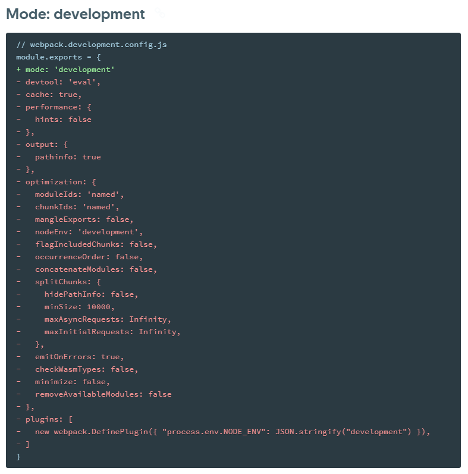

# webpack配置

webpack配置中常用的配置。

## 安装webpack

需要同时安装webpack和 webpack-cl/webpack-nano

建议本地安装webpack，不要全局安装，以保持开发人员之间的webpack版本相同，以保证生产环境的webpack版本和开发环境相同，避免版本不同产生的bug。

## entry(入口)

表示应用程序打包的一个或多个起点，如果传入数组，则会处理所有条目。

**动态加载的模块不是入口起点。**

如果传入一个字符串或字符串数组，chunk会被命名为main。如果传入一个对象，则每个属性的键(key)会是chunk的名称，value是一个可解析的模块路径，value为字符串数组时，表示需要将数组里的模块打包到一起。

对象形式是entry的最完整形式，字符串是简化的entry:{main:'xxx'}，字符串数组是简化的entry:{main:['xxxx','yyyy']}。

## mode(模式)

有三个值`'none'/'development'/'production'`。会自动根据选中的模式开启对应的优化选项，及设置响应的环境变量。




## output(输出)

包含了一组选项，控制webpack如何输出，在哪里打包的bundule、asset和其他所打包或者使用webpack载入的任何内容。

### charset

告诉webpack为html的`<script>`标签添加`charset="utf-8"`标识。默认为true

### chunkFilename

这个选项决定了非初始chunk文件的名称，默认为`[id].js`。取值占位符和`output.filename`相同。

这些文件名需要在运行时根据chunk发送的请求去生成，所以需要在webpack runtime输出bundle时，将chunk id的值对应映射到占位符(如[name]和[chunkhash])。这会增加文件的大小，**并且在任何chunk的占位符值修改后，都会使bundle失效**。

### filename

此选项决定了每个输出bundle的名称，也就是入口js的名称。这些bundle将写入到`output.path`选项指定的目录下。这个选项只能设置初始加载的输出文件，对于按需加载的chunk文件，需要在`output.chunkFilename`里设置。

### globalObject

决定使用哪个全局变量来挂载library，默认为`window`，设置成`this`，可以让web worker也生效

### path

output目录的绝对路径。

### pathinfo

告知webpack在bundle中引入所包含模块信息的相关注释，在开发模式下默认true，生产模式默认false。

### publicPath

对于按需加载或外部资源如图片和文件来说，这是很重要的选项，如果指定了错误的值，则在加载这些资源时会受到404错误。这个选项指定在浏览器中所引用的 **此输出目录对应的公开URL**。可能是CDN的托管地址。

该选项的值以runtime或loader所创建的每个URL为前缀，**因此大多数情况下都以"/"结束。**

### futureEmitAssets

告诉 webpack 使用未来版本的资源文件 emit 逻辑，允许在 emit 后释放资源文件的内存。这可能会破坏那些认为资源文件 emit 后仍然可读的插件。webpack5次选项被移除并且这种行为将被默认支持。

## module(模块)

### noParse

防止 webpack 解析那些任何与给定正则表达式相匹配的文件。忽略的文件中**不应该含有**import，require，define的调用，或者任何其他导入机制。忽略大型的library可以提高构建性能。

### strictExportPresence

为true时，将缺失的导出提示成错误而不是警告

### rules

创建模块时，匹配请求的规则数组，这系规则能够修改模块的创建方式，这些规则能够对模块应用loader或者parser。

条件有两种输入值：

- resource：资源文件的绝对路径。它已经根据resolve规则解析。
- issuer：请求者的文件绝对路径。是导入时的位置。

在规则中，属性`test、include、excluce、resource`对resource匹配，属性`issuer`对issuer匹配。

规则结果只在规则条件匹配时使用。

规则有两种输入值：

- 应用的loader：应用在resource上的loader数组
- Parser选项：用于为模块创建解析器的选项对象

这些属性会影响loader：`loader,options,use`

也兼容这些属性：`query，loaders`

`enforce`属性会影响loader种类，无论的普通的，前置的，还是后置的loader。

`parser`属性会影响parser选项。

可以使用`rules`和`oneOf`指定嵌套规则。

被解析的顺序基于以下规则：

1. 父规则
2. rules
3. oneOf

#### enforce

"pre"|"post"。指定loader种类。没有值表示是普通loader。**一般在eslint-loader上使用“pre”来让语法检测最先执行以避免不必要的编译工作。**

#### exclude

排除所有符合条件的模块。正则表达式或者正则数组

#### include

引入所有符合条件的模块。正则表达式或者正则数组

#### loader

是`Rule.use:[{loader}]`的简写。

#### oneOf

规则数组，当规则匹配时，只使用第一个匹配规则。

#### sideEffects

表明模块的那一部分包含副作用。

#### test

用于匹配模块

#### use

loader配置数组。`use:['style-loader']`是`use:[{loader:'style-loader'}]`的简写。

**use中的数组会从右到左被应用。**所以要配置好顺序

## resolve(解析)

### alias

创建import或require的别名，来确保模块引入变得更简单。值为对象，里面的键值对，键名作为别名，值作为被替代的路径。可以在键后增加"$"来进行精确匹配。

```js
alias: {
      Utilities: path.resolve(__dirname, 'src/utilities/'),
      Templates: path.resolve(__dirname, 'src/templates/'),
},
```

```js
import Utility from '../../utilities/utility';
```

```js
import Utility from 'Utilities/utility';
```

### enforceExtension

是否强制拓展名，默认为false，设置为true引用模块时需要拓展名。

### extensions

字符串数组，尝试按顺序解析这些后缀名，如：

```js
 resolve: {
    extensions: ['.wasm', '.mjs', '.js', '.json'],
  },
```

### mainFields

字符串数组。当从npm包中导入模块时，如`import * as D3 from 'd3'`，此选项将决定在`package.json`中使用哪个字段导入模块。默认值为：

```js
 resolve: {
    mainFields: ['browser', 'module', 'main'],
  },
```

例如，考虑任意一个名为 `upstream` 的类库 `package.json` 包含以下字段：

```json
{
  "browser": "build/upstream.js",
  "module": "index"
}
```

在我们 `import * as Upstream from 'upstream'` 时，这实际上会从 `browser` 属性解析文件。 在这里 `browser` 属性是最优先选择的，因为它是 `mainFields` 的第一项。

### modules

字符串数组。告诉webpack解析模块时应该搜索的目录。

### plugins

插件数组。解析过程应该使用的额外的解析插件列表。

## resolveLoader

resolveLoader选项和resolve对象的属性集合相同，但仅用于解析webpack的loader包。

## Optimization(优化)

### minimize

是否开启压缩。告知webpack使用TerserPlugin或其他在`optimization.minimizer`定义的插件压缩bundle

### minimizer

允许我们通过提供一个或多个定制过的plugin实例，覆盖默认压缩工具。

项目中添加了**terser-webpack-plugin**和**optimize-css-assets-webpack-plugin**分别进行JS和css的压缩。

### splitChunks

webpack4提供的内置**split-chunks-plugin**帮助我们进行分包的配置，具体配置可以参考**split-chunks-plugin**。

### runtimeChunk

设置为true或者'multiple'，会喂每个只含有runtime的入口添加一个额外chunk。'single'会创建一个在所有生成chunk之间共享的运行时文件。

默认值是false，在每个入口chunk直接嵌入runtime。

### emitOnErrors

默认值为false。当为true时，每当编译时有错误发生，就会emit asset，这样可以确保出错的asset被emit出来。关键错误会被emit中，并在运行时报错

### moduleIds

告知模块选择模块id时需要使用哪种算法。

| 可选值        | 描述                                |
| ------------- | ----------------------------------- |
| false(默认值) | 不使用任何内置算法                  |
| natural       | 按使用顺序的数字id                  |
| named         | 对调试更友好的可读id                |
|               |                                     |
| size          | 专注于让初始下载包大小更小的数字 id |

`deterministic` 选项有益于长期缓存，不会因为模块的导入顺序而影响生成包的id的变化。

### chunkIds

告知webpack当选择模块id时需要使用哪种算法。

| 可选值              | 描述             |
| ------------------- | ---------------- |
| false(默认)         | 不回用任何算法   |
|                     |                  |
| named(开发环境默认) | 对调试更友好的id |

## plugins(插件)

添加webpack构建过程中的插件。

## devServer(开发服务器)

### compress

boolean，是否为每个静态文件开启gzip压缩。

### contentBase

告诉服务器内容的来源，仅在需要提供静态文件时配置，也就是index.html。实现上相当于把你配的地址的内容给拷贝到了output指定的位置(默认在内存中)，然后给你起个服务，让你可以获取到index.html。在项目中就是把public里的内容“虚拟地”拷贝到/dist里。

### contentBasePublicPath 

告诉服务器使用哪个URL服务`devServer.contentBase`静态内容。项目中是“/”。

### headers

为所有请求添加响应头，即模拟服务器返回。

```javascript
 devServer: {
    headers: {
      'X-Custom-Foo': 'bar'
    }
  }
```

### host

指定要使用的host，如果希望服务器可以从外部访问，要配置成`0.0.0.0`。

### hot

是否启动HMR

### https

是否开启https

### proxy

一般用来转发http请求以避免跨域。

### publicPath

打包的文件将在这个路径下的浏览器中可用。

### quiet

启动之后除了初始启动信息外，其他的都不会写入控制台，所以webpack的错误或者告警都不可见。

### watchContentBase

告诉dev-server监听`devServer.contentBase`选项提供的文件。这样更改index.html文件就会触发更新了。

### writeToDisk

是否把构建文件写入硬盘，默认写入内存中。

## devtool

sourceMap的选项。在sourceMap章节讲。

## bail

当第一个错误出现时抛出失败结果，而不是容忍它。默认情况下，当使用HMR时，webpack会将在终端和浏览器控制台中以红色文字记录这些错误，但仍然继续打包。在开发环境为false，生产环境为true，这样可以在build出现错误时直接停止。

