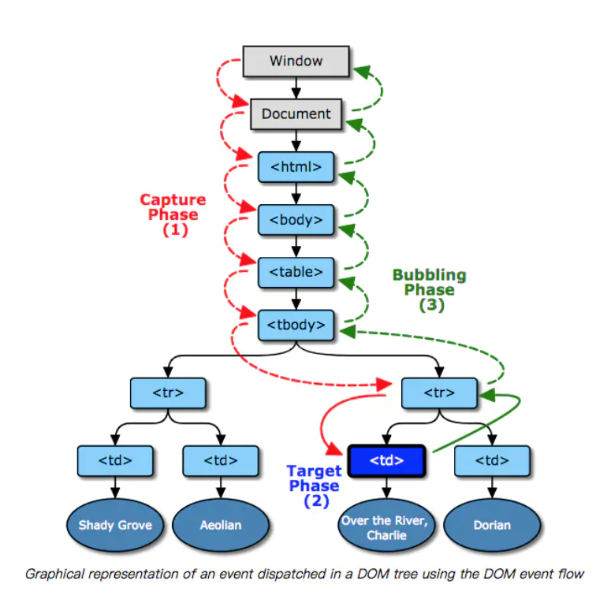

# 浏览器中的事件机制

浏览器中事件传播的三个阶段：

- 捕获
- 目标对象
- 冒泡



捕获capture是指事件对象从window派发到目标对象父级的过程。

目标target阶段是指事件对象派发到目标元素时的阶段，如果事件类型指示不冒泡，那事件传播将在这个阶段终止。

冒泡bubbing阶段和捕获相反，是从目标对象父级到window的过程。

## 事件绑定

传统的绑定方法，`onclick=xxx`，使用的是**冒泡机制**，并且一个事件只能绑定一个函数，因为赋值会覆盖。

非IE浏览器中使用`addEventListener(eventName,callback,isCapturing)`绑定事件，可以绑定多个事件，按绑定顺序执行，并且最后一个`isCapturing`参数true表示采用捕获机制，false表示采用冒泡机制，**不传第三个参数默认为false**。

由于IE8以下不支持`addEventListener`，采用IE独有的`attachEvent(eventName,callback)`，没有第三个参数，无法指定事件处理机制，**默认使用捕获机制**。

`onlick=xxx`和`addEventListener`的执行顺序和绑定的顺序相同，`onlick=xxx`是冒泡。


## 事件触发顺序

对于非目标节点，绑定的对应事件的回调会先进行捕获的，再进行冒泡的，并且在每个阶段绑定多个时按绑定顺序执行。

**对于目标节点，无论绑定的是capture还是bubble阶段，都按照绑定的顺序执行，因为对于目标节点没有所谓捕获和冒泡。**

## 阻止事件传播

在任一阶段调用`stopPropagation`都可以阻止事件的传播，不管是捕获还是冒泡，都会停止传播。

在IE浏览器中，使用`e.cancelBubble = true`阻止事件冒泡，虽然叫`cancelBubble`，但也不管是捕获还是冒泡，都会停止传播。

## stopPropagation和stopImmediatePropagation区别

`stopPropagation`只是阻止了事件的传播，但是它会把当前节点绑定的相同事件类型的回调都执行了。

如果多个事件监听器被附加到相同元素的相同事件类型上，当此事件触发时，它们会按其被添加的顺序被调用。如果在其中一个事件监听器中执行 `stopImmediatePropagation()` ，那么剩下的事件监听器都不会被调用。

## 事件委托

事件委托指的是将一个元素响应事件的函数委托到另一个元素。

一般来说我们都在触发事件的元素上绑定事件，但当节点数量过多，或者节点经常变化(动态)时，处理起来就比较麻烦且性能低，占用内存高。

节点数量过多：导致事件绑定的回调函数过多，占用内存，当相同类型的节点成百上千时占用内存高。

节点进场变化时：当新增节点时，我们需要绑定对应的回调函数，当节点删除时，我们需要解绑对应的回调函数，操作麻烦。

所以我们可以把事件委托给父节点统一处理，减少了事件绑定的回调函数数量，节省内存，并且不用处理动态新增和删除的节点。

一般来说我们都在冒泡阶段处理事件，所以事件委托一般也在冒泡阶段进行。

```
<ul id="list">
  <li>item 1</li>
  <li>item 2</li>
  <li>item 3</li>
  ......
  <li>item n</li>
</ul>
// ...... 代表中间还有未知数个 li
```

```
// 给父层元素绑定事件
document.getElementById('list').addEventListener('click', function (e) {
  // 兼容性处理
  var event = e || window.event;
  var target = event.target || event.srcElement;
  // 判断是否匹配目标元素
  if (target.nodeName.toLocaleLowerCase === 'li') {
    console.log('the content is: ', target.innerHTML);
  }
});
```

当有可能出现嵌套时，如：

```
<ul id="list">
  <li className="class-1">item 1</li>
  <li>item 2</li>
  <li className="class-1">item 3</li>
  ......
  <li>item n</li>
</ul>
// ...... 代表中间还有未知数个 li
```

```
　　var oUl = document.getElementById('list');
    oUl.addEventListener('click',function(ev){
        var target = ev.target;
        while(target !== oUl ){
            if(target.tagName.toLowerCase() == 'li'){
                console.log('li click~');
                break;
            }
            target = target.parentNode;
        }
    })
    //通过不断向上查找父节点，以找到需要委托的元素。
```

### 事件委托优点

- 减少事件回调函数注册数量，节省内存
- 简化了dom更新时，相应事件的更新

### 事件委托缺点

- 事件委托基于事件传播，对于没有传播的事件不支持，如：onblur、onfocus
- 层级过多时，在冒泡的某层可能被阻止掉

### 适合和不适合委托的事件

适合：click，mousedown，mouseup，keydown，keyup，keypress等事件。

不适合：mouseover、mouseout、mousemove等不断通过位置去计算定位的对性能消耗高，也不适合事件委托。

没得委托：focus、blur等没有传播特性的事件。


