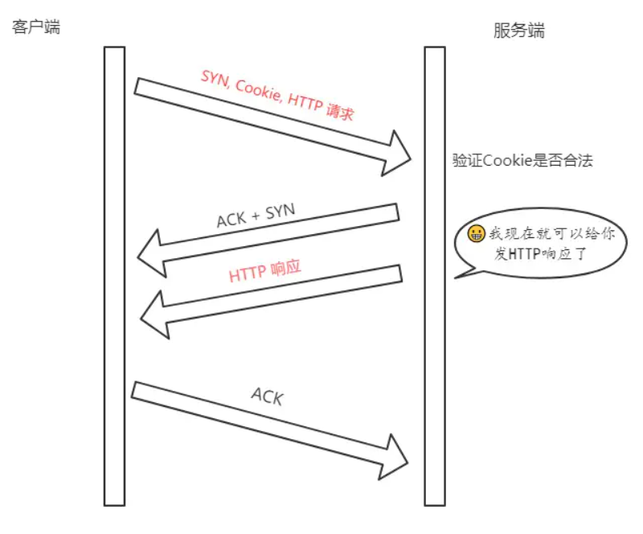

# TCP相关

## TCP和UDP的区别

**TCP是一个面向连接的、可靠的、基于字节流的传输层协议。**

**UDP是一个面向无连接的传输层协议**

TCP是可靠的，UDP是尽力而为的

在对系统资源的要求上：TCP要求多，UDP要求少

报文结构：TCP复杂，UDP简单

TCP保证顺序，UDP不保证

TCP是面向连接的，所以一次只能向一台机器发送报文，而UDP是无连接的，可以同时向多台机器发送同样的报文

TCP有拥塞控制，UDP没有

TCP头部大(20字节)，UDP头部小(8字节)

TCP是面向字节流的，UDP是面向报文的(应用层的数据加个UDP头就传给IP层了)

**应用场景：**

TCP适用于可靠性要求高

UDP适用于实时性要求高，有少量丢包无所谓的场景。

## 讲讲TCP三次握手

### 三次握手的目的

握手的意义是为了确认双方的两种能力：**发送的能力** 和 **接收的能力**

第一次握手：客户端发起SYN，自己从CLOSED变成SYN-SENT，服务端收到，因此服务端确定了客户端有**发送的能力**。

第二次握手：服务端收到SYN之后，返回SYN和ACK，自己变成SYN-RCVD状态。

第三次握手：客户端收到服务端返回的SYN和ACK，证明了服务端有**发送的能力**和**接收的能力**，于是发送ACK给服务端，自己变成ESTABLISHED状态，服务端收到客户端的ACK之后得知了客户端有**接收的能力**，也变成ESTABLISHED，握手结束。

三次握手客服端和服务端各自证明了对方有发送的能力和接收的能力。

**凡是需要对端确认的，一定消耗TCP报文的序列号。**

SYN需要对端的确认，而ACK不用，所以SYN消耗一个序列号而ACK不需要。

### 为什么不是两次

根本原因：无法确认客户端的接收能力。

如果是两次握手，假设发送了一个SYN报文向握手，但是报文由于网络原因直流在网络链路中阻塞没有到达，TCP认为是丢包而进行重传，重传的包到达后服务器响应成功握手建立起了连接，如果这次连接传输完之后关闭了连接之后，滞留的那个包又到达了服务器，这个服务器接收到，误以为客户端想建立连接，因为是两次握手，服务端接收并确认之后建立起连接，但是客户端此时已经断开了，所以会导致服务器一直在等待造成浪费资源的情况。

### 为什么不是四次

三次握手的目的是确定双方具有发送和接收的能力，三次握手已经能够达成这个目的，这个时候再增加握手次数也没有太大意义了，只会浪费资源和增加通信时间。

### 三次握手中可以携带数据吗

前两次握手不能携带，第三次握手可以携带。

如果前两次握手可以携带数据，那么如果有人想攻击服务器的话，他只需要在第一次握手中的SYN报文中放大量的数据，这个时候服务器就会消耗很多的时间和内存去处理数据，增加了服务器被攻击的风险。

第三次握手的时候，客户端已经处于ESTABLISHED状态了，并且客户端已经确认了服务端的接收和发送的能力，这个时候就相对安全可言携带数据了。

### 两端同时打开会怎样？(同时发送SYN报文)

双方同时发送SYN报文的情况是可能发生的情况：

发完SYN，两者状态都变成SYN-SENT

收到对方的SYN后，两者都变成了SYN-REVD

接着回复SYN+ACK，在对方接收到这个报文后会变为ESTABLISHED。

这就是同时打开情况下的状态变迁，由TCP握手的状态机决定。

## 讲讲TCP四次挥手

刚开始双方处于ESTABLISHED状态。

客户端要断开，向服务器发送FIN报文，发送后客户端进入FIN-WAIT-1状态，这个时候客户端处于half-close(半关闭)状态，**无法向服务器发送报文，只能接受**

服务器接收后想客户端发出确认，变成CLOSE-WAIT状态。

客户端接收到服务端的确认后，变成FIN-WAIT2状态。

随后服务端向客户端发送FIN，进入LAST-ACK状态。

客户端收到来自服务端发送的FIN后，自己变成了TIME-WAIT状态，然后发送ACK给服务端。

这个时候客户端需要等待足够的时间，等待时长为**2个MSL**(Maximum Segment Lifetime，报文最大生存时间)，在这段时间内如果没有收到服务端的重发请求，那么表示ACK成功到达，挥手结束，否则重发ACK。

### 为什么要等待2MSL

如果不等待会怎么样？

在服务器端收到客户端第一个Fin并发出Ack的时候，此时服务端可能还有数据没发完，等到发完了，服务器端才会发出FIN进入Last-Ack阶段，此时，如果发送的数据报文由于网络阻塞，导致比Fin报文晚到达的话，如果客户端收到服务端的FIN补等待直接关闭连接的话，会导致客户端没有收到本该收到的报文，此时如果客户端的端口又被新的应用占用的话，会导致接收到很多无用数据包，造成数据包混乱。所以为了保险需要等到服务器发来的数据包都被当前应用收到或者都在路上丢失了再关闭。

上面的等待理论上只需要等待1个MSL就可以了，为什么要等待2个MSL呢？

- 1个MSL确保四次挥手中主动关闭放最后的ACK报文最终能到达对方
- 1个MSL确保对方没有收到ACK而超时重传的FIN报文可以到达

极限情况下就是在接近1个MSL的时候对方重传一个FIN过来，所以是2个MSL。

### 为什么是四次挥手而不是三次

服务端在收到FIN后，可能还在发送报文，所以需要等报文处理完之后才发送自己也能关闭的FIN，因此会先发送一个ACK告诉客户端自己已经收到了对方的FIN了，然后等处理完所有报文之后再发送FIN，告诉对方自己可以关闭了。这就是需要四次握手的原因。

如果是三次握手的话，相当于服务端再接收到客户端的FIN后，把ACK和FIN都发送回给客户端，这个时候如果之前的报文处理时间过长，导致迟迟没有发出FIN/ACK的报文的话，客户端会误以为自己的FIN没有到达对方而不断重发FIN。

### 同时关闭会怎样

其实也是由自动状态机决定的，我们正常的握手和挥手都是理想状态，但是协议的制定人已经帮我们考虑好了，所以我们看到的握手和挥手的状态机每个状态都会有我们比较少见的入和出状态转移。

## TCP握手攻击

首先了解一下操作系统中的半连接队列和全连接队列：

在三次握手之前，服务端的状态从CLOSE变成LISTEN，同时在内部创建了两个队列：**半连接队列**和**全连接队列**，即**SYN队列**和**ACCEPT队列**。

### 半连接队列

当客户端发送`SYN`到服务端，服务端收到以后回复`ACK`和`SYN`，状态由`LISTEN`变为`SYN_RCVD`，此时这个连接就被推入了**SYN队列**，也就是**半连接队列**。

### 全连接队列

当客户端返回`ACK`, 服务端接收后，三次握手完成。这个时候连接等待被具体的应用取走，在被取走之前，它会被推入另外一个 TCP 维护的队列，也就是**全连接队列(Accept Queue)**。

### SYN Flood 攻击原理

其攻击的原理很简单，就是用客户端在短时间内伪造大量不存在的 IP 地址，并向服务端疯狂发送`SYN`。对于服务端而言，会产生两个危险的后果:

1. 处理大量的`SYN`包并返回对应`ACK`, 势必有大量连接处于`SYN_RCVD`状态，从而占满整个**半连接队列**，无法处理正常的请求。
2. 由于是不存在的 IP，服务端长时间收不到客户端的`ACK`，会导致服务端不断重发数据，直到耗尽服务端的资源。

### 如何应对 SYN Flood 攻击？

增加 SYN 连接，也就是增加半连接队列的容量。

减少 SYN + ACK 重试次数，避免大量的超时重发。

利用 SYN Cookie 技术，在服务端接收到`SYN`后不立即分配连接资源，而是根据这个`SYN`计算出一个Cookie，连同第二次握手回复给客户端，在客户端回复`ACK`的时候带上这个`Cookie`值，服务端验证 Cookie 合法之后才分配连接资源。

## TCP快速打开原理(fast open)

第一次三次握手的时候：

服务端不是马上回复SYN+ACK，而是通过计算，得到一个SYN Cookie，把这个Cookie放到TCP报文中的Fast Open选项中，然后给客户返回，客户拿到这个Cookie后缓存下来，然后正常完成三次握手。

后面的三次握手：

客户端会把缓存的Cookie、SYN、和HTTP请求发送给客户端，服务端验证了Cookie的合法性，如果不合法就抛弃，合法就正常返回SYN+ACK，然后发送HTTP响应，客户端接收到ACK+SYN后返回ACK，这个ACK的返回和HTTP响应之间没有关系。

fast open的优势：后序的HTTP请求只需要1个RTT。

## TCP报文中时间戳的作用

timestamp是TCP报文首部的一个可选项，一共占用10个字节，它可以帮助我们计算两个问题：

- 计算往返时延RTT
- 防止序列号的回绕问题

### 计算往返时延RTT

在没有时间戳的时候，计算 RTT 会遇到的问题如下图所示:

如果以第一次发包为开始时间的话，就会出现左图的问题，RTT 明显偏大，开始时间应该采用第二次的；

如果以第二次发包为开始时间的话，就会导致右图的问题，RTT 明显偏小，开始时间应该采用第一次发包的。

所以实际上无论开始时间以第一次发包还是第二次发包为准，都是不准确的。

那这个时候引入时间戳就很好的解决了这个问题。

比如现在 a 向 b 发送一个报文 s1，b 向 a 回复一个含 ACK 的报文 s2 那么：

**step 1:** a 向 b 发送的时候，`timestamp` 中存放的内容就是 a 主机发送时的内核时刻 `ta1`。

**step 2:** b 向 a 回复 s2 报文的时候，`timestamp` 中存放的是 b 主机的时刻 `tb`, `timestamp echo`字段为从 s1 报文中解析出来的 ta1。

**step 3:** a 收到 b 的 s2 报文之后，此时 a 主机的内核时刻是 ta2, 而在 s2 报文中的 timestamp echo 选项中可以得到 `ta1`, 也就是 s2 对应的报文最初的发送时刻。然后直接采用 ta2 - ta1 就得到了 RTT 的值。

### 防止序列号回绕

序列号标志位是4个字节，也就是0~2^32-1个字节，即4GB，如果在一次TCP连接中传输了超过4GB的内容，并且假设速度极快，在网络中有部分的丢包，然后再这部分丢包之后又传输了4GB，那么服务端有可能收到相同序列号但其实是不同数据内容的包，这就是序列号回绕。

我们减小一下序列号的范围，假设是0~4，到4之后又会回到0：

假设在第 6 次的时候，之前还滞留在网路中的包回来了，那么就有两个序列号为`1 ~ 2`的数据包了，怎么区分谁是谁呢？这个时候就产生了序列号回绕的问题。

那么用 timestamp 就能很好地解决这个问题，因为每次发包的时候都是将发包机器当时的内核时间记录在报文中，那么两次发包序列号即使相同，时间戳也不可能相同，这样就能够区分开两个数据包了。

## TCP的流量控制

对于接收端和发送端，TCP需要把发送的数据放在**发送缓存区**，把接受的数据放在**接受缓存区**，流量控制要做的事情就是通过接收缓存区的大小，控制发送端的放松，如果对方的接受缓存区满了，就不能再继续发送了。

发送窗口包含四个部分：

- 已发送且已确认
- 已发送但未确认
- 未发送但可以发送
- 未发送也不可以发送

接受窗口也差不多，在接受窗口由于负载的原因处理不了太多数据的时候，会只处理部分数据，将其他部分放在缓存区中，此时接收端会发送小心告诉发送端控制发送窗口的大小，在接收端资源充足的情况下，接收端又会发送消息告诉发送端增大发送窗口的大小，由此往复实现了流量控制。

## TCP的拥塞控制

流量控制发生在发送端和控制端之间，但是没有考虑到网络环境的影响，如果网络环境特别差，容易发生丢包的话，那发送端就需要控制发送消息的速度了，否则发再多的包都会丢失重发，这也是拥塞控制需要处理的问题。

拥塞控制中每条TCP连接都需要维护两个状态：

- 拥塞窗口（Congestion Window，cwnd）
- 慢启动阈值（Slow Start Threshold，ssthresh）

涉及到的算法有这几个:

- 慢启动
- 拥塞避免
- 快速重传和快速恢复

### 拥塞窗口

拥塞窗口（Congestion Window，cwnd）是指目前自己还能传输的数据量大小。

- 接收窗口(rwnd)是`接收端`给的限制
- 拥塞窗口(cwnd)是`发送端`的限制

限制谁呢？

限制的是`发送窗口`的大小。

有了这两个窗口，如何来计算`发送窗口`？取两者的较小值。而拥塞控制，就是来控制`cwnd`的变化。

`发送窗口大小 = min(rwnd, cwnd)`

### 慢启动

一开始传输数据的时候，是不知道网络情况的，如果发太多包，有可能会疯狂丢包，导致网络更加拥堵。所以拥塞控制首先要做的就是通过保守的算法来慢慢适应真个网络，这种算法叫做慢启动。

首先，三次握手，双方宣告自己的接收窗口大小

双方初始化自己的**拥塞窗口**(cwnd)大小

在开始传输的一段时间，发送端每收到一个 ACK，拥塞窗口大小加 1，也就是说，每经过一个 RTT，cwnd 翻倍。如果说初始窗口为 10，那么第一轮 10 个报文传完且发送端收到 ACK 后，cwnd 变为 20，第二轮变为 40，第三轮变为 80，依次类推。

当到达**慢启动阈值**的时候就进入了拥塞避免。

### 拥塞避免

原来每收到一个 ACK，cwnd 加1，现在到达阈值了，cwnd 只能加这么一点: **1 / cwnd**。那你仔细算算，一轮 RTT 下来，收到 cwnd 个 ACK, 那最后拥塞窗口的大小 cwnd 总共才增加 1。

也就是说，以前一个 RTT 下来，`cwnd`翻倍，现在`cwnd`只是增加 1 而已。

当然，**慢启动**和**拥塞避免**是一起作用的，是一体的。

### 快速重传和快速恢复

在 TCP 传输的过程中，如果发生了丢包，即接收端发现数据段不是按序到达的时候，接收端的处理是重复发送之前的 ACK。

比如第 5 个包丢了，即使第 6、7 个包到达的接收端，接收端也一律返回第 4 个包的 ACK。当发送端收到 3 个重复的 ACK 时，意识到丢包了，于是马上进行重传，不用等到一个 RTO 的时间到了才重传。

这就是**快速重传**，它解决的是**是否需要重传**的问题。

**选择性重传：**

那你可能会问了，既然要重传，那么只重传第 5 个包还是第5、6、7 个包都重传呢？

当然第 6、7 个都已经到达了，TCP 的设计者也不傻，已经传过去干嘛还要传？干脆记录一下哪些包到了，哪些没到，针对性地重传。

在收到发送端的报文后，接收端回复一个 ACK 报文，那么在这个报文首部的可选项中，就可以加上`SACK`这个属性，通过`left edge`和`right edge`告知发送端已经收到了哪些区间的数据报。因此，即使第 5 个包丢包了，当收到第 6、7 个包之后，接收端依然会告诉发送端，这两个包到了。剩下第 5 个包没到，就重传这个包。这个过程也叫做**选择性重传(SACK，Selective Acknowledgment)**，它解决的是**如何重传**的问题。

**快速恢复：**

当然，发送端收到三次重复 ACK 之后，发现丢包，觉得现在的网络已经有些拥塞了，自己会进入**快速恢复**阶段。

在这个阶段，发送端如下改变：

- 拥塞阈值降低为 cwnd 的一半
- cwnd 的大小变为拥塞阈值
- cwnd 线性增加

