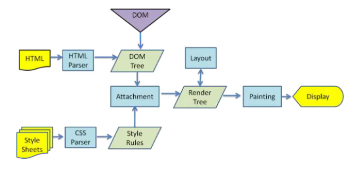

# 在地址栏输入URL后会发生什么

## 总体流程

1. 浏览器DNS解析获得服务器的PI地址和端口号
2. 浏览器用TCP的三次握手与服务器建立连接
3. 浏览器向服务器发送拼接好的报文
4. 浏览器收到报文后处理请求返回拼接好的报文给浏览器
5. 浏览器解析报文，渲染到页面上。

## DNS解析

当输入的不是ip地址而是域名时，浏览器会现在本地查找是否有对应域名的缓存

1. 查找浏览器缓存
2. 查找操作系统缓存
3. 查找hosts文件
4. 查找本地网卡被分配的非权威域名服务器(野生域名服务器)

在上述任一流程中找到则返回对应的ip，没有找到的话，则由**非权威域名服务器**代替用户访问核心DNS系统：

1. 访问根域名服务器，它会告诉我们对应顶级域名服务器的地址
2. 访问对应顶级域名服务器的地址，它会告诉我们对应权威服务器的地址
3. 访问对应的权威服务器的地址，它会告诉我们**最终的单个IP地址** 或返回一个**CNAME**(Canonical Name)别名记录，指向的就是 CDN 的 GSLB**（CDN全局负载均衡服务器）**。
4. 3中如果拿到的是CDN全局负载均衡服务器的地址，那么会有两种实现负载均衡的方式，一种是返回该域名对应的多个IP地址，客户端收到多个IP地址后，用自己的轮询算法一次向服务器发起请求，以实现负载均衡。另一种方式是在CDN全局负载服务器中配置内部的策略，返回离客户最近的主机，或者当前服务质量最好的主机，这样在就把请求分发到不同的服务器，实现负载均衡。

补充：CDN的全局负载均衡系统的只能调度依据：

- 看IP地址，查表得知地理位置，找相对最近的边缘结点
- 看用户所在的运营商，找相同网络的边缘结点
- 检查边缘结点的负载情况，找负载比较轻的结点
- 其他，比如节点的“健康状况”、服务能力、带宽、响应时间等。

GSLB把这些因素综合起来用一个复杂的算法找出一台“最合适”的边缘结点，吧这个节点的IP返回给用户，用户就可以“就近访问”CDN的缓存代理了。

拿到对应域名的ip地址后，就会缓存在**非权威域名服务器**中，以方便其他用户查询对应域名时直接返回。并且在返回的链路中逐级根据需要决定是否缓存。

## TCP三次握手

在三次握手的地方说，还有四次挥手

## 浏览器向服务器发送拼接好的报文

http报文相关

## 浏览器收到报文后处理请求返回拼接好的报文给浏览器

http报文相关

## 浏览器解析报文，渲染到页面上

图为webkit解析渲染页面的过程

- 解析HTML生成DOM树
- 解析CSS生成CSSOM树
- 合并DOM树和CSSOM树
- 浏览器开始渲染并绘制页面，这个过程会有回流(reflow)和重绘(repaint)

