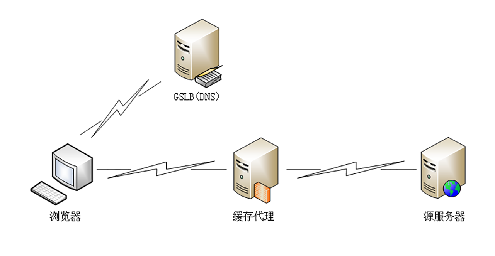

# CDN(内容分发网络)

在协议方面，有HTTPS强化链路安全，HTTP/2优化传输效率，应用方面有nginx/openresty等服务器提升网站的服务能力，有WAF应用防火墙抵御网站入侵攻击。

但是我们还缺少一个在外部加速HTTP协议的服务，这个服务就是CDN（Content Delivery Network 或 Content Distribution Network），中文名叫“内容分发网络”

## 为什么需要CDN

光速是有限的，每秒30万公里/秒，在电缆，光缆的时机传输速度会下降到三分之二左右，也就是20万公里/秒，这样如果地理位置比较远的话，传输延迟就会比较明显，比如深圳到背景的距离大概是2000公里，这样一个请求单程就要10ms，往返就是20ms，所以什么都不敢的情况下，都至少要20ms。

并且由于互联网是由许多小网络组成的，所以就会有小网络之间“互联互通”的问题，典型的就是各个电信运营商的网络，比如国内的电信、联通、移动三大家。

小网络内部沟通顺畅，但是跨网时候必须通过连接点，连接点的带宽有限，所以速度会降低很多。

并且在网络中还有很多路由器、网关等，每一次的转发、解析都会增加一定的时延。

## CDN是什么

CDN的核心原则就是**就近访问**，如果用户能够在本地几十公里的地方获取到数据，那么网络传输时延就基本上变成0了。

所以CDN就在全国、全球各大枢纽城市建立机房，部署了大量拥有高存储高带宽的节点，构建了一个专用网络。这个网络是跨运营商、跨地域的，虽然内部也划分成多个小网络，但它们之间用高速专有线路连接，是真正的“信息高速公路”，基本上可以认为不存在网络拥堵。

有了这个高速的专用网之后，CDN 就要“分发”源站的“内容”了，使用“缓存代理”的技术，使用“推”或者“拉”的手段，把源站的内容逐级缓存到网络的每一个节点上。

于是，用户在上网的时候就不直接访问源站，而是访问离他“最近的”一个 CDN 节点，术语叫**“边缘节点”（edge node）**，其实就是缓存了源站内容的代理服务器，这样一来就省去了“长途跋涉”的时间成本，实现了“网络加速”。

在 CDN 领域里，“内容”其实就是 HTTP 协议里的“资源”，比如超文本、图片、视频、应用程序安装包等等。

资源按照是否可缓存又分为“静态资源”和“动态资源”。所谓的“静态资源”是指数据内容“静态不变”，任何时候来访问都是一样的，比如图片、音频。所谓的“动态资源”是指数据内容是“动态变化”的，也就是由后台服务计算生成的，每次访问都不一样，比如商品的库存、微博的粉丝数等。

很显然，只有静态资源才能够被缓存加速、就近访问，而动态资源只能由源站实时生成，即使缓存了也没有意义。不过，如果动态资源指定了“Cache-Control”，允许缓存短暂的时间，那它在这段时间里也就变成了“静态资源”，可以被 CDN 缓存加速

## CDN的负载均衡

CDN有两个关键组成部分：**全局负载均衡**和**缓存系统**。

全局负载均衡（Global Sever Load Balance）一般简称为 GSLB，它是 CDN 的“大脑”，主要的职责是当用户接入网络的时候在 CDN 专网中挑选出一个“最佳”节点提供服务，解决的是用户如何找到“最近的”边缘节点，对整个 CDN 网络进行“负载均衡”。

GSLB 最常见的实现方式是**“DNS 负载均衡”**。

原来没有 CDN 的时候，权威 DNS 返回的是网站自己服务器的实际 IP 地址，浏览器收到 DNS 解析结果后直连网站。

但加入 CDN 后就不一样了，权威 DNS 返回的不是 IP 地址，而是一个 **CNAME( Canonical Name ) 别名记录**，指向的就是 **CDN 的 GSLB**。它有点像是 HTTP/2 里“Alt-Svc”的意思，告诉外面：“我这里暂时没法给你真正的地址，你去另外一个地方再查查看吧。”

因为没拿到 IP 地址，于是本地 DNS 就会向 GSLB 再发起请求，这样就进入了 CDN 的全局负载均衡系统，开始“智能调度”，主要的依据有这么几个：

- 看用户的 IP 地址，查表得知地理位置，找相对最近的边缘节点；
- 看用户所在的运营商网络，找相同网络的边缘节点；
- 检查边缘节点的负载情况，找负载较轻的节点；
- 其他，比如节点的“健康状况”、服务能力、带宽、响应时间等。

GSLB 把这些因素综合起来，用一个复杂的算法，最后找出一台“最合适”的边缘节点，把这个节点的 IP 地址返回给用户，用户就可以“就近”访问 CDN 的缓存代理了。

## CDN的缓存代理

缓存系统是 CDN 的另一个关键组成部分，相当于 CDN 的“心脏”。如果缓存系统的服务能力不够，不能很好地满足用户的需求，那 GSLB 调度算法再优秀也没有用。

但互联网上的资源是无穷无尽的，不管 CDN 厂商有多大的实力，也不可能把所有资源都缓存起来。所以，缓存系统只能有选择地缓存那些最常用的那些资源。

这里就有两个 CDN 的关键概念：**“命中”**和**“回源”**。

“命中”就是指用户访问的资源恰好在缓存系统里，可以直接返回给用户；“回源”则正相反，缓存里没有，必须用代理的方式回源站取。

相应地，也就有了两个衡量 CDN 服务质量的指标：**“命中率”**和**“回源率”**。命中率就是命中次数与所有访问次数之比，回源率是回源次数与所有访问次数之比。显然，好的 CDN 应该是命中率越高越好，回源率越低越好。现在的商业 CDN 命中率都在 90% 以上，相当于把源站的服务能力放大了 10 倍以上。

缓存系统也可以划分出层次，分成一级缓存节点和二级缓存节点。一级缓存配置高一些，直连源站，二级缓存配置低一些，直连用户。回源的时候二级缓存只找一级缓存，一级缓存没有才回源站，这样最终“扇入度”就缩小了，可以有效地减少真正的回源。

## CDN的边缘计算

对于动态资源，CDN与源站通常都有专网连接，所以对于非静态的资源，走CDN也可以走专网到源站，也比正常不走CDN要快。

现在cdn有种叫“边缘计算”的技术，就是把计算动态资源的代码和数据也放在cdn的节点上，这样就可以在cdn里获取动态资源不用回源站了。

