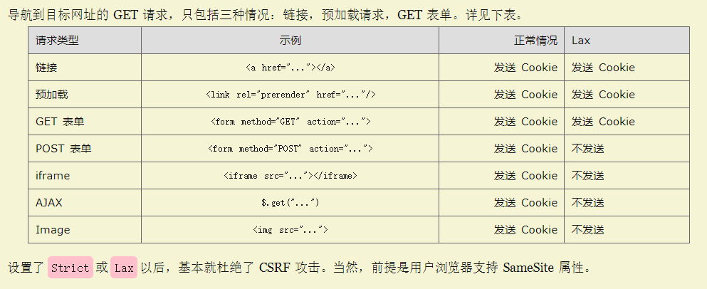

# 说说cookie

## 使用方式

服务端通过响应头中的set-cookie字段，返回需要浏览器进行存储的信息。set-cookie首部可以有多个，浏览器接收到会自己进行拼接。每个set-cookie都是key=value的键值对形式。除此之外还有与该cookie相关的信息。

浏览器再以后的请求中，都会自动在cookie字段中带上set-cookie的值，形式为"key=value"的键值对，用分号";"分隔每个键值对。

## set-cookie属性

set-cookie的属性，通过分号";"分隔，形式为"属性名=xxx"或者"属性名"。

**__Secure- 前缀**：以 __Secure- 为前缀的 cookie（其中连接符是前缀的一部分），必须与 secure 属性一同设置，同时必须应用于安全页面（即使用 HTTPS 访问的页面）。

**__Host- 前缀：** 以 __Host- 为前缀的 cookie，必须与 secure 属性一同设置，必须应用于安全页面（即使用 HTTPS 访问的页面），必须不能设置 domain 属性 （也就不会发送给子域），同时 path 属性的值必须为“/”。

### Expires

Expires=<date>。cookie的有效时间，当cookie超过这个时间点就会失效。如果没有设置这个属性，则表示这是一个会话cookie，当我们关闭浏览器tab之后cookie就会被移除。

### Max-Age

Max-Age=<non-zero-digit>。经历max-age后，cookie就会失效，秒数为0或者-1会使cookie直接过期。如果Expires和Max-age同事存在，那么Max-age的优先级更高。

### Domain

Domain=<domain-value>。指定cookie可以送达的主机名。假如没有指定，那么默认值为当前文档访问地址中的主机部分(但是不包含子域名)。**假如指定了域名，则相当于各个子域名也包含在内了。**

### Path

Path=<path-value>。指定一个URL路径，这个路径必须要出现在要请求的资源的路径中才可以发送Cookie首部。

### Secure

一个带有安全属性的 cookie 只有在请求使用SSL和HTTPS协议的时候才会被发送到服务器(https 情况下才会发送cookie)。然而，保密或敏感信息永远不要在 HTTP cookie 中存储或传输，因为整个机制从本质上来说都是不安全的，比如前述协议并不意味着所有的信息都是经过加密的。

### HttpOnly

设置了 HttpOnly 属性的 cookie 不能使用 JavaScript 经由  Document.cookie 属性、XMLHttpRequest 和  Request APIs 进行访问，以防范跨站脚本攻击（XSS）。

### SameSite

允许服务器设定一则 cookie 不随着跨域请求一起发送，这样可以在一定程度上防范跨站请求伪造攻击（CSRF）。

这个字段影响发送与否，是作为第三方网站时应用的，也就是别人网站跳到我网站时，cookie会应用samesite的规则。

sameSite有三个值：

- Strict
- Lax(默认)
- None

**Strict最严格**，完全禁止第三方Cookie，只要是跨站点都不会发送Cookie，也就是说只有当前页面的URL和请求的目标一致时，才会带上cookie。这个规则过于严格，所以会造成非常不好的用户体验。比如当前页面中有个github链接，用户点击链接跳转到github不会带上github的cookie，跳转过去是未登录状态。

**Lax中等严格**，大多数情况下不发送第三方cookie，但是导航到目标网址的GET请求除外。

None最宽松，和以前的cookie机制相同，但是前提是必须设置Secure属性(只能通过https发送)，否则无效，所以必须：

`set-cookie:key=value;SameSite=None;Secure;`

## Cookie限制

cookie个数限制：每个域名50个。

cookie大小限制：chrome为cookie总大小限制在4KB。超过大小会被忽略。

