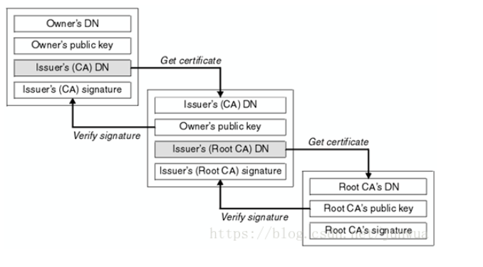

# 说说HTTPS

## https的安全的四个特性

https实现了安全的四个特征，即机密性、完整性、身份认证、不可否认。

- 机密性指对数据加密，即使在传输的过程中被中间人监听，中间人也无法得知传输的数据。
- 完整性指数据在传输的过程中没有被篡改
- 身份认证指确定对方的身份，保证消息只能发送给可信的人
- 不可否认指不能否认已经发生过的行为，用以保证事务的真实性

https采用混合加密的方式，在通信开始的时候使用非对称加密算法，解决密钥交换的问题，在交换密钥之后使用对称加密算法，安全和性能兼顾，实现了通信的机密性。

使用摘要算法实现完整性，通过在明文后面附上它的摘要，如果消息遭到修改，那么对应的摘要会完全不同，计算对比就可以发现消息被篡改。完整性需要基于机密性，否则如果明文传输，黑客可以修改消息后把摘要也一起改了。

使用非对称加密中的“私钥”，再加上摘要算法，实现的“数字签名”就可以同时实现“身份认证”和“不可否认”。通过对原文进行摘要，再用私钥对摘要进行加密，当接收方用对应的公钥解密得出的摘要和原文的摘要一致时，就实现了“身份认证“和”不可否认“。

“公钥的信任”问题，需要一个保证绝对可信的第三方来证明，这就是CA的存在，它通过自己的荣誉来做背书，保证公钥无法伪造，是可信的。

RSA非对称加密，AES对称加密，ECDHE椭圆曲线加密，SHA摘要算法

## 数字证书的申请流程

通过在服务器上生成公钥和私钥，然后将公钥和服务器及域名等信息拿到CA去认证，认证通过后CA会将服务器的信息及数字证书有效期等信息进行摘要，并对摘要用自己的私钥进行加密生成数字签名，并将数字签名附在数字证书中以实现数字证书的可信度，保证数字证书可信。

获取的数字签名是一个证书链：

浏览器中内置了root CA的公钥，当浏览器拿到证书链时，通过对“证书链根证书”(这里称为第一级)的数字签名(本来就是用root CA的私钥加密的)进行解密，然后和原文进行摘要后生成的值进行对比，相等则得到第一级CA的公钥，然后用这个公钥对下一级(这里称为第二级)的数字签名(本来就是用第一级CA的私钥加密的)进行解密，和原文进行摘要后生成的值进行对比，相等则得到第二级CA的公钥，然后用这个公钥对服务器数字证书的数字签名进行解密，生成的值和原文进行摘要后的值进行对比，如果相等则得到服务器数字证书的公钥，这个公钥会用到后续的加密当中。

## ECDHE握手过程

1. 客户端发送Client Hello，带有随机数Client Random、客户端TLS版本号、密码套件列表、扩展列表

2. 服务端发送Server Hello，带有随机数Server Random、确认TLS的版本号、使用的密码套件(EDCHE)

3. 服务端发送Server Certificate，带有数字证书

4. 服务端发送Server Key Exchange，带有EDCHE椭圆曲线加密算法的公钥(Server Params)，用自己的私钥签名

5. 服务器发送Server Hello Done。

6. 客户端对证书链进行验签，确认服务器身份后：

   客户端发送Client Key Exchange，带有EDCHE椭圆曲线加密算法的公钥(Client Params)

7. 此时客户端和服务端里都拿到了密钥交换算法的两个参数(Client Params和Server Params)，就是各自的椭圆曲线公钥，再配合各自的椭圆曲线私钥用ECDHE算法得出了Pre-Master随机数，再使用Client Random、Server Random和Pre-Master作为参数生出用于加密会话的主密钥Master-Secret，之所以不用Pre-Master而要计算生成Master-Secret是因为要保证完全随机和不可预测。完成后：

   客户端发送Change Cipher Spec，告诉服务器后续使用加密

8. 客户端发送Finished，把之前发送的数据做个摘要，再用Master-Secret生成的会话密钥用对称加密算法AES加密一下，让服务器验证。

9. 服务器发送Change Cipher Spec，告诉客户端后续使用加密

10. 服务器发送Finished，也把之前发送的数据做个摘要，再用AES加密，让客户端验证一下。

ECDHE算法保证了即使中间人获取了Client Params和Server Params都计算不出Pre-Master，后面又用Client Random、Server Random、Pre-Master计算出Master-Secret以保证完全随机。

由于ECDHE每次的加密都是会话生成的随机数产生的，因此具有前向保密性，即使服务器私钥被破解，也不会影响历史报文的安全性。

使用ECDHE可以不用等到服务器返回Finished就可以发出HTTP报文，省去了一个消息往返的时间浪费，这个叫**TLS False Start**

## RSA握手过程

RSA算法的大体流程没有变，不过Pre-Master不再需要通过算法生成，而是客户端直接生成随机数，然后用服务端的公钥加密发送给服务端(公钥加密只有私钥能解开，所以就算被中间人监听也无所谓)，服务器用私钥解开后，用3个随机数生成主密钥Master-Secret用于后面的对称加密。

RSA不具有前向安全，一旦服务器私钥被破解，历史报文的安全性得不到保障，黑客可以破解以前所有历史报文。

## TLS1.3

- 兼容性：通过在Client Hello消息后面加上**supported_versions**扩展，标记TLS的版本好，使用它就可以区分新旧协议。
- 强化安全：只保留了5个密码套件，废除了RSA这样的不具有前向安全的加密算法。
- 性能提升：握手时间减少到1个RTT。通过在Client Hello消息里用**supported_groups**带上支持的曲线，用**key_share**带上曲线对应的客户端公钥参数(每个曲线对应一个公钥，所以一共5个)，用**signature_algorithms**带上签名算法。服务器收到后在这些扩展里选择一个曲线和参数，在用**key_share**返回服务端公钥参数(选择的算法及对应的曲线公钥)，就实现了双方的密钥交换，后面就和1.2相同了。

## https性能优化

- 硬件优化：选择更快的CPU；选择SSL加速卡，加解密时调用它的api，用专门的硬件来做非对称加解密，分担CPU的计算压力；SSL加速服务器，用专门的服务器集群来计算。
- 软件优化：软件升级：升级linux，升级Nginx，升级OpenSSL
- 协议优化：首先使用高版本协议如TLS1.3；如果不支持高版本协议则选择椭圆曲线算法，可以通过“false start”把2-RTT减少到1-RTT；
- 证书优化：证书传输优化：使用运算量、体积更小的椭圆曲线证书；证书验证使用更快的验证方式。

除了以上四种之外还有**会话复用(重点)：**

**通过缓存，省去了握手和计算的成本。**

- Session ID：客户端和服务器首次连接后各自保存一个会话的 ID 号，内存里存储主密钥和其他相关的信息。当客户端再次连接时发一个 ID 过来，服务器就在内存里找，找到就直接用主密钥恢复会话状态，跳过证书验证和密钥交换，只用一个消息往返就可以建立安全通信。

  优点：1个RTT，Session ID在浏览器和服务器中都存储了对应的master-secret，即使Session ID被获取也无法获取到master-secret。

  缺点：1、服务器必须保存每一个客户端的会话数据，对于拥有百万、千万级别用户的网站来说存储量(一般是内存)就成了大问题，加重了服务器的负担。2、不同主机的server共享session Id成了问题，用户往往通过负载均衡，每次访问的不一定是同一台机器。 

- Session Ticket：有点类似 HTTP 的 Cookie，存储的责任由服务器转移到了客户端，服务器加密会话信息，用**“New Session Ticket”**消息发给客户端，让客户端保存。重连的时候，客户端使用扩展**“session_ticket”**发送**“Ticket”**而不是“Session ID”，服务器解密后验证有效期，就可以恢复会话，开始加密通信。

  优点：解决了服务器存储负担，服务器只需要存储一个对称加解密的密钥文件（ticket_key）来加解密Ticket，密钥文件（ticket_key）不带在消息中，对客户端发来的ticket_key解密即可获得master-secret，浏览器中也存储这对应ticket_key对应的master-secret。

  缺点：“Session Ticket”方案需要使用一个固定的密钥文件（ticket_key）（服务器集群共享该密钥）来加密 Ticket，为了防止密钥被破解，保证“前向安全”，密钥文件需要定期轮换，比如设置为一小时或者一天。

Session ID和Session Ticket这两种会话复用技术在TLS1.3中均已被废除，只能使用PSK实现会话复用。

**预共享密钥：**

“False Start”“Session ID”“Session Ticket”等方式只能实现 1-RTT，而 TLS1.3 更进一步实现了“0-RTT”，原理和“Session Ticket”差不多，但在**发送 Ticket 的同时会带上应用数据（Early Data）**，免去了 1.2 里的服务器确认步骤，这种方式叫“**Pre-shared Key”**，简称为**“PSK”**。所谓的Ticket就在Pre-shared Key中。

优点：0-RTT。

缺点：为了追求效率而牺牲了一点安全性，容易受到“重放攻击”（Replay attack）的威胁。黑客可以截获“PSK”的数据，像复读机那样反复向服务器发送。原理：PSK的数据虽然是加密的，但是是可以通过服务器验证的，所以只要捕获了报文就可以一直用这个报文向服务器发请求攻击服务器。解决的办法是：

- 只允许安全的 GET/HEAD 方法
- 在消息里加入时间戳(设置合理的过期时间,并签名防止会话被劫持，时间被修改)
- “nonce”验证(客户端随机生成的，有一个要求，就是正常情况下短时间内如60s连续生成两个相同nonce的情况几乎为0。服务器接收到nonce，如果没有，就创建这个key，设置失效时间，如果下次收到的nonce如果有，则判断为重放。)，或者“一次性票证”限制重放。

