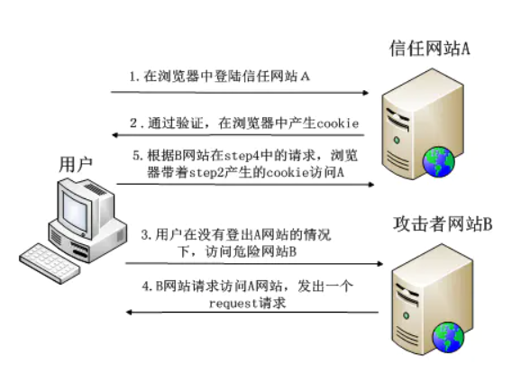
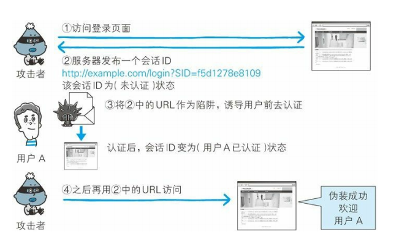

# WEB安全

HTTP协议本身不存在安全性问题，所以协议本身几乎不会成为攻击的对象。运行在服务器上的web应用等资源才是攻击目标。

## 针对web应用的攻击模式

对web应用的攻击模式有两种：

- 主动攻击
- 被动攻击

### 以服务器为目标的主动攻击

主动攻击是通过直接访问web应用，把攻击代码传入的攻击模式。由于这个模式是直接针对服务器上的资源进行攻击，因此**攻击者需要能够访问到哪些资源**。

**主动攻击里具有代表性的攻击是SQL注入攻击和OS命令注入攻击。**

### 以服务器为目标的被动攻击

被动攻击是指利用圈套策略执行攻击代码的攻击模式。在被动攻击的过程中，攻击者不直接对目标web应用发起攻击。

被动攻击通常的攻击模式：

1. 攻击者引诱用户触发已经设置好的陷阱，而陷阱会启动发送已迁入攻击代码的HTTP请求。
2. 当用户不知不觉中招之后，用户的浏览器就会触发这个陷阱。
3. 中招之后的用户浏览器会把含有攻击代码的HTTP请求发送给作为攻击目标的web应用，运行攻击代码。
4. 执行完攻击代码，存在安全漏洞的web应用会成为攻击者的跳板，可能导致用户持有的Cookie等个人信息被窃取，登录状态中的用户权限遭到恶意滥用等。

**被动攻击模式中具有代表性的攻击是跨站脚本攻击和跨站点请求伪造。**

## 因输出值转义不完全引发的安全漏洞

实施web应用的安全策略大致可分为：

- 客户端的验证
- web服务器的验证
  - 输入值验证
  - 输出值转义

### 跨站脚本攻击(XSS)

跨站脚本攻击（Cross-Site Scripting，XSS），指通过存在安全漏洞的Web网站注册用户的浏览器内运行非法的HTML标签或JavaScript进行的一种攻击。动态创建的HTML部分有可能有安全漏洞，所以攻击者编写脚本设下陷阱，用户在自己的浏览器上运行的时候，就会收到被动攻击。

跨站脚本攻击有可能造成以下影响：

- 利用虚假输入表单骗取用户个人信息
- 利用脚本窃取用户的Cookie值
- 显示伪造的图片或者文章

#### 非持久型XSS(反射型XSS)

一般是通过给别人发送**带有恶意脚本代码参数的URL**，当URL被打开时，特有的恶意代码被HTML解析，执行，从而导致泄漏账号密码等。


比如，一个网页应用的html页面代码包含以下部分：

<select>
    <script>
        document.write(''
            + '<option value=1>'
            +     location.href.substring(location.href.indexOf('default=') + 8)
            + '</option>'
        );
        document.write('<option value=2>English</option>');
    </script>
</select>
该网页应用通过URL中default=后面的参数来提供选项，但是恶意攻击者可以利用该漏洞，使用特定的URL如`https://xxx.com/xxx?default=<script>alert(document.cookie)</script>`这样的方式注入可执行代码，获取到用户的个人信息。**script标签也可以加载非同源的服务器上的恶意代码，以执行特定的操作**。

非持久性XSS攻击有以下特征：

- 即时性，不需要服务器存储，直接通过构造恶意的URL，直接通过HTTP的GET和POST就能完成一次攻击，拿到用户信息。
- 攻击者需要诱骗点击，必须要用户点击链接才能发起。
- 反馈率低，不通过服务器，所以很难发现和响应修复
- 盗取用户敏感保密信息(cookie等)

为了防止出现非持久型XSS漏洞，需要确保下面几件事：

- web页面渲染的内容和数据都必须来自服务端

- 尽量不要从`URL，document.referrer，document.forms`这种DOM API获取数据渲染

- 尽量不要使用下列可执行字符串的方法

  ```
  eval, new Function()，document.write()，document.writeln()，window.setInterval()，window.setTimeout()，innerHTML，document.createElement()
  ```

- 如果要使用以上API，都需要对字符串参数进行excape转义

- 前端渲染的时候对任何字段都需要做escape转义编码。

#### 持久型XSS(存储型XSS)

持久型XSS漏洞，一般用在表单提交等交互功能，比如文章留言，提交文本信息等，黑客利用XSS漏洞，将恶意代码经过正常功能提交进入数据库持久保存，当前端页面获取后端从数据库中读取出的数据渲染时，会执行解析执行对应的恶意代码。

比如你在一个论坛中的评论留言区输入了`<script>alert(document.cookies)</script>`并进行提交时，后端会将你对应的评论存入数据库，并且在别的用户浏览该文章时，获取到对应的评论时浏览器就会对该脚本解析执行，由此获取到你的敏感信息。

和非持久型XSS漏洞相似，但是持久型的XSS攻击的来源不是URL,refer，forms等，而是来源于后端从数据库中读出来的数据。持久型XSS攻击不需要诱骗点击，黑客只需要在提交表单的地方完成注入即可。

持久型XSS攻击需要同时满足以下几个条件：

- POST请求提交表单后端没有转义直接入库
- 后端从数据库中取出没有转义直接输出给前端
- 前端拿到后端数据后没有转义直接渲染成DOM

持久型XSS有以下几个特点：

- 持久型，因为存在数据库中
- 危害面广(请求到对应数据的用户都会危及到)
- 盗取用户敏感信息(cookie等)

如何防御：

1. **使用CSP**

   CSP本质上就是建立白名单，开发者明确告诉浏览器哪些外部资源可以加载和执行，我们只需要配置规则，如何拦截由浏览器自己实现，通过这种方式减少XSS攻击

   - 设置HTTP Header中的Content-Security-Policy

     `Content-Security-Policy: default-src 'self'     //只允许加载本站`

     `Content-Security-Policy: img-src https://*      //只允许加载HTTPS协议图片`

     `Content-Security-Policy: child-src 'none'       //允许加载任何来源框架`       

   - 使用meta标签设置Content-Security-Policy

     ```
     <meta http-equiv="content-security-policy" content="策略">
     ```

     Meta 标签与 HTTP 头只是行式不同而作用是一致的。与 HTTP 头一样，优先采用最先定义的策略。如果 HTTP 头与 Meta 定义同时存在，则优先采用 HTTP 中的定义。

2. **转义字符**

   用户的输入永远不可信任，最普遍的做法就是转义输入输出的内容，对引号、尖括号、斜杠进行转义。

   对于显示富文本来说，不能够通过上面的方法转义所有字符，这样会把需要的格式也过滤掉，通常采用白名单过滤的方法。

3. HttpOnly Cookie

   这是预防XSS攻击窃取用户cookie最有效的防御手段，可以避免该网页的cookie被客户端javascript窃取。

### SQL注入攻击

SQL注入指针对web应用使用的数据库，通过运行非法的SQL语句而产生的攻击。

前端发送的请求的参数可能被后端直接用来构造SQL语句，而如果前端发送的参数中带有特定的SQL关键字时，如“--”，SQL语句中--之后全视为注释，所以就会忽略后面的查询条件，或者插入分隔语句";"后执行其他语句，造成更严重的后果。

如何防御：

- 严格限制web应用的数据库操作权限。
- 对前端发送的参数进行转义

### OS命令注入攻击

OS 命令注入攻击（OS Command Injection）是指通过 Web 应用，执行非法的操作系统命令达到攻击的目的。只要在能调用 Shell 函数的地方就有存在被攻击的风险。

也是通过前端发送的参数后端直接使用造成的。

防御方式：

- 对前端发送的内容进行规则限制
- 调用系统命令前对所有入参进行转义

### HTTP首部注入攻击

HTTP 首部注入攻击（HTTP Header Injection）是指攻击者通过在响应首部字段内插入换行，添加任意响应首部或主体的一种攻击。属于被动攻击模式。

向首部主体内添加内容的攻击称为 HTTP 响应截断攻击（HTTP Response Splitting Attack）。 

如下所示，Web 应用有时会把从外部接收到的数值，赋给响应首部字段 Location 和 Set-Cookie。

`Location: http://www.example.com/a.cgi?q=12345` 

`Set-Cookie: UID=12345`

`＊12345就是插入值`

HTTP 首部注入可能像这样，通过在某些响应首部字段需要处理输出值的地方，插入换行发动攻击。

 HTTP 首部注入攻击有可能会造成以下一些影响：

- 设置任何Cookie信息
- 重定向到任意URL
- 显示任意的主题(HTTP响应截断攻击)

#### HTTP首部注入攻击案例

如果有一个页面，根据你在选择框中选择选择项的id进行重定向，一旦选定类别，就会将该ID值反映在响应头内的Location字段内，形成`Location: http://example.com/? cat=101`的头部，令浏览器发生重定向跳转。


那么攻击者就可以用下面的内容代替之前的类别ID后发送请求

`101%0D%0ASet-Cookie:+SID=123456789 `

其中%0D%0A代表HTTP报文中的换行符，紧接着通过set-cookie字段把会话id设置了，假设结果返回的响应如下：

`Location: http://example.com/?cat=101（%0D%0A ：换行符）` 

`Set-Cookie: SID=123456789`

此时set-cookie生效，因此攻击者可以制定修改任意的cookie信息，攻击者可以伪装成用户。

**原理是通过攻击者输入的%0D%0A，进行了HTTP头的换换行，插入了新的首部。**

#### HTTP响应截断

HTTP响应截断是用在HTTP首部注入的一种攻击，攻击顺序相同，但是将两个%0D%0A插入后发送，利用两个连续的回车换行就可以制造出HTTP中头部与实体部分的空行，由此进行截断并且插入伪造的主体，以达到攻击的目的。

`%0D%0A%0D%0A<HTML><HEAD><TITLE>之后，想要显示的网页内容<!--`

在可能进行HTTP首部注入的环节，发送上面的字符串，返回的结果可能如下所示：

`Set-Cookie: UID=（%0D%0A ：换行符）` 

（%0D%0A ：换行符） 

`<HTML><HEAD><TITLE>之后，想要显示的网页内容 <!--（原来页面内容`

利用这个攻击，触发陷阱的用户浏览器就会显示伪造的web页面，再让用户输入个人信息等，可达到和跨站脚本攻击相同的效果。

### 目录遍历攻击

目录遍历（Directory Traversal）攻击是指对本无意公开的文件目录，通过非法截断其目录路径后，达成访问目的的一种攻击。这种攻击有时也称为路径遍历（Path Traversal）攻击。

通过 Web 应用对文件处理操作时，在由外部指定文件名的处理存在疏漏的情况下，用户可使用 .../ 等相对路径定位到 /etc/passed 等绝对 路径上，因此服务器上任意的文件或文件目录皆有可能被访问到。这 样一来，就有可能非法浏览、篡改或删除 Web 服务器上的文件。

固然存在输出值转义的问题，但更应该**关闭指定对任意文件名的访问权限**。

**目录遍历攻击案例：**

下面以显示读取文件功能为例，讲解目录遍历攻击。该功能通过以下查询字段，指定某个文件名。然后从 /www/log/ 文件目录下读取这个指定的文件

`http://example.com/read.php?log=0401.log` 

攻击者设置如下查询字段后发出请求：

`http://example.com/read.php?log=../../etc/passwd`

查询字段为了读取攻击者盯上的 /etc/passwd 文件，会从/www/log/ 目录开始定位相对路径。如果这份 read.php 脚本接受对指定目录的访问请求处理，那原本不公开的文件就存在可被访问的风险


**解决方式：关闭指定对任意文件名的访问权限**

## 因会话管理疏忽引发的安全漏洞

### 跨站请求伪造(CSRF)

CSRF利用用户已登录的身份，在用户不知情的情况下，以用户的名义完成非法操作。



完成CSRF的三个条件：

- 用户登录了站点A，并在本地记录了cookie
- 在用户没有登出站点A的情况下(cookie还生效时)，访问了恶意攻击者提供的引诱危险站点B(站点B要求访问站点A)
- 站点A没有做任何CSRF防御

当用户在互联网上，经过诱导，进入了攻击者的页面时，以下是攻击者页面的代码：


页面一加载，就会就会执行表单提交，此时的用户已经登录了该网站，所以请求回成功，于是就给黑客转账了。

防御的方式可以遵循以下几种规则：

- GET请求不对数据进行修改
- 不让第三方网站访问到用户cookie
- 阻止第三方网站请求接口
- 请求时附带验证信息，比如验证码或者Token

1. **SameSite**

   设置严格的samesite，这样cookie就不会随着跨域请求发送，跨域很大程度减少CSRF攻击，但是该属性目前兼容性一般。

2. **Referer Check**

   当浏览器向web服务器发送请求时，一般都会带上Referer信息告知服务器从哪个页面来的，可以通过检查请求的来源防御CSRF攻击。

   某些情况下如https跳转到http时，浏览器处于安全考虑不会发送referer，服务器无法check，所以不能完全依赖referer头

3. **Anti CSRF Token**

   在登录之后，后端返回一个有一定有效期的token，前端将该token存放在localStorage/sessionStorage中，在每一次的请求中，前端都将token带在请求头中，后端接收到请求后，检测该token是否合法，如果合法则处理该请求，否则返回错误。csrf token的原理在于存储token的localStorage/sessionStorage的存储是有同源策略的，第三方网站无法获取到目标网站的localstorage/sessionStorage，所以在第三方网站发送的请求都会失败。

4. **验证码**

   在用户交互的过程中，特别是转账这种核心步骤，强制用户输入验证码，才能完成最终请求。用户在进行特定操作时，需要向后端请求对应的验证码，并且在后续的请求中带上验证码的内容，后端验证通过才接受请求，否则返回失败。

### 会话劫持


通过XSS获取的cookie，往自己浏览器设置该cookie从而伪装成该用户

### 会话固定



## 其他安全漏洞

### 密码破解

通过网络进行密码试错：

- 穷举法

- 字典攻击

  利用事先收集好的密码，枚举字典中的密码，尝试通过认真。

对已加密密码的破解：

- 穷举法

- 彩虹表

  彩虹表（Rainbow Table）是由明文密码及与之对应的散列值构成的一张数据库表，是一种通过事先制作庞大的彩虹表，可在穷举法 • 字典攻击等实际破解过程中缩短消耗时间的技巧。从彩虹表 内搜索散列值就可以推导出对应的明文密码。

  为了提高攻击成功率，拥有一张海量数据的彩虹表就成了必不可少的条件

- 拿到密钥

- 分析加密算法的漏洞

### 点击劫持

点击劫持（Clickjacking）是指利用透明的按钮或链接做成陷阱，覆盖在 Web 页面之上。然后诱使用户在不知情的情况下，点击那个链接访问内容的一种攻击手段。这种行为又称为界面伪装（UI Redressing）

已设置陷阱的 Web 页面，表面上内容并无不妥，但早已埋入想让用户点击的链接。当用户点击到透明的按钮时，实际上是点击了已指定 透明属性元素的 iframe 页面。

用户点击了已经登录过的站点A的透明的iframe上对应位置的按钮，就发送了特定的请求，黑客的目标就达到了。

**如何防御：**

- X-FRAME-OPTIONS

  `X-FRAME-OPTIONS`是一个 HTTP 响应头，在现代浏览器有一个很好的支持。这个 HTTP 响应头 就是为了防御用 iframe 嵌套的点击劫持攻击。

  该响应头有三个值可选，分别是:

  - DENY，表示页面不允许通过 iframe 的方式展示
  - SAMEORIGIN，表示页面可以在相同域名下通过 iframe 的方式展示
  - ALLOW-FROM，表示页面可以在指定来源的 iframe 中展示

- JavaScript防御

  对于某些远古浏览器来说，并不能支持上面的这种方式，那我们只有通过 JS 的方式来防御点击劫持了

  <head>
    <style id="click-jack">
      html {
        display: none !important;
      }
    </style>
  </head>
  <body>

    <script>
      if (self == top) {
        var style = document.getElementById('click-jack')
        document.body.removeChild(style)
      } else {
        top.location = self.location
      }
    </script>
  </body>

以上代码的作用就是当通过 iframe 的方式加载页面时，攻击者的网页直接不显示所有内容了

### DoS攻击

DoS 攻击（Denial of Service attack）是一种让运行中的服务呈停止状态的攻击。有时也叫做服务停止攻击或拒绝服务攻击。DoS 攻击的对 象不仅限于 Web 网站，还包括网络设备及服务器等。 

主要有两种Dos攻击方式：

- 集中利用访问请求造成资源过载，资源用尽时服务也就呈停止状态。
- 通过攻击安全漏洞使服务停止

多台计算机发起的DoS攻击称为DDoS攻击（Distributed Denial of Service attack）。


