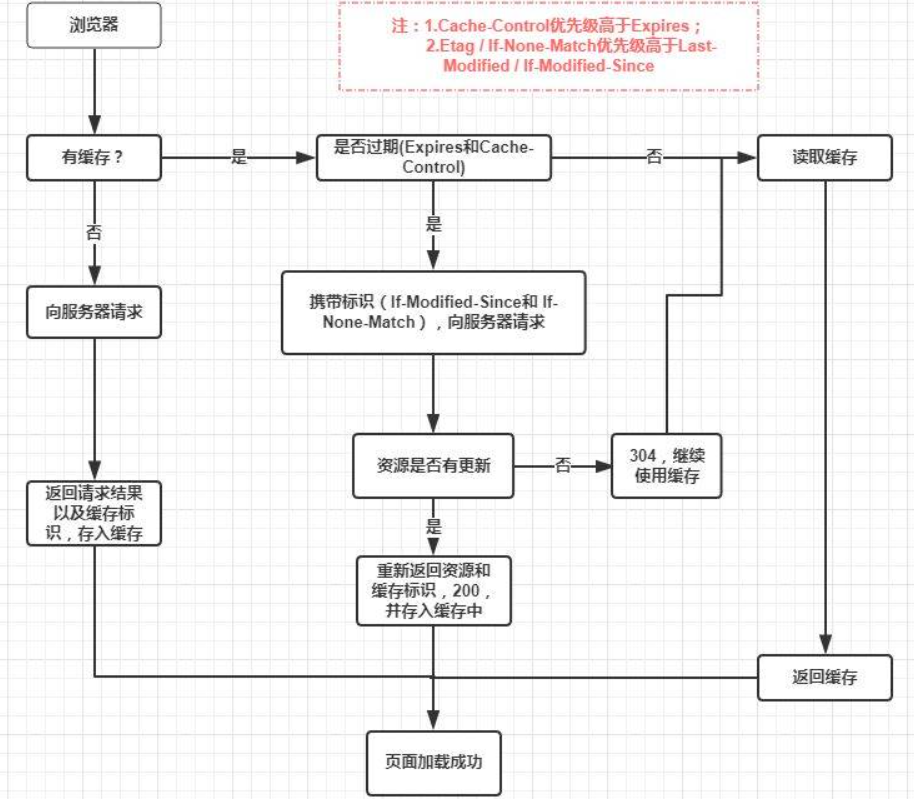

# 说说浏览器缓存机制

## 流程图片总结

根据缓存策略可以分为强缓存(cahce-control、expires)和协商缓存(if-modified-since、if-none-match)

根据缓存位置可以分为memory cache(速度快，容量小)和disk cache(速度慢，容量大)，**缓存在内存还是磁盘中由浏览器当前内存情况决定，并不绝对**。

浏览器在第一次向服务器发起请求后拿到结果后，将请求结果和缓存标识存入浏览器缓存，浏览器对缓存的处理是根据第一次请求资源时返回的相应头来确定的。

浏览器每次发起请求，都会先在浏览器缓存中查找该请求的结果和缓存表示，浏览器每次拿到返回的请求都会将该结果和缓存标识存到浏览器缓存中。

## 强缓存

不会向服务器发送请求，直接从缓存中读取资源，在chrome控制台的Network选项中可以看到该请求返回200的状态码，并且Size显示from disk cache或from memory cache。强缓存可以通过设置三种 HTTP Header 实现：Expires、Pragma 和 Cache-Control。

优先级从高到低分别是 **Pragma -> Cache-Control -> Expires** 。

- Expires(http/1.0)

  **缓存过期时间，用来指定资源到期的时间，是服务器端的具体的时间点**。如果发请求的时候还没过这个时间点，则从浏览器中获取，不发起请求。Expires时间是相对服务器而言，无法保证和客户端时间统一。如果客户端修改了操作系统时间，则可能导致缓存失效。

- Pragma(http/1.0)

  这个字段只有`no-cache`这个值，告知客户端不要对该资源进行读缓存，每次都要向服务器发起一次请求才行。Pragma的优先级高于cache-control。这是为了做兼容用的老字段

- Cache-Control(http/1.1)

  针对上述的“Expires时间是相对服务器而言，无法保证和客户端时间统一”的问题，http1.1新增了 Cache-Control 来定义缓存过期时间，若报文中同时出现了expires和Cache-Control，则以Cache-Control为准。

Cache-Control的值：

| 值               | 类型               | 解释                                                         | 使用方         |
| ---------------- | ------------------ | ------------------------------------------------------------ | -------------- |
| public           | 可缓存性           | 表示对象可以被任何对象缓存，也即可以同时被客户端和代理服务器缓存 | 服务端         |
| private          | 可缓存性           | 表明响应只能被单个用户缓存，不能作为共享缓存（即代理服务器不能缓存它） | 服务端         |
| no-cache         | 可缓存性           | 可以缓存，但是强制要求向服务器进行协商缓存，告知代理服务器不直接使用缓存，需要把请求交给源服务器进行验证。客户端也可以使用，当在浏览器上按Ctrl+F5时会加上这个头(为了兼容还会带上`Pragma: no-cache`)，并且不会带上If-None-Match和If-modified-since，所以不会进行协商缓存，服务器直接返回 200 和最新内容。 | 服务端、客户端 |
| no-store         | 可缓存性           | 缓存不应存储有关客户端请求或服务器响应的任何内容，即不使用任何缓存。 | 服务端、客户端 |
| max-age          | 到期               | 设置缓存存储的最大周期，超过这个时间缓存被认为过期(单位秒)，相对于Date，即源服务器返回的时间。当在浏览器上按F5时，会发送max-age=0，表示立即过期，并且带上If-None-Match和If-modified-since，所以会进行协商缓存。 | 服务端、客户端 |
| s-maxage         | 到期               | 用于缓存服务器，对于缓存服务器s-maxage优先级大于max-age      | 服务端         |
| max-stale        | 到期               | 表明客户端愿意接受一个已经过期的资源，表示响应不能已经过时超过给定的时间，即过期x秒内的缓存可接受。 | 客户端         |
| min-fresh        | 到期               | 表示客户端希望获取一个能在指定秒数内保持最新状态的相应，即至少在x秒内资源都是最新的 | 客户端         |
| must-revalidate  | 重新验证和重新加载 | 一旦资源过期（比如已经超过`max-age`），在成功向**原始服务器**验证之前，缓存不能用该资源响应后续请求。 | 服务端         |
| proxy-revalidate | 重新验证和重新加载 | 与must-revalidate作用相同，但它仅适用于共享缓存（例如代理），并被私有缓存忽略 | 服务端         |
| no-transform     | 其他               | 不得对资源进行转换或转变。`Content-Encoding`、`Content-Range`、`Content-Type`等HTTP头不能由代理修改，不允许代理服务器对图片进行压缩等操作 | 服务端、客户端 |
| only-if-cached   | 其他               | 表明客户端只接受已缓存的响应，并且不要向原始服务器检查是否有更新的拷贝 | 客户端         |

## 协商缓存

**协商缓存就是强制缓存失效后，浏览器携带缓存标识向服务器发起请求，由服务器根据缓存标识决定是否使用缓存的过程**

协商缓存生效，返回304 not modified，使用浏览器缓存

协商缓存失败，返回200 和请求结果

If-Modified-Since对应于last-modified，如果If-Modified-Since的时间在last-modified时间之前，则返回200，没有变化则返回304。last-modified以秒为单位，所以在极短的时间内发生变化时，服务器会认为还是命中了。

If-None-Match对应于ETag，ETag是服务器为资源生成的唯一标识，只要资源变化就会重新生成，如果If-None-Match和对应资源的Etag相等，则返回304，否则返回200

对比：

- 精确度Etag比last-modified准确
- 性能上Etag不如last-modified
- 优先级服务器优先考虑Etag

**如果响应报文中提供了“last-modified”，但没有cache-control或者expires的话，浏览器就会启发式地计算一个缓存时间，一般是(Date- last-modified)/10。**

## 缓存实际应用场景

对于频繁变动的资源，使用`Cache-Control: no-cache`，以保证获取获取到最新的资源，虽然不能减少请求次数，但是能减少请求体积。如webpack打包后的index.html

对于不常变化的资源，使用`Cache-Control: max-age=31536000`，这样浏览器之后请求相同的资源机会命中强缓存，对于这种资源的更新问题，使用文件指纹，即在文件名中加入可标识版本的字符串，如hash、动态版本号等，从而达到更改应用URL的目的，从而在更新之后不再使用之前的资源而是请求新的资源。如webpack打包后的js和css等。

## 用户操作对缓存的影响

- 打开网页，会查找浏览器缓存，常规缓存流程。
- 普通刷新(F5)：会发送max-age=0，如果有if-modified-since和if-none-match会带上进行协商缓存。
- 强制刷新(Ctrl+F5)：会发送cache-control:no-cache(为了兼容还会带上`Pragma: no-cache`)，并且不会带上If-None-Match和If-modified-since，所以不会进行协商缓存，服务器直接返回 200 和最新内容。
- 前进后退也走常规缓存流程，但是对于没有强缓存的页面有时候会200 from disk cache，没搞懂，没找到资料。

